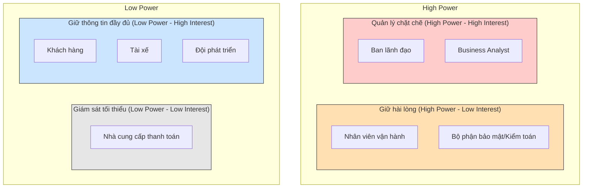

### Xây dựng hệ thống cơ bản
**Đóng vai trò:** BA (Business Analyst)

#### Bước 1: Phân tích yêu cầu của khách hàng
Ở giai đoạn sơ khởi (giai đoạn 1), BA cần tập trung vào việc **phân tích và tìm hiểu yêu cầu của khách hàng**.
Mục tiêu chính là hiểu được **Business Context** - tức là **ngữ cảnh của nghiệp vụ**, bao gồm:
- **Khách hàng là ai?**
- **Doanh nghiệp đang giải quyết vấn đề gì?**
- **Mục tiêu kinh doanh (Business Goal) là gì?**
- **Quy trình nghiệp vụ hiện tại (As-Is) đang diễn ra như thế nào?**
- **Những vấn đề hoặc khó khăn đang tồn tại là gì?**
- **Hệ thống cần giải quyết vấn đề nào?**
- **Kết quả mong muốn (To-Be) của khách hàng là gì?**

**Trả lời cho dự án CAB System:**
- **Khách hàng là ai?**
  Công ty ABC – doanh nghiệp cung cấp dịch vụ đặt xe trực tuyến.
- **Doanh nghiệp đang giải quyết vấn đề gì?**
  Hệ thống hiện tại (tổng đài + app đơn giản) còn nhiều hạn chế: phân công tài xế thủ công, khách hàng khó theo dõi trạng thái chuyến đi, thông tin thanh toán chưa quản lý tập trung, khó mở rộng hệ thống khi quy mô tăng.
- **Mục tiêu kinh doanh (Business Goal) là gì?**
  Xây dựng một nền tảng CAB mới có khả năng phục vụ số lượng lớn khách hàng và tài xế, đồng thời có thể phát triển thêm tính năng trong tương lai mà không cần xây lại toàn bộ hệ thống.
- **Quy trình nghiệp vụ hiện tại (As-Is) đang diễn ra như thế nào?**
  Khách hàng liên hệ tổng đài hoặc dùng app đơn giản để yêu cầu xe → nhân viên phân công tài xế thủ công → khách hàng khó nắm được trạng thái chuyến → thanh toán và dữ liệu chưa tập trung, khó theo dõi.
- **Những vấn đề hoặc khó khăn đang tồn tại là gì?**
  - Phân công tài xế thủ công, chậm, không tối ưu.
  - Thiếu minh bạch về trạng thái chuyến đi cho khách hàng.
  - Thanh toán phân mảnh, chưa tích hợp cổng thanh toán bên ngoài an toàn.
  - Khó mở rộng hạ tầng khi tải tăng cao (giờ cao điểm).
  - Thiếu công cụ quản trị & báo cáo cho vận hành.
  - Chưa có kiểm soát bảo mật, phân quyền và audit trail rõ ràng.
- **Hệ thống cần giải quyết vấn đề nào?**
  Tự động hóa việc tìm và phân công tài xế, tập trung hóa quản lý thanh toán, cung cấp khả năng theo dõi chuyến đi theo thời gian thực, đảm bảo hệ thống có thể mở rộng độc lập theo module (kiến trúc modular/microservices) và không bị sập toàn bộ khi một thành phần (thanh toán, thông báo) gặp lỗi.
- **Kết quả mong muốn (To-Be) của khách hàng là gì?**
  Một nền tảng CAB hoàn chỉnh, đáp ứng toàn bộ quy trình từ tạo yêu cầu → tìm/phân công tài xế → thực hiện chuyến → tính cước → thanh toán → thông báo → đánh giá sau chuyến, có khả năng mở rộng linh hoạt (thêm dịch vụ, phương thức thanh toán, kênh thông báo) và đảm bảo bảo mật, ổn định khi vận hành ở quy mô lớn.

.....

#### Bước 2: Xác định Stakeholders (Các bên liên quan)

Sau khi hiểu được Business Context, BA cần xác định **ai là người liên quan đến dự án** và **mức độ ảnh hưởng/quan trọng** của từng người, để có kế hoạch giao tiếp và thu thập yêu cầu phù hợp.

**Danh sách Stakeholders**

| Stakeholder | Vai trò |
|---|---|
| Ban lãnh đạo / Ban giám đốc Công ty ABC | Người ra quyết định, phê duyệt ngân sách, định hướng chiến lược sản phẩm |
| Khách hàng (Customer) | Người sử dụng dịch vụ đặt xe, đặt chuyến, thanh toán, đánh giá tài xế |
| Tài xế (Driver) | Người thực hiện chuyến đi, nhận/từ chối yêu cầu, cập nhật trạng thái chuyến |
| Nhân viên vận hành (Operations Staff) | Quản trị hệ thống, xử lý sự cố, theo dõi chuyến, tra cứu báo cáo |
| Business Analyst (BA) | Phân tích, làm rõ yêu cầu, xác định phạm vi, tài liệu hóa nghiệp vụ |
| Đội phát triển (Development Team) | Thiết kế và xây dựng hệ thống dựa trên yêu cầu đã được làm rõ |
| Nhà cung cấp thanh toán bên ngoài (Payment Provider) | Đối tác tích hợp xử lý giao dịch thanh toán điện tử |
| Bộ phận bảo mật / Kiểm toán (Security/Audit) | Đảm bảo yêu cầu bảo mật, phân quyền, lưu vết thao tác được tuân thủ |

Nguyên nhân phổ biến nhất khi quadrantChart không render trên GitHub là:

Thiếu/sai code fence — phải có ```mermaid mở đầu và ``` đóng lại, đúng ba dấu backtick, không được có khoảng trắng thừa trước "mermaid".
GitHub dùng phiên bản Mermaid cũ hơn — quadrantChart là loại diagram khá mới (từ Mermaid v10.5+), GitHub đôi khi chưa hỗ trợ đầy đủ loại này, kể cả khi cú pháp đúng 100%.

Vì lý do #2 khá phổ biến, cách an toàn nhất là thay quadrantChart bằng một biểu đồ dạng flowchart/graph để mô phỏng ma trận 2x2 — loại này GitHub luôn hỗ trợ ổn định.

Copy đoạn này thay cho đoạn quadrantChart cũ:

markdown
**Ma trận Stakeholders (Power/Interest Matrix)**

Ma trận thể hiện mức độ **quyền lực/ảnh hưởng (Power)** và **mức độ quan tâm (Interest)** của từng stakeholder đối với dự án, giúp BA xác định ưu tiên giao tiếp:



**Diễn giải 4 nhóm trong ma trận:**

- **Quản lý chặt chẽ (High Power – High Interest):** Ban lãnh đạo, BA → cần giao tiếp thường xuyên, tham gia sâu vào các quyết định.
- **Giữ hài lòng (High Power – Low Interest):** Nhân viên vận hành, Bộ phận bảo mật → cần được thông báo và đảm bảo yêu cầu của họ được đáp ứng dù không tham gia hàng ngày.
- **Giữ thông tin đầy đủ (Low Power – High Interest):** Khách hàng, Tài xế, Đội phát triển → quan tâm trực tiếp đến kết quả, cần được cập nhật thông tin thường xuyên nhưng không có quyền quyết định phạm vi dự án.
- **Giám sát tối thiểu (Low Power – Low Interest):** Nhà cung cấp thanh toán bên ngoài → chỉ cần phối hợp ở mức tích hợp kỹ thuật, không cần tham gia sâu vào quá trình phân tích.

