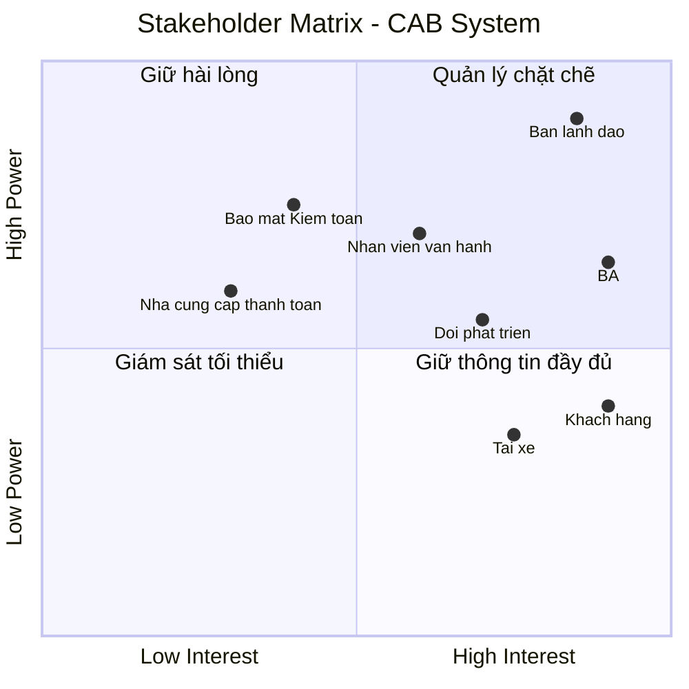
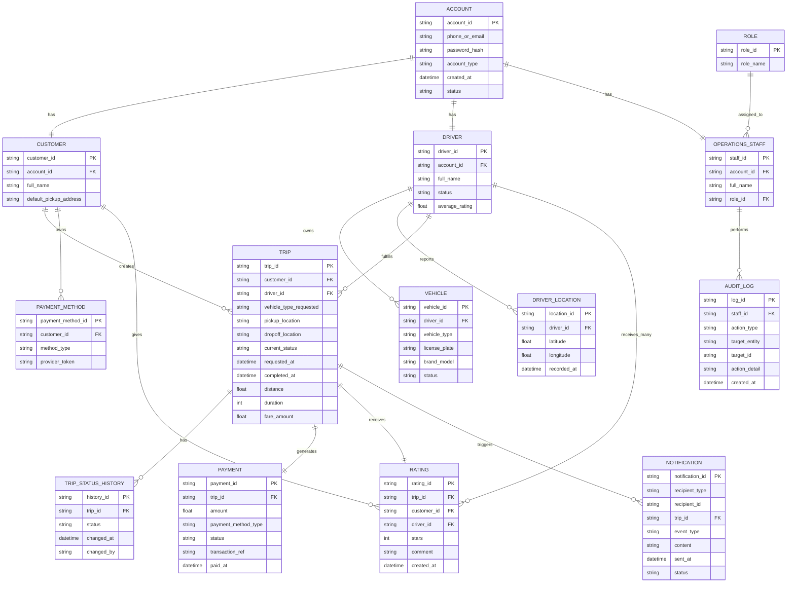

### Xây dựng hệ thống cơ bản
**Đóng vai trò:** BA (Business Analyst)

#### Bước 1: Phân tích yêu cầu của khách hàng
Ở giai đoạn sơ khởi (giai đoạn 1), BA cần tập trung vào việc **phân tích và tìm hiểu yêu cầu của khách hàng**.
Mục tiêu chính là hiểu được **Business Context** - tức là **ngữ cảnh của nghiệp vụ**, bao gồm:
- **Khách hàng là ai?**
- **Doanh nghiệp đang giải quyết vấn đề gì?**
- **Mục tiêu kinh doanh (Business Goal) là gì?**
- **Quy trình nghiệp vụ hiện tại (As-Is) đang diễn ra như thế nào?**
- **Những vấn đề hoặc khó khăn đang tồn tại là gì?**
- **Hệ thống cần giải quyết vấn đề nào?**
- **Kết quả mong muốn (To-Be) của khách hàng là gì?**

**Trả lời cho dự án CAB System:**
- **Khách hàng là ai?**
  Công ty ABC – doanh nghiệp cung cấp dịch vụ đặt xe trực tuyến.
- **Doanh nghiệp đang giải quyết vấn đề gì?**
  Hệ thống hiện tại (tổng đài + app đơn giản) còn nhiều hạn chế: phân công tài xế thủ công, khách hàng khó theo dõi trạng thái chuyến đi, thông tin thanh toán chưa quản lý tập trung, khó mở rộng hệ thống khi quy mô tăng.
- **Mục tiêu kinh doanh (Business Goal) là gì?**
  Xây dựng một nền tảng CAB mới có khả năng phục vụ số lượng lớn khách hàng và tài xế, đồng thời có thể phát triển thêm tính năng trong tương lai mà không cần xây lại toàn bộ hệ thống.
- **Quy trình nghiệp vụ hiện tại (As-Is) đang diễn ra như thế nào?**
  Khách hàng liên hệ tổng đài hoặc dùng app đơn giản để yêu cầu xe → nhân viên phân công tài xế thủ công → khách hàng khó nắm được trạng thái chuyến → thanh toán và dữ liệu chưa tập trung, khó theo dõi.
- **Những vấn đề hoặc khó khăn đang tồn tại là gì?**
  - Phân công tài xế thủ công, chậm, không tối ưu.
  - Thiếu minh bạch về trạng thái chuyến đi cho khách hàng.
  - Thanh toán phân mảnh, chưa tích hợp cổng thanh toán bên ngoài an toàn.
  - Khó mở rộng hạ tầng khi tải tăng cao (giờ cao điểm).
  - Thiếu công cụ quản trị & báo cáo cho vận hành.
  - Chưa có kiểm soát bảo mật, phân quyền và audit trail rõ ràng.
- **Hệ thống cần giải quyết vấn đề nào?**
  Tự động hóa việc tìm và phân công tài xế, tập trung hóa quản lý thanh toán, cung cấp khả năng theo dõi chuyến đi theo thời gian thực, đảm bảo hệ thống có thể mở rộng độc lập theo module (kiến trúc modular/microservices) và không bị sập toàn bộ khi một thành phần (thanh toán, thông báo) gặp lỗi.
- **Kết quả mong muốn (To-Be) của khách hàng là gì?**
  Một nền tảng CAB hoàn chỉnh, đáp ứng toàn bộ quy trình từ tạo yêu cầu → tìm/phân công tài xế → thực hiện chuyến → tính cước → thanh toán → thông báo → đánh giá sau chuyến, có khả năng mở rộng linh hoạt (thêm dịch vụ, phương thức thanh toán, kênh thông báo) và đảm bảo bảo mật, ổn định khi vận hành ở quy mô lớn.

#### Bước 2: Xác định Stakeholders (Các bên liên quan)

Sau khi hiểu được Business Context, BA cần xác định **ai là người liên quan đến dự án** và **mức độ ảnh hưởng/quan trọng** của từng người, để có kế hoạch giao tiếp và thu thập yêu cầu phù hợp.

**Danh sách Stakeholders**

| Stakeholder | Vai trò |
|---|---|
| Ban lãnh đạo / Ban giám đốc Công ty ABC | Người ra quyết định, phê duyệt ngân sách, định hướng chiến lược sản phẩm |
| Khách hàng (Customer) | Người sử dụng dịch vụ đặt xe, đặt chuyến, thanh toán, đánh giá tài xế |
| Tài xế (Driver) | Người thực hiện chuyến đi, nhận/từ chối yêu cầu, cập nhật trạng thái chuyến |
| Nhân viên vận hành (Operations Staff) | Quản trị hệ thống, xử lý sự cố, theo dõi chuyến, tra cứu báo cáo |
| Business Analyst (BA) | Phân tích, làm rõ yêu cầu, xác định phạm vi, tài liệu hóa nghiệp vụ |
| Đội phát triển (Development Team) | Thiết kế và xây dựng hệ thống dựa trên yêu cầu đã được làm rõ |
| Nhà cung cấp thanh toán bên ngoài (Payment Provider) | Đối tác tích hợp xử lý giao dịch thanh toán điện tử |
| Bộ phận bảo mật / Kiểm toán (Security/Audit) | Đảm bảo yêu cầu bảo mật, phân quyền, lưu vết thao tác được tuân thủ |

**Ma trận Stakeholders (Power/Interest Matrix)**

Ma trận thể hiện mức độ **quyền lực/ảnh hưởng (Power)** và **mức độ quan tâm (Interest)** của từng stakeholder đối với dự án, giúp BA xác định ưu tiên giao tiếp:

**Diễn giải 4 nhóm trong ma trận:**

- **Quản lý chặt chẽ (High Power – High Interest):** Ban lãnh đạo, BA → cần giao tiếp thường xuyên, tham gia sâu vào các quyết định.
- **Giữ hài lòng (High Power – Low Interest):** Nhân viên vận hành, Bộ phận bảo mật → cần được thông báo và đảm bảo yêu cầu của họ được đáp ứng dù không tham gia hàng ngày.
- **Giữ thông tin đầy đủ (Low Power – High Interest):** Khách hàng, Tài xế, Đội phát triển → quan tâm trực tiếp đến kết quả, cần được cập nhật thông tin thường xuyên nhưng không có quyền quyết định phạm vi dự án.
- **Giám sát tối thiểu (Low Power – Low Interest):** Nhà cung cấp thanh toán bên ngoài → chỉ cần phối hợp ở mức tích hợp kỹ thuật, không cần tham gia sâu vào quá trình phân tích.

#### Bước 3: Xác định Mục tiêu nghiệp vụ (Business Goals)

Từ Business Context và Business Purpose đã phân tích ở Bước 1, BA xác định các mục tiêu nghiệp vụ cụ thể mà hệ thống CAB cần đạt được:

| Mã | Mục tiêu nghiệp vụ (Business Goal) |
|---|---|
| BG01 | Tự động tìm và phân công tài xế phù hợp cho khách hàng |
| BG02 | Hỗ trợ thanh toán (cho phép thanh toán tiền mặt và thanh toán điện tử) |
| BG03 | Cung cấp khả năng theo dõi chuyến đi theo thời gian thực cho khách hàng |
| BG04 | Gửi thông báo tự động cho khách hàng và tài xế xuyên suốt vòng đời chuyến đi |
| BG05 | Cung cấp công cụ quản trị và báo cáo cho nhân viên vận hành |
| BG06 | Đảm bảo hệ thống có khả năng mở rộng (scalable) và hoạt động ổn định khi tải tăng cao |
| BG07 | Bảo vệ dữ liệu và kiểm soát truy cập theo đúng yêu cầu bảo mật |
| BG08 | Xây dựng kiến trúc linh hoạt, dễ mở rộng để bổ sung dịch vụ, phương thức thanh toán, kênh thông báo mới trong tương lai |
| BG09 | Nâng cao chất lượng dịch vụ thông qua cơ chế đánh giá tài xế sau chuyến đi |

**Diễn giải chi tiết:**

- **BG01 – Tự động tìm tài xế:** Khi khách hàng tạo chuyến, hệ thống tự động xác định tài xế phù hợp dựa trên vị trí, trạng thái sẵn sàng và tiêu chí vận hành, có cơ chế tìm tài xế khác nếu tài xế đầu tiên không phản hồi/từ chối, không yêu cầu khách hàng tạo lại yêu cầu.
- **BG02 – Hỗ trợ thanh toán:** Cho phép thanh toán tiền mặt và thanh toán điện tử qua nhà cung cấp thanh toán bên ngoài, không lưu trực tiếp thông tin nhạy cảm của thẻ/tài khoản trong hệ thống CAB, có cơ chế xử lý khi giao dịch điện tử thất bại.
- **BG03 – Theo dõi chuyến đi thời gian thực:** Khách hàng biết được trạng thái tìm tài xế, tài xế nhận chuyến, thời gian dự kiến đến và trạng thái hiện tại của chuyến đi.
- **BG04 – Thông báo:** Khách hàng nhận thông báo khi yêu cầu được tiếp nhận, tài xế nhận chuyến, tài xế đến điểm đón, chuyến hoàn thành, kết quả thanh toán; tài xế nhận thông báo về chuyến mới hoặc thay đổi liên quan.
- **BG05 – Công cụ quản trị & báo cáo:** Nhân viên vận hành quản lý khách hàng, tài xế, phương tiện, chuyến đi; xem báo cáo số lượng chuyến, doanh thu, tỷ lệ hoàn thành/hủy, hiệu quả hoạt động tài xế.
- **BG06 – Khả năng mở rộng & ổn định:** Các thành phần hệ thống scale độc lập khi tải tăng; lỗi ở một chức năng (thanh toán, thông báo) không làm sập toàn bộ hệ thống.
- **BG07 – Bảo mật:** Xác thực khách hàng/tài xế trước khi dùng chức năng yêu cầu tài khoản, kiểm soát quyền truy cập cho thao tác quản trị, bảo vệ dữ liệu cá nhân/vị trí/giao dịch, lưu vết (audit log) các thao tác quan trọng.
- **BG08 – Kiến trúc linh hoạt:** Cho phép bổ sung loại dịch vụ mới, phương thức thanh toán mới, nhà cung cấp thông báo mới hoặc thay đổi thành phần kỹ thuật mà không cần xây lại toàn bộ ứng dụng.
- **BG09 – Đánh giá tài xế:** Sau khi hoàn thành chuyến, khách hàng có thể đánh giá tài xế; dữ liệu đánh giá được dùng để cải thiện chất lượng dịch vụ và làm tiêu chí tham khảo trong hoạt động vận hành (ví dụ: theo dõi hiệu quả tài xế trong báo cáo — liên quan BG05).

#### Bước 4: Xác định Phạm vi dự án (Scope)

Với thời gian triển khai này , BA cần xác định rõ phạm vi để đội phát triển tập trung xây dựng **MVB** — đáp ứng đúng luồng nghiệp vụ cốt lõi mà khách hàng mô tả, đồng thời loại trừ các phần có thể mở rộng sau để tránh trễ tiến độ.

##### 4.1 Trong phạm vi (In-Scope)

**Module Khách hàng (Customer)**
- Đăng ký tài khoản, đăng nhập, cập nhật thông tin cá nhân
- Nhập điểm đón/điểm đến, chọn loại xe, gửi yêu cầu đặt xe
- Theo dõi trạng thái chuyến đi (đang tìm tài xế, tài xế đã nhận, thời gian dự kiến đến, trạng thái hiện tại)
- Xem lịch sử chuyến đi, số tiền phải trả
- Đánh giá tài xế sau khi hoàn thành chuyến

**Module Tài xế (Driver)**
- Đăng ký hoặc được nhân viên vận hành tạo tài khoản
- Cập nhật hồ sơ, thông tin phương tiện, trạng thái hoạt động (sẵn sàng/không sẵn sàng)
- Nhận thông báo yêu cầu chuyến phù hợp, chấp nhận/từ chối chuyến
- Cập nhật trạng thái chuyến: đã đến điểm đón, đã đón khách, đang di chuyển, hoàn thành
- Cập nhật vị trí để phục vụ tìm tài xế gần khách hàng

**Module Tìm & Phân công tài xế (Driver Matching)**
- Xác định tài xế phù hợp dựa trên vị trí, trạng thái sẵn sàng
- Cơ chế tìm tài xế thay thế khi tài xế được đề xuất không phản hồi/từ chối
- Thông báo cho khách hàng khi không tìm được tài xế

**Module Tính cước & Thanh toán (Fare & Payment)**
- Tính số tiền khách hàng phải trả dựa trên loại dịch vụ và thông tin chuyến đi
- Thanh toán tiền mặt
- Thanh toán điện tử (tích hợp với 1 nhà cung cấp thanh toán bên ngoài, không lưu thông tin thẻ nhạy cảm trong hệ thống CAB)
- Thông báo và cho phép xử lý lại khi giao dịch điện tử thất bại

**Module Thông báo (Notification)**
- Thông báo cho khách hàng: yêu cầu được tiếp nhận, tài xế nhận chuyến, tài xế đến điểm đón, chuyến hoàn thành, kết quả thanh toán
- Thông báo cho tài xế: chuyến mới, thay đổi liên quan đến chuyến đang thực hiện
- Kiến trúc cho phép mở rộng thêm kênh thông báo sau này (chỉ cần thiết kế sẵn, chưa cần triển khai nhiều kênh trong 7 tuần)

**Module Quản trị vận hành (Admin/Operations)**
- Quản lý khách hàng, tài xế, phương tiện, chuyến đi
- Xem các chuyến đang diễn ra, kiểm tra trạng thái tài xế
- Hỗ trợ xử lý chuyến bị lỗi, tra cứu lịch sử giao dịch
- Phân quyền cơ bản (nhân viên thường vs. thao tác nhạy cảm)
- Báo cáo cơ bản: số lượng chuyến, doanh thu, tỷ lệ hoàn thành/hủy, hiệu quả tài xế

**Yêu cầu phi chức năng (Non-Functional)**
- Xác thực người dùng (khách hàng, tài xế) trước khi dùng chức năng cần tài khoản
- Kiểm soát quyền truy cập cho thao tác quản trị
- Lưu vết (audit log) các thao tác quan trọng
- Kiến trúc cho phép các thành phần scale độc lập, cô lập lỗi (một module lỗi không kéo sập toàn hệ thống)

##### 4.2 Ngoài phạm vi (Out-of-Scope)

> Các mục dưới đây **không nên triển khai trong giai đoạn này**, do chưa được khách hàng chốt chi tiết hoặc không phải yêu cầu cốt lõi của MVB. BA cần ghi nhận và xác nhận lại với khách hàng để đưa vào roadmap giai đoạn sau.

- Tích hợp **nhiều** nhà cung cấp thanh toán cùng lúc (chỉ tích hợp 1 nhà cung cấp trong phạm vi MVB)
- Tích hợp **nhiều kênh thông báo** (SMS, email, push, in-app...) — chỉ cần 1 kênh chính, kiến trúc chừa sẵn khả năng mở rộng
- Tính năng khuyến mãi, mã giảm giá, chương trình khách hàng thân thiết
- Đặt xe hộ người khác, đặt xe theo lịch (đặt trước)
- Chat trực tiếp giữa khách hàng và tài xế trong ứng dụng
- Bản đồ nội bộ tự phát triển (dự kiến dùng dịch vụ bản đồ bên thứ ba có sẵn, không tự xây engine định vị/routing)
- Ứng dụng dành riêng cho nhiều ngôn ngữ/đa quốc gia (chỉ 1 ngôn ngữ/thị trường ban đầu)
- Chính sách hủy chuyến chi tiết, biểu phí phạt hủy (chưa được khách hàng chốt — cần làm rõ trước, xem mục Open Issues)
- Cách tính cước nâng cao (giờ cao điểm, surge pricing, khuyến mãi theo khu vực) — chỉ áp dụng công thức tính cước cơ bản trong MVB
- Xử lý chi tiết khi mất kết nối mạng (offline mode) — chưa được chốt, cần làm rõ
- Chính sách và thời gian lưu trữ dữ liệu dài hạn (data retention/archiving) — chưa được chốt, cần làm rõ
- Ứng dụng di động native (iOS/Android) đầy đủ — trong 7 tuần ưu tiên nền tảng chính (web hoặc 1 nền tảng di động), việc phát triển đa nền tảng đầy đủ để giai đoạn sau
- Tính năng phân tích nâng cao / AI dự đoán nhu cầu, tối ưu tuyến đường

#### Bước 5: Chuyển đổi thành Yêu cầu nghiệp vụ (Business Requirements)

Từ các Mục tiêu nghiệp vụ (Business Goals) đã xác định ở Bước 3, BA cụ thể hóa thành các **Yêu cầu nghiệp vụ (Business Requirements)** — mô tả những việc hệ thống phải làm được để đạt mục tiêu đề ra. Mỗi yêu cầu được ký hiệu bằng mã **BN**, được nhóm theo từng khối chức năng để dễ theo dõi.

##### Nhóm 1: Tài khoản & Hồ sơ người dùng

| Mã | Tên yêu cầu | Diễn giải |
|---|---|---|
| BN01 | Đăng ký & đăng nhập tài khoản | Khách hàng và tài xế có thể đăng ký tài khoản mới, đăng nhập vào hệ thống; tài xế có thể được nhân viên vận hành tạo tài khoản thay |
| BN02 | Quản lý thông tin cá nhân & hồ sơ | Khách hàng cập nhật thông tin cá nhân; tài xế cập nhật hồ sơ, thông tin phương tiện và trạng thái hoạt động |

##### Nhóm 2: Đặt xe & Tìm tài xế

| Mã | Tên yêu cầu | Diễn giải |
|---|---|---|
| BN03 | Đặt chuyến xe | Khách hàng nhập điểm đón, điểm đến, chọn loại xe và gửi yêu cầu đặt xe |
| BN04 | Tự động tìm tài xế | Hệ thống xác định tài xế phù hợp dựa trên vị trí, trạng thái sẵn sàng và tiêu chí vận hành; tự động tìm tài xế khác nếu tài xế đầu tiên không phản hồi/từ chối |
| BN05 | Thông báo khi không tìm được tài xế | Hệ thống thông báo rõ ràng cho khách hàng trong trường hợp không tìm được tài xế phù hợp |
| BN06 | Nhận/từ chối chuyến (tài xế) | Tài xế nhận thông báo yêu cầu chuyến phù hợp và có thể chấp nhận hoặc từ chối |

##### Nhóm 3: Thực hiện chuyến đi

| Mã | Tên yêu cầu | Diễn giải |
|---|---|---|
| BN07 | Cập nhật trạng thái chuyến đi | Tài xế cập nhật các trạng thái: đã đến điểm đón, đã đón khách, đang di chuyển, hoàn thành chuyến |
| BN08 | Theo dõi chuyến đi theo thời gian thực | Khách hàng theo dõi được trạng thái tìm tài xế, tài xế đã nhận chuyến, thời gian dự kiến đến và trạng thái hiện tại của chuyến |
| BN09 | Cập nhật vị trí tài xế | Hệ thống lưu và cập nhật vị trí tài xế để hỗ trợ tìm tài xế gần khách hàng và dự đoán thời gian đến |
| BN17 | Xem lịch sử chuyến đi | Khách hàng xem được lịch sử các chuyến đã thực hiện và số tiền đã trả |

##### Nhóm 4: Tính cước & Thanh toán

| Mã | Tên yêu cầu | Diễn giải |
|---|---|---|
| BN10 | Tính cước chuyến đi | Hệ thống xác định số tiền khách hàng phải trả dựa trên loại dịch vụ và thông tin chuyến đi sau khi hoàn thành |
| BN11 | Thanh toán tiền mặt | Khách hàng có thể thanh toán chuyến đi bằng tiền mặt |
| BN12 | Thanh toán điện tử | Khách hàng có thể thanh toán qua phương thức điện tử, tích hợp với nhà cung cấp thanh toán bên ngoài, không lưu thông tin nhạy cảm trong hệ thống CAB |
| BN13 | Xử lý lỗi thanh toán | Hệ thống thông báo cho khách hàng và cho phép xử lý lại khi giao dịch thanh toán điện tử thất bại |

##### Nhóm 5: Thông báo

| Mã | Tên yêu cầu | Diễn giải |
|---|---|---|
| BN14 | Thông báo cho khách hàng | Khách hàng nhận thông báo khi: yêu cầu được tiếp nhận, tài xế nhận chuyến, tài xế đến điểm đón, chuyến hoàn thành, kết quả thanh toán |
| BN15 | Thông báo cho tài xế | Tài xế nhận thông báo về chuyến mới hoặc thay đổi liên quan đến chuyến đang thực hiện |

##### Nhóm 6: Đánh giá dịch vụ

| Mã | Tên yêu cầu | Diễn giải |
|---|---|---|
| BN16 | Đánh giá tài xế | Khách hàng đánh giá tài xế sau khi hoàn thành chuyến đi |

##### Nhóm 7: Quản trị & Vận hành

| Mã | Tên yêu cầu | Diễn giải |
|---|---|---|
| BN18 | Quản trị khách hàng, tài xế, phương tiện, chuyến đi | Nhân viên vận hành quản lý thông tin khách hàng, tài xế, phương tiện và các chuyến đi trên giao diện quản trị |
| BN19 | Giám sát chuyến đi & xử lý sự cố | Nhân viên vận hành xem các chuyến đang diễn ra, kiểm tra trạng thái tài xế, hỗ trợ xử lý chuyến bị lỗi, tra cứu lịch sử giao dịch |
| BN20 | Phân quyền chức năng quản trị | Hệ thống phân quyền để nhân viên thông thường không thể thực hiện các thao tác quản trị nhạy cảm |
| BN21 | Báo cáo vận hành | Hệ thống cung cấp báo cáo về số lượng chuyến, doanh thu, tỷ lệ chuyến hoàn thành, tỷ lệ hủy và hiệu quả hoạt động của tài xế |

##### Nhóm 8: Bảo mật & Kiểm soát dữ liệu

| Mã | Tên yêu cầu | Diễn giải |
|---|---|---|
| BN22 | Xác thực người dùng | Khách hàng và tài xế phải được xác thực trước khi sử dụng các chức năng yêu cầu tài khoản |
| BN23 | Kiểm soát truy cập | Các thao tác quản trị phải được kiểm soát quyền truy cập |
| BN24 | Bảo vệ dữ liệu | Thông tin cá nhân, thông tin phương tiện, dữ liệu vị trí và dữ liệu giao dịch phải được bảo vệ |
| BN25 | Lưu vết thao tác (Audit log) | Hệ thống lưu vết các thao tác quan trọng để phục vụ kiểm tra khi có sự cố |

##### Nhóm 9: Kiến trúc & Khả năng mở rộng

| Mã | Tên yêu cầu | Diễn giải |
|---|---|---|
| BN26 | Khả năng mở rộng độc lập | Các thành phần của hệ thống có khả năng mở rộng (scale) độc lập khi tải tăng cao |
| BN27 | Cô lập lỗi giữa các module | Lỗi ở chức năng thanh toán hoặc thông báo không được làm toàn bộ hệ thống đặt xe ngừng hoạt động |
| BN28 | Triển khai từng phần (incremental deployment) | Các chức năng mới có thể được triển khai từng phần, hạn chế ảnh hưởng đến các chức năng đang hoạt động |
| BN29 | Kiến trúc mở rộng linh hoạt | Hệ thống có kiến trúc đủ linh hoạt để bổ sung loại dịch vụ mới, phương thức thanh toán mới, nhà cung cấp thông báo mới mà không cần xây lại toàn bộ ứng dụng |

#### Bước 6: Xây dựng Business Process (Quy trình nghiệp vụ)

Từ các Yêu cầu nghiệp vụ (BN) đã xác định ở Bước 5, BA xây dựng các quy trình nghiệp vụ (business process) mô tả từng bước xử lý, gắn với từng tác nhân liên quan trong hệ thống.

##### 6.1 Quy trình Đặt chuyến & Tìm tài xế

- Khách hàng tạo yêu cầu chuyến đi
  + Xác nhận điểm đón
  + Xác nhận điểm đến
  + Chọn loại xe
  + Gửi yêu cầu đặt xe
- Hệ thống xác nhận yêu cầu và bắt đầu tìm tài xế
  + Tìm tài xế phù hợp dựa trên vị trí và trạng thái sẵn sàng
  + Nếu không có tài xế phù hợp → thông báo cho khách hàng và kết thúc quy trình
  + Nếu có tài xế phù hợp → gửi thông báo mời chuyến đến tài xế
- Tài xế phản hồi yêu cầu
  + Tài xế chấp nhận chuyến → xác nhận tài xế cho chuyến, thông báo khách hàng (tài xế đã nhận + thời gian dự kiến đến)
  + Tài xế từ chối hoặc không phản hồi trong thời gian quy định → hệ thống loại tài xế khỏi danh sách đề xuất và quay lại bước tìm tài xế khác
  + Lặp lại cho đến khi có tài xế nhận chuyến hoặc hết danh sách tài xế phù hợp

##### 6.2 Quy trình Thực hiện chuyến đi

- Tài xế di chuyển đến điểm đón
- Tài xế cập nhật trạng thái: đã đến điểm đón → hệ thống thông báo cho khách hàng
- Kiểm tra khách hàng có mặt tại điểm đón
  + Nếu không, quá thời gian chờ quy định → xử lý theo chính sách chờ/hủy (cần làm rõ với khách hàng)
  + Nếu có → tài xế cập nhật trạng thái: đã đón khách
- Tài xế cập nhật trạng thái: đang di chuyển
- Hệ thống theo dõi và ghi nhận vị trí tài xế theo thời gian thực trong suốt chuyến đi
- Tài xế đến điểm đến, cập nhật trạng thái: hoàn thành chuyến
- Chuyển sang quy trình Tính cước & Thanh toán

##### 6.3 Quy trình Tính cước & Thanh toán

- Hệ thống tính cước dựa trên loại dịch vụ và thông tin chuyến đi sau khi chuyến hoàn thành
- Hệ thống hiển thị số tiền phải trả cho khách hàng
- Khách hàng chọn phương thức thanh toán
  + Thanh toán tiền mặt:
    - Khách hàng thanh toán trực tiếp cho tài xế
    - Tài xế xác nhận đã nhận tiền
    - Hệ thống ghi nhận: thanh toán thành công
  + Thanh toán điện tử:
    - Hệ thống gửi yêu cầu thanh toán đến nhà cung cấp thanh toán bên ngoài
    - Nếu giao dịch thành công → ghi nhận: thanh toán thành công
    - Nếu giao dịch thất bại → thông báo lỗi cho khách hàng, cho phép xử lý lại (thử thanh toán lại hoặc đổi phương thức)
- Hệ thống thông báo kết quả thanh toán cho khách hàng
- Chuyển sang quy trình Đánh giá tài xế

##### 6.4 Quy trình Đánh giá tài xế

- Sau khi thanh toán thành công, hệ thống mời khách hàng đánh giá tài xế
- Khách hàng quyết định có đánh giá hay không
  + Không đánh giá → kết thúc quy trình
  + Có đánh giá → khách hàng chọn số sao/nhận xét
- Hệ thống lưu đánh giá và cập nhật điểm đánh giá trung bình của tài xế
- Dữ liệu đánh giá được đưa vào báo cáo hiệu quả hoạt động tài xế cho bộ phận vận hành

##### 6.5 Quy trình Thông báo (xuyên suốt các quy trình khác)

- Hệ thống phát sinh thông báo dựa theo từng sự kiện nghiệp vụ:
  + Gửi cho khách hàng khi: yêu cầu đặt xe được tiếp nhận, tài xế nhận chuyến, tài xế đến điểm đón, chuyến hoàn thành, có kết quả thanh toán
  + Gửi cho tài xế khi: có chuyến mới phù hợp, có thay đổi liên quan đến chuyến đang thực hiện
- Hệ thống gửi thông báo qua kênh đã cấu hình (kiến trúc chừa sẵn khả năng bổ sung kênh thông báo mới trong tương lai)

##### 6.6 Quy trình Quản trị & Vận hành (Nhân viên vận hành)

- Nhân viên vận hành đăng nhập vào hệ thống quản trị
- Xem danh sách các chuyến đang diễn ra, kiểm tra trạng thái tài xế
- Khi phát hiện chuyến gặp sự cố:
  + Kiểm tra chi tiết chuyến gặp sự cố
  + Nếu thao tác xử lý thuộc nhóm nhạy cảm → chuyển yêu cầu đến nhân viên có quyền phù hợp (theo phân quyền)
  + Nếu không → nhân viên xử lý trực tiếp (vd: hủy chuyến, hỗ trợ liên hệ khách hàng/tài xế)
  + Hệ thống ghi log thao tác xử lý vào Audit Trail
- Tra cứu lịch sử giao dịch khi cần
- Xem báo cáo vận hành: số lượng chuyến, doanh thu, tỷ lệ hoàn thành/hủy, hiệu quả hoạt động tài xế

##### 6.7 Quy trình Quản lý tài khoản & Hồ sơ (Khách hàng / Tài xế)

- Khách hàng:
  + Đăng ký tài khoản hoặc đăng nhập
  + Cập nhật thông tin cá nhân khi cần
- Tài xế:
  + Đăng ký tài khoản, hoặc được nhân viên vận hành tạo tài khoản thay
  + Cập nhật hồ sơ cá nhân, thông tin phương tiện
  + Chuyển đổi trạng thái hoạt động: sẵn sàng nhận chuyến / không sẵn sàng
  + Hệ thống ghi nhận và cập nhật vị trí tài xế liên tục khi ở trạng thái sẵn sàng, phục vụ cho quy trình tìm tài xế (6.1)

##### 6.8 Bảng liên kết Business Process với Business Requirements

| Business Process | Tác nhân chính | Business Requirements liên quan |
|---|---|---|
| 6.1 Đặt chuyến & Tìm tài xế | Khách hàng, Tài xế, Hệ thống | BN03, BN04, BN05, BN06 |
| 6.2 Thực hiện chuyến đi | Tài xế, Hệ thống | BN07, BN08, BN09 |
| 6.3 Tính cước & Thanh toán | Khách hàng, Tài xế, Hệ thống, Nhà cung cấp thanh toán | BN10, BN11, BN12, BN13 |
| 6.4 Đánh giá tài xế | Khách hàng, Hệ thống | BN16, BN17 |
| 6.5 Thông báo | Hệ thống | BN14, BN15 |
| 6.6 Quản trị & Vận hành | Nhân viên vận hành, Hệ thống | BN18, BN19, BN20, BN21, BN23, BN25 |
| 6.7 Quản lý tài khoản & Hồ sơ | Khách hàng, Tài xế | BN01, BN02 |

#### Bước 7: Phân rã thành Yêu cầu chức năng (Functional Requirements - FR)

Từ mỗi Yêu cầu nghiệp vụ (BN) đã xác định ở Bước 5, BA tiếp tục phân rã thành các **Yêu cầu chức năng (Functional Requirements - FR)** — mô tả chi tiết từng bước xử lý cụ thể mà hệ thống phải thực hiện, làm cơ sở cho đội phát triển thiết kế và xây dựng.

##### 7.1 Nhóm Tài khoản & Hồ sơ (từ BN01, BN02)

- **FR01:** Cho phép khách hàng đăng ký tài khoản bằng số điện thoại/email
- **FR02:** Cho phép khách hàng/tài xế đăng nhập bằng tài khoản đã đăng ký
- **FR03:** Cho phép nhân viên vận hành tạo tài khoản thay cho tài xế
- **FR04:** Cho phép khách hàng cập nhật thông tin cá nhân (họ tên, số điện thoại, email...)
- **FR05:** Cho phép tài xế cập nhật hồ sơ cá nhân và thông tin phương tiện (biển số, loại xe, hãng xe...)
- **FR06:** Cho phép tài xế chuyển đổi trạng thái hoạt động: sẵn sàng nhận chuyến / không sẵn sàng

##### 7.2 Nhóm Đặt xe & Tìm tài xế (từ BN03, BN04, BN05, BN06)

**Đặt chuyến (BN03):**
- **FR07:** Cho phép khách hàng nhập điểm đón (chọn trên bản đồ hoặc nhập địa chỉ)
- **FR08:** Cho phép khách hàng nhập điểm đến
- **FR09:** Cho phép khách hàng chọn loại xe (vd: xe máy, xe 4 chỗ, xe 7 chỗ...)
- **FR10:** Cho phép khách hàng gửi yêu cầu đặt xe sau khi xác nhận đầy đủ thông tin

**Tìm tài xế (BN04) — ví dụ minh họa của bạn:**
- **FR11:** Xác định vị trí hiện tại của khách hàng (lấy từ điểm đón)
- **FR12:** Tìm các tài xế đang ở trạng thái online/sẵn sàng trong bán kính xung quanh vị trí khách hàng
- **FR13:** Lọc tài xế theo loại xe khách hàng đã chọn
- **FR14:** *(Điều kiện)* Nếu yêu cầu của khách hàng có tiêu chí "tài xế rating cao" → lọc thêm theo điểm đánh giá tối thiểu; nếu không có tiêu chí này → bỏ qua bước lọc rating
- **FR15:** Sắp xếp danh sách tài xế phù hợp theo khoảng cách gần nhất
- **FR16:** Gửi thông báo mời chuyến lần lượt đến tài xế theo thứ tự ưu tiên
- **FR17:** Đặt thời gian giới hạn chờ phản hồi cho mỗi tài xế được mời
- **FR18:** Nếu tài xế từ chối hoặc hết thời gian chờ → loại khỏi danh sách và mời tài xế tiếp theo (quay lại FR16)
- **FR19:** Nếu không còn tài xế phù hợp trong danh sách → dừng tìm kiếm

**Không tìm được tài xế (BN05):**
- **FR20:** Thông báo rõ ràng cho khách hàng khi không tìm được tài xế phù hợp
- **FR21:** Cho phép khách hàng thử lại yêu cầu đặt xe sau khi nhận thông báo

**Tài xế phản hồi (BN06):**
- **FR22:** Hiển thị thông tin chuyến mời (điểm đón, điểm đến, loại xe, cước dự kiến) cho tài xế
- **FR23:** Cho phép tài xế chấp nhận chuyến
- **FR24:** Cho phép tài xế từ chối chuyến
- **FR25:** Xác nhận tài xế chính thức cho chuyến sau khi chấp nhận, khóa chuyến không cho tài xế khác nhận trùng

##### 7.3 Nhóm Thực hiện chuyến đi (từ BN07, BN08, BN09, BN17)

- **FR26:** Cho phép tài xế cập nhật trạng thái "đã đến điểm đón"
- **FR27:** Cho phép tài xế cập nhật trạng thái "đã đón khách"
- **FR28:** Cho phép tài xế cập nhật trạng thái "đang di chuyển"
- **FR29:** Cho phép tài xế cập nhật trạng thái "hoàn thành chuyến"
- **FR30:** Hiển thị cho khách hàng trạng thái chuyến đi theo thời gian thực
- **FR31:** Hiển thị thời gian dự kiến tài xế đến điểm đón (ETA)
- **FR32:** Ghi nhận vị trí tài xế định kỳ (vd: mỗi vài giây) trong suốt chuyến đi
- **FR33:** Cho phép khách hàng xem lại danh sách các chuyến đã thực hiện
- **FR34:** Hiển thị chi tiết một chuyến trong lịch sử (điểm đón, điểm đến, số tiền, tài xế, thời gian)

##### 7.4 Nhóm Tính cước & Thanh toán (từ BN10, BN11, BN12, BN13)

- **FR35:** Tính khoảng cách và thời gian di chuyển thực tế của chuyến đi
- **FR36:** Tính số tiền phải trả dựa trên loại dịch vụ và công thức cước cơ bản (khoảng cách/thời gian)
- **FR37:** Hiển thị số tiền cần thanh toán cho khách hàng sau khi chuyến hoàn thành
- **FR38:** Cho phép khách hàng chọn phương thức thanh toán: tiền mặt hoặc điện tử
- **FR39:** Ghi nhận xác nhận của tài xế khi khách hàng thanh toán tiền mặt
- **FR40:** Gửi yêu cầu thanh toán điện tử đến nhà cung cấp thanh toán bên ngoài (qua API/tích hợp)
- **FR41:** Nhận kết quả giao dịch từ nhà cung cấp thanh toán (thành công/thất bại)
- **FR42:** Thông báo lỗi cho khách hàng khi giao dịch điện tử thất bại
- **FR43:** Cho phép khách hàng thử thanh toán lại hoặc đổi phương thức khi giao dịch thất bại
- **FR44:** Không lưu trữ trực tiếp thông tin thẻ/tài khoản thanh toán nhạy cảm trong hệ thống CAB

##### 7.5 Nhóm Thông báo (từ BN14, BN15)

- **FR45:** Gửi thông báo cho khách hàng khi yêu cầu đặt xe được tiếp nhận
- **FR46:** Gửi thông báo cho khách hàng khi tài xế nhận chuyến
- **FR47:** Gửi thông báo cho khách hàng khi tài xế đến điểm đón
- **FR48:** Gửi thông báo cho khách hàng khi chuyến hoàn thành
- **FR49:** Gửi thông báo cho khách hàng khi có kết quả thanh toán
- **FR50:** Gửi thông báo cho tài xế khi có chuyến mới phù hợp
- **FR51:** Gửi thông báo cho tài xế khi có thay đổi liên quan đến chuyến đang thực hiện
- **FR52:** Thiết kế module thông báo dạng độc lập (service riêng) để dễ bổ sung kênh gửi mới sau này

##### 7.6 Nhóm Đánh giá tài xế (từ BN16)

- **FR53:** Hiển thị lời mời đánh giá cho khách hàng sau khi thanh toán thành công
- **FR54:** Cho phép khách hàng chọn số sao đánh giá (vd: 1–5 sao)
- **FR55:** Cho phép khách hàng nhập nhận xét (tùy chọn)
- **FR56:** Lưu đánh giá và cập nhật điểm đánh giá trung bình của tài xế
- **FR57:** Cho phép khách hàng bỏ qua bước đánh giá

##### 7.7 Nhóm Quản trị & Vận hành (từ BN18, BN19, BN20, BN21)

- **FR58:** Hiển thị danh sách khách hàng, tài xế, phương tiện cho nhân viên vận hành
- **FR59:** Cho phép nhân viên vận hành tìm kiếm/lọc thông tin khách hàng, tài xế, chuyến đi
- **FR60:** Hiển thị danh sách các chuyến đang diễn ra theo thời gian thực
- **FR61:** Hiển thị trạng thái hiện tại của từng tài xế
- **FR62:** Cho phép nhân viên vận hành can thiệp xử lý chuyến gặp sự cố (vd: hủy chuyến, gán lại tài xế)
- **FR63:** Cho phép tra cứu lịch sử giao dịch theo khách hàng/tài xế/khoảng thời gian
- **FR64:** Kiểm tra quyền của nhân viên trước khi cho thực hiện thao tác nhạy cảm
- **FR65:** Tạo báo cáo số lượng chuyến theo khoảng thời gian
- **FR66:** Tạo báo cáo doanh thu theo khoảng thời gian
- **FR67:** Tạo báo cáo tỷ lệ chuyến hoàn thành / tỷ lệ hủy
- **FR68:** Tạo báo cáo hiệu quả hoạt động của từng tài xế (số chuyến, điểm đánh giá trung bình)

##### 7.8 Nhóm Bảo mật & Kiểm soát dữ liệu (từ BN22, BN23, BN24, BN25)

- **FR69:** Xác thực khách hàng/tài xế bằng tài khoản (mật khẩu/OTP) trước khi truy cập chức năng yêu cầu đăng nhập
- **FR70:** Kiểm tra vai trò (role) người dùng trước khi cho phép thực hiện thao tác quản trị
- **FR71:** Mã hóa/bảo vệ dữ liệu cá nhân, dữ liệu vị trí và dữ liệu giao dịch khi lưu trữ và truyền tải
- **FR72:** Ghi log mọi thao tác quan trọng (ai thực hiện, thời gian, hành động) vào Audit Trail
- **FR73:** Cho phép nhân viên có quyền phù hợp tra cứu Audit Trail khi cần điều tra sự cố

##### 7.9 Nhóm Kiến trúc & Khả năng mở rộng (từ BN26, BN27, BN28, BN29)

> *Ghi chú: Nhóm này thiên về yêu cầu phi chức năng (NFR) hơn là FR, nhưng được liệt kê dưới dạng yêu cầu kỹ thuật cụ thể để đội phát triển có cơ sở thiết kế kiến trúc.*

- **FR74:** Tách các module (đặt xe, thanh toán, thông báo, quản trị...) thành các service độc lập, có thể scale riêng
- **FR75:** Thiết kế cơ chế cô lập lỗi (vd: circuit breaker, timeout, retry) giữa các service để lỗi một module không lan sang module khác
- **FR76:** Thiết kế API/kiến trúc dạng module hóa để có thể triển khai (deploy) cập nhật từng phần
- **FR77:** Thiết kế lớp tích hợp thanh toán (payment adapter) và thông báo (notification adapter) theo dạng plug-in để dễ bổ sung nhà cung cấp mới

##### 7.10 Bảng tổng hợp liên kết FR → BN

| Nhóm FR | Business Requirement gốc |
|---|---|
| 7.1 (FR01–FR06) | BN01, BN02 |
| 7.2 (FR07–FR25) | BN03, BN04, BN05, BN06 |
| 7.3 (FR26–FR34) | BN07, BN08, BN09, BN17 |
| 7.4 (FR35–FR44) | BN10, BN11, BN12, BN13 |
| 7.5 (FR45–FR52) | BN14, BN15 |
| 7.6 (FR53–FR57) | BN16 |
| 7.7 (FR58–FR68) | BN18, BN19, BN20, BN21 |
| 7.8 (FR69–FR73) | BN22, BN23, BN24, BN25 |
| 7.9 (FR74–FR77) | BN26, BN27, BN28, BN29 |

#### Bước 8: Thiết kế Business Rules & Exception Handling

Sau khi có các Yêu cầu chức năng (FR), BA cần xác định **Business Rules (quy tắc nghiệp vụ)** — các ràng buộc/điều kiện hệ thống phải luôn tuân thủ, và **Exceptions (ngoại lệ)** — các tình huống bất thường có thể xảy ra cùng cách hệ thống xử lý, để đội phát triển không bỏ sót logic quan trọng.

##### 8.1 Business Rules & Exceptions — Nhóm Tài khoản & Hồ sơ

**Business Rules**
- **BR01:** Một số điện thoại/email chỉ được đăng ký cho một tài khoản duy nhất trên hệ thống
- **BR02:** Tài xế phải khai báo đầy đủ thông tin phương tiện (biển số, loại xe) trước khi được chuyển sang trạng thái "sẵn sàng nhận chuyến"

**Exceptions**
- **EX01:** Khách hàng/tài xế nhập số điện thoại/email đã tồn tại khi đăng ký → hệ thống từ chối và thông báo tài khoản đã tồn tại, gợi ý đăng nhập hoặc khôi phục mật khẩu
- **EX02:** Tài xế cố chuyển sang trạng thái "sẵn sàng" khi hồ sơ/phương tiện chưa đầy đủ → hệ thống chặn và yêu cầu bổ sung thông tin còn thiếu

##### 8.2 Business Rules & Exceptions — Nhóm Đặt xe & Tìm tài xế

**Business Rules**
- **BR03:** Chỉ những tài xế đang ở trạng thái **sẵn sàng (online)** mới được hệ thống đề xuất nhận chuyến
- **BR04:** Một tài xế chỉ được nhận **1 chuyến tại một thời điểm** (không được nhận chuyến mới khi đang thực hiện chuyến khác)
- **BR05:** Tài xế được mời chuyến phải phản hồi (chấp nhận/từ chối) trong một khoảng thời gian giới hạn quy định *(giá trị cụ thể — cần xác nhận với khách hàng, xem Open Issues)*
- **BR06:** Hệ thống chỉ đề xuất tài xế có loại xe đúng với loại khách hàng đã chọn khi đặt chuyến

**Exceptions**
- **EX03:** Khách hàng chờ tìm tài xế quá lâu (vượt ngưỡng thời gian chờ tối đa) → hệ thống dừng tìm kiếm và thông báo rõ ràng cho khách hàng rằng chưa tìm được tài xế, đề xuất khách hàng thử lại sau
- **EX04:** Tài xế được đề xuất **không phản hồi trong thời gian quy định** (hết hạn BR05) → hệ thống tự động coi như từ chối, loại tài xế khỏi danh sách đề xuất cho chuyến này, và chuyển sang mời tài xế tiếp theo
- **EX05:** Tài xế **chủ động từ chối** chuyến → hệ thống ngay lập tức chuyển sang mời tài xế tiếp theo trong danh sách, không chờ hết thời gian giới hạn
- **EX06:** Không còn tài xế nào phù hợp trong danh sách đề xuất (đã mời hết) → xử lý như EX03 (thông báo không tìm được tài xế)
- **EX07:** Hai tài xế cùng lúc bấm "chấp nhận" một chuyến (trường hợp tranh chấp/race condition) → hệ thống chỉ xác nhận cho tài xế đầu tiên gửi yêu cầu chấp nhận thành công, tài xế còn lại nhận thông báo "chuyến đã có tài xế khác nhận"

##### 8.3 Business Rules & Exceptions — Nhóm Thực hiện chuyến đi

**Business Rules**
- **BR07:** Tài xế chỉ được cập nhật trạng thái chuyến theo đúng thứ tự: đã đến điểm đón → đã đón khách → đang di chuyển → hoàn thành (không được bỏ qua bước hoặc đảo ngược trạng thái)
- **BR08:** Khách hàng có một khoảng thời gian chờ tối đa tại điểm đón trước khi tài xế được phép báo cáo "khách không có mặt" *(giá trị cụ thể — cần xác nhận, xem Open Issues)*

**Exceptions**
- **EX08:** Tài xế đến điểm đón nhưng khách hàng không có mặt quá thời gian chờ (hết hạn BR08) → hệ thống xử lý theo chính sách chờ/hủy chuyến *(chính sách cụ thể — cần khách hàng xác nhận)*
- **EX09:** Mất kết nối vị trí (GPS) của tài xế trong khi đang thực hiện chuyến → hệ thống giữ nguyên trạng thái chuyến gần nhất đã ghi nhận, thử kết nối lại, và cảnh báo cho nhân viên vận hành nếu mất kết nối quá lâu *(ngưỡng thời gian — cần làm rõ)*
- **EX10:** Tài xế/khách hàng thoát ứng dụng giữa chuyến (mất kết nối mạng) → hệ thống không tự hủy chuyến ngay, cho phép resume khi kết nối lại trong một khoảng thời gian nhất định *(cần làm rõ chi tiết xử lý mất kết nối)*

##### 8.4 Business Rules & Exceptions — Nhóm Tính cước & Thanh toán

**Business Rules**
- **BR09:** Cước phí chỉ được tính **sau khi** chuyến đi ở trạng thái "hoàn thành"
- **BR10:** Thông tin thẻ/tài khoản thanh toán nhạy cảm **không được lưu trữ trực tiếp** trong hệ thống CAB, chỉ lưu token/tham chiếu từ nhà cung cấp thanh toán bên ngoài
- **BR11:** Một chuyến đi chỉ được xác nhận thanh toán thành công **một lần**, không cho phép trừ tiền/thu tiền trùng lặp

**Exceptions**
- **EX11:** Giao dịch thanh toán điện tử thất bại (lỗi mạng, thẻ không đủ tiền, timeout từ nhà cung cấp...) → hệ thống thông báo lỗi cho khách hàng và cho phép thử lại hoặc đổi phương thức thanh toán, theo BR11 không tính tiền trùng
- **EX12:** Khách hàng chọn thanh toán tiền mặt nhưng không đủ tiền mặt tại chỗ → xử lý theo chính sách của doanh nghiệp *(chưa được chốt — cần làm rõ)*
- **EX13:** Nhà cung cấp thanh toán bên ngoài gặp sự cố / không phản hồi (timeout) → hệ thống không để khách hàng chờ vô thời hạn, hiển thị thông báo lỗi tạm thời và gợi ý phương thức thanh toán khác (vd: tiền mặt)

##### 8.5 Business Rules & Exceptions — Nhóm Thông báo

**Business Rules**
- **BR12:** Mỗi sự kiện nghiệp vụ quan trọng (BN14, BN15) phải kích hoạt đúng **một** thông báo tương ứng, không gửi trùng lặp

**Exceptions**
- **EX14:** Gửi thông báo thất bại (do lỗi kênh gửi, mất kết nối thiết bị...) → hệ thống ghi log lỗi gửi thông báo và thử gửi lại theo cơ chế retry có giới hạn số lần, không làm gián đoạn luồng nghiệp vụ chính (đúng theo BR nhóm Kiến trúc — cô lập lỗi)

##### 8.6 Business Rules & Exceptions — Nhóm Đánh giá tài xế

**Business Rules**
- **BR13:** Khách hàng chỉ được đánh giá **sau khi** chuyến đã thanh toán thành công
- **BR14:** Mỗi chuyến đi chỉ được đánh giá **một lần**

**Exceptions**
- **EX15:** Khách hàng bỏ qua bước đánh giá → hệ thống không ép buộc, chuyến vẫn được coi là hoàn tất bình thường

##### 8.7 Business Rules & Exceptions — Nhóm Quản trị & Vận hành

**Business Rules**
- **BR15:** Nhân viên vận hành thông thường **không được thực hiện** các thao tác quản trị nhạy cảm (vd: xóa dữ liệu, chỉnh sửa giao dịch tài chính) — chỉ nhân viên có quyền phù hợp mới thực hiện được
- **BR16:** Mọi thao tác can thiệp vào chuyến đi hoặc dữ liệu quan trọng của nhân viên vận hành phải được ghi log vào Audit Trail

**Exceptions**
- **EX16:** Nhân viên không đủ quyền cố thực hiện thao tác nhạy cảm → hệ thống từ chối thao tác và thông báo không đủ quyền, đồng thời ghi log nỗ lực truy cập trái phép
- **EX17:** Chuyến đi bị lỗi không thuộc các exception đã định nghĩa sẵn (trường hợp phát sinh ngoài dự kiến) → nhân viên vận hành có quyền can thiệp thủ công (hủy chuyến, gán lại tài xế), thao tác này bắt buộc ghi log theo BR16

##### 8.8 Business Rules & Exceptions — Nhóm Bảo mật & Dữ liệu

**Business Rules**
- **BR17:** Người dùng chưa xác thực (chưa đăng nhập) không được phép truy cập bất kỳ chức năng nào yêu cầu tài khoản
- **BR18:** Dữ liệu cá nhân, vị trí, giao dịch phải được mã hóa khi lưu trữ và truyền tải

**Exceptions**
- **EX18:** Người dùng cố truy cập chức năng cần tài khoản khi chưa đăng nhập/token hết hạn → hệ thống chặn truy cập, chuyển hướng về màn hình đăng nhập

##### 8.9 Bảng tổng hợp

| Nhóm | Business Rules | Exceptions | Trạng thái làm rõ |
|---|---|---|---|
| Tài khoản & Hồ sơ | BR01–BR02 | EX01–EX02 | Đã rõ |
| Đặt xe & Tìm tài xế | BR03–BR06 | EX03–EX07 | BR05 (thời gian phản hồi) cần chốt giá trị cụ thể |
| Thực hiện chuyến đi | BR07–BR08 | EX08–EX10 | BR08, EX08, EX09, EX10 cần làm rõ (chính sách chờ/hủy, xử lý mất kết nối) |
| Tính cước & Thanh toán | BR09–BR11 | EX11–EX13 | EX12 cần chính sách cụ thể |
| Thông báo | BR12 | EX14 | Đã rõ |
| Đánh giá tài xế | BR13–BR14 | EX15 | Đã rõ |
| Quản trị & Vận hành | BR15–BR16 | EX16–EX17 | Đã rõ |
| Bảo mật & Dữ liệu | BR17–BR18 | EX18 | Đã rõ |

#### Bước 9: Data Modeling (Xây dựng mô hình dữ liệu)

Từ các Business Requirements và Functional Requirements đã xác định, BA xác định các **thực thể dữ liệu (entities)** cốt lõi mà hệ thống cần quản lý, thuộc tính chính của từng thực thể, và mối quan hệ giữa chúng — làm cơ sở cho đội phát triển thiết kế cơ sở dữ liệu.

##### 9.1 Danh sách các thực thể (Entities)

| Thực thể | Mô tả |
|---|---|
| **Account** | Tài khoản đăng nhập chung, dùng chung cho Customer, Driver, OperationsStaff (xác thực) |
| **Customer** | Thông tin khách hàng |
| **Driver** | Thông tin tài xế |
| **Vehicle** | Thông tin phương tiện của tài xế |
| **OperationsStaff** | Nhân viên vận hành |
| **Role** | Vai trò/nhóm quyền (dùng cho phân quyền OperationsStaff) |
| **Trip** | Chuyến đi |
| **TripStatusHistory** | Lịch sử thay đổi trạng thái của một chuyến đi |
| **DriverLocation** | Vị trí tài xế theo thời gian (real-time tracking) |
| **Payment** | Giao dịch thanh toán của một chuyến đi |
| **PaymentMethod** | Phương thức thanh toán (tiền mặt/điện tử) khách hàng đã lưu/sử dụng |
| **Notification** | Thông báo gửi cho khách hàng/tài xế |
| **Rating** | Đánh giá của khách hàng dành cho tài xế sau chuyến |
| **AuditLog** | Nhật ký ghi vết các thao tác quan trọng (đặc biệt của nhân viên vận hành) |

##### 9.2 Thuộc tính chính của từng thực thể

**Account**
- account_id (PK)
- phone_or_email
- password_hash
- account_type (customer / driver / operations_staff)
- created_at
- status (active / locked)

**Customer**
- customer_id (PK)
- account_id (FK)
- full_name
- default_pickup_address *(tuỳ chọn)*
- created_at

**Driver**
- driver_id (PK)
- account_id (FK)
- full_name
- status (available / unavailable / on_trip)
- average_rating
- created_at

**Vehicle**
- vehicle_id (PK)
- driver_id (FK)
- vehicle_type (xe máy / 4 chỗ / 7 chỗ...)
- license_plate
- brand_model
- status (active / inactive)

**OperationsStaff**
- staff_id (PK)
- account_id (FK)
- full_name
- role_id (FK)

**Role**
- role_id (PK)
- role_name
- permissions (danh sách quyền — có thể tách bảng Permission riêng nếu cần chi tiết hơn)

**Trip**
- trip_id (PK)
- customer_id (FK)
- driver_id (FK, nullable — chưa có tài xế nhận)
- vehicle_type_requested
- pickup_location (lat/long, address)
- dropoff_location (lat/long, address)
- current_status (searching / assigned / arrived / picked_up / in_progress / completed / cancelled)
- requested_at
- completed_at
- distance
- duration
- fare_amount

**TripStatusHistory**
- history_id (PK)
- trip_id (FK)
- status
- changed_at
- changed_by (driver_id / system)

**DriverLocation**
- location_id (PK)
- driver_id (FK)
- latitude
- longitude
- recorded_at

**Payment**
- payment_id (PK)
- trip_id (FK, 1-1)
- amount
- payment_method_type (cash / electronic)
- status (pending / success / failed)
- transaction_ref (mã tham chiếu từ nhà cung cấp thanh toán bên ngoài — KHÔNG lưu thông tin thẻ)
- paid_at

**PaymentMethod**
- payment_method_id (PK)
- customer_id (FK)
- method_type (cash / e-wallet / card_token...)
- provider_token (token từ nhà cung cấp thanh toán, không lưu số thẻ thật)
- created_at

**Notification**
- notification_id (PK)
- recipient_type (customer / driver)
- recipient_id
- trip_id (FK, nullable)
- event_type (request_received / driver_assigned / driver_arrived / trip_completed / payment_result / new_trip_offer / trip_update)
- content
- sent_at
- status (sent / failed)

**Rating**
- rating_id (PK)
- trip_id (FK, 1-1)
- customer_id (FK)
- driver_id (FK)
- stars (1–5)
- comment
- created_at

**AuditLog**
- log_id (PK)
- staff_id (FK, nullable)
- action_type
- target_entity
- target_id
- action_detail
- created_at

##### 9.3 Mối quan hệ giữa các thực thể (Relationships)

| Quan hệ | Loại |
|---|---|
| Account – Customer | 1 – 1 |
| Account – Driver | 1 – 1 |
| Account – OperationsStaff | 1 – 1 |
| Role – OperationsStaff | 1 – nhiều |
| Driver – Vehicle | 1 – nhiều (tài xế có thể có nhiều phương tiện, nhưng thường 1 phương tiện đang hoạt động) |
| Customer – Trip | 1 – nhiều |
| Driver – Trip | 1 – nhiều |
| Trip – TripStatusHistory | 1 – nhiều |
| Driver – DriverLocation | 1 – nhiều |
| Trip – Payment | 1 – 1 |
| Customer – PaymentMethod | 1 – nhiều |
| Trip – Rating | 1 – 1 |
| Customer – Rating | 1 – nhiều |
| Driver – Rating | 1 – nhiều |
| Trip – Notification | 1 – nhiều |
| OperationsStaff – AuditLog | 1 – nhiều |

##### 9.4 Sơ đồ ERD (Mermaid)

##### 9.5 Ghi chú thiết kế

- **Account** được tách riêng làm bảng xác thực chung (dùng chung logic đăng nhập/mật khẩu cho cả 3 loại người dùng), đúng với yêu cầu bảo mật BR17 (xác thực trước khi truy cập chức năng cần tài khoản).
- **PaymentMethod.provider_token** chỉ lưu token tham chiếu từ nhà cung cấp thanh toán bên ngoài, tuân thủ đúng BR10 (không lưu thông tin thẻ nhạy cảm trực tiếp).
- **DriverLocation** thiết kế dạng bảng ghi nhận liên tục (time-series) để phục vụ FR32 (theo dõi vị trí thời gian thực) — trong triển khai thực tế có thể cân nhắc dùng cơ sở dữ liệu chuyên biệt (vd: Redis, time-series DB) thay vì RDBMS thông thường để tối ưu hiệu năng, nhưng ở mức data model logic vẫn thể hiện như một entity.
- **Trip.current_status** kết hợp với **TripStatusHistory** giúp vừa truy vấn nhanh trạng thái hiện tại, vừa lưu vết đầy đủ lịch sử thay đổi trạng thái (phục vụ audit và xử lý exception).
- Quan hệ **Trip – Payment** và **Trip – Rating** là 1–1 vì mỗi chuyến chỉ có một giao dịch thanh toán chính thức và một đánh giá duy nhất (theo BR11, BR14).
- Thời gian lưu trữ dữ liệu (data retention) của các bảng như DriverLocation, AuditLog, TripStatusHistory hiện **chưa được khách hàng chốt** — cần bổ sung vào danh sách Open Issues.
- 

#### Bước 10: Xác định Non-Functional Requirements (NFR)

Sau khi có Data Model, BA xác định các **Yêu cầu phi chức năng (NFR)** — mô tả hệ thống phải vận hành **như thế nào** (hiệu năng, khả năng mở rộng, bảo mật, độ tin cậy...) chứ không phải làm được **những gì**. Với ràng buộc **7 tuần cho MVB**, BA cần phân loại rõ NFR nào là **bắt buộc ngay ở MVB** và NFR nào **chưa cần đầu tư ở giai đoạn này**, để đội phát triển không tốn thời gian tối ưu hóa những phần chưa cần thiết.

##### 10.1 Nguyên tắc áp dụng cho giai đoạn MVB

- Ưu tiên đúng luồng nghiệp vụ, dữ liệu chính xác, hệ thống chạy ổn định ở tải thấp/trung bình hơn là tối ưu hiệu năng cực hạn.
- Kiến trúc nên module hóa theo logic (tách rõ ràng theo domain: Trip, Payment, Notification...) để dễ tách thành microservice sau này, nhưng không bắt buộc triển khai microservices thật sự ở MVB — có thể là modular monolith để giảm độ phức tạp vận hành trong 7 tuần, miễn là ranh giới module rõ ràng.
- Các yêu cầu về độ trễ cực thấp, khả năng chịu tải cực lớn, đa vùng địa lý (multi-region) chưa cần thiết ở MVB, để dành cho giai đoạn mở rộng sau khi hệ thống đã chứng minh được mô hình vận hành.

##### 10.2 Bảng Non-Functional Requirements

| Mã | Danh mục | Yêu cầu | Áp dụng ở MVB |
|---|---|---|---|
| NFR01 | Hiệu năng (Performance) | Thời gian phản hồi cho các thao tác thông thường (đăng nhập, đặt chuyến, xem lịch sử) ở mức chấp nhận được cho người dùng (vài giây), không cần tối ưu xuống dưới 1 giây ở giai đoạn MVB | Bắt buộc mức tối thiểu, không cần tối ưu sâu |
| NFR02 | Hiệu năng | Tần suất cập nhật vị trí tài xế (DriverLocation) ở mức đủ dùng để theo dõi chuyến (vd: vài giây/lần), chưa cần tối ưu real-time độ trễ cực thấp | Chưa cần tối ưu sâu |
| NFR03 | Khả năng mở rộng (Scalability) | Kiến trúc module hóa theo domain (Trip, Payment, Notification, Admin...), ranh giới rõ ràng để có thể tách thành microservice trong tương lai | Bắt buộc thiết kế (có thể triển khai dạng modular monolith) |
| NFR04 | Khả năng mở rộng | Triển khai đầy đủ kiến trúc microservices, container orchestration (Kubernetes), auto-scaling theo tải | Không bắt buộc ở MVB |
| NFR05 | Độ tin cậy (Reliability) | Lỗi ở module Thanh toán hoặc Thông báo không được làm sập luồng đặt xe/thực hiện chuyến (cô lập lỗi ở mức logic, có thể chỉ cần try-catch/timeout hợp lý, chưa cần circuit breaker phức tạp) | Bắt buộc mức cơ bản |
| NFR06 | Độ tin cậy | Tỷ lệ uptime hệ thống ở mức chấp nhận được cho môi trường MVB/pilot (không cần SLA 99.9%+ như hệ thống production quy mô lớn) | Bắt buộc mức cơ bản |
| NFR07 | Bảo mật (Security) | Mật khẩu được mã hóa (hash) khi lưu trữ, dữ liệu truyền tải qua HTTPS | Bắt buộc |
| NFR08 | Bảo mật | Phân quyền rõ ràng giữa các vai trò (customer/driver/operations staff), không cho truy cập chéo dữ liệu | Bắt buộc |
| NFR09 | Bảo mật | Không lưu trữ trực tiếp thông tin thẻ/tài khoản thanh toán nhạy cảm (dùng token từ nhà cung cấp thanh toán ngoài) | Bắt buộc |
| NFR10 | Bảo mật | Cơ chế bảo mật nâng cao (mã hóa đầu-cuối, penetration testing định kỳ, chuẩn PCI-DSS đầy đủ) | Chưa cần ở MVB, để giai đoạn sau |
| NFR11 | Khả năng bảo trì (Maintainability) | Code tổ chức theo module rõ ràng, có tài liệu API cơ bản để đội phát triển sau này dễ tiếp tục mở rộng | Bắt buộc mức cơ bản |
| NFR12 | Khả năng triển khai (Deployability) | Có thể triển khai (deploy) các thay đổi nhỏ mà không cần rebuild/redeploy toàn bộ hệ thống cùng lúc | Nên có, mức cơ bản, chưa cần CI/CD phức tạp |
| NFR13 | Khả năng sử dụng (Usability) | Giao diện khách hàng và tài xế đơn giản, dễ thao tác trên thiết bị di động | Bắt buộc |
| NFR14 | Khả năng sử dụng | Hỗ trợ đa ngôn ngữ, đa nền tảng (iOS + Android native đầy đủ) | Không cần ở MVB (đúng theo Out-of-Scope ở Bước 4) |
| NFR15 | Khả năng tương thích (Compatibility) | Tích hợp được với 1 nhà cung cấp thanh toán bên ngoài qua API chuẩn (REST/webhook) | Bắt buộc |
| NFR16 | Khả năng tương thích | Hỗ trợ tích hợp nhiều nhà cung cấp thanh toán/thông báo cùng lúc | Không cần ở MVB |
| NFR17 | Khả năng theo dõi (Observability) | Ghi log cơ bản cho các lỗi hệ thống và audit trail cho thao tác quan trọng (theo BR16) | Bắt buộc mức cơ bản |
| NFR18 | Khả năng theo dõi | Hệ thống giám sát (monitoring/alerting) chuyên sâu, dashboard vận hành thời gian thực nâng cao | Chưa cần ở MVB |
| NFR19 | Khả năng phục hồi (Recoverability) | Có cơ chế backup dữ liệu định kỳ cơ bản | Nên có, mức cơ bản |
| NFR20 | Khả năng phục hồi | Disaster recovery đa vùng (multi-region failover) | Không cần ở MVB |

##### 10.3 Diễn giải nguyên tắc phân loại

- **Bắt buộc ở MVB:** Những NFR ảnh hưởng trực tiếp đến tính đúng đắn, an toàn dữ liệu và trải nghiệm cơ bản của người dùng — không thể bỏ qua dù thời gian gấp.
- **Chưa cần ở MVB:** Những NFR liên quan đến tối ưu hiệu năng cực hạn, hạ tầng phức tạp (microservices đầy đủ, đa vùng, auto-scaling nâng cao) — phù hợp đầu tư khi hệ thống đã có người dùng thực tế và cần mở rộng quy mô, tránh over-engineering trong giai đoạn 7 tuần.
- Các NFR thuộc nhóm "chưa cần" vẫn nên được cân nhắc ở mức thiết kế (vd: module hóa rõ ràng theo domain — NFR03) để không tạo ra nợ kỹ thuật (technical debt) lớn, dù chưa cần triển khai đầy đủ ngay.

##### 10.4 Bảng liên kết NFR với Business Goals

| NFR | Business Goal liên quan |
|---|---|
| NFR01, NFR02 | BG03 (theo dõi thời gian thực) |
| NFR03, NFR04, NFR12 | BG06, BG08 (mở rộng, kiến trúc linh hoạt) |
| NFR05, NFR06 | BG06 (ổn định, cô lập lỗi) |
| NFR07–NFR10 | BG07 (bảo mật) |
| NFR11 | BG08 (kiến trúc linh hoạt, dễ bảo trì) |
| NFR13, NFR14 | Trải nghiệm người dùng chung (không gắn trực tiếp 1 BG cụ thể) |
| NFR15, NFR16 | BG02 (thanh toán), BG04 (thông báo), BG08 |
| NFR17, NFR18 | BG05 (báo cáo vận hành), BG07 (audit) |
| NFR19, NFR20 | BG06 (ổn định hệ thống) |

  
