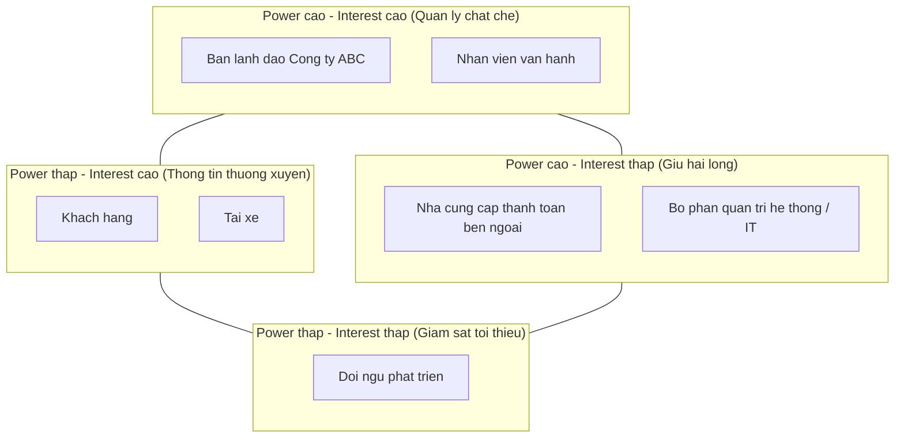
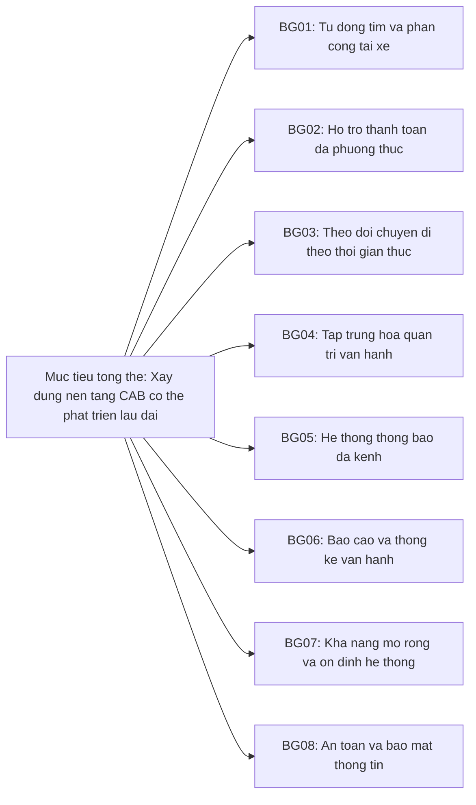
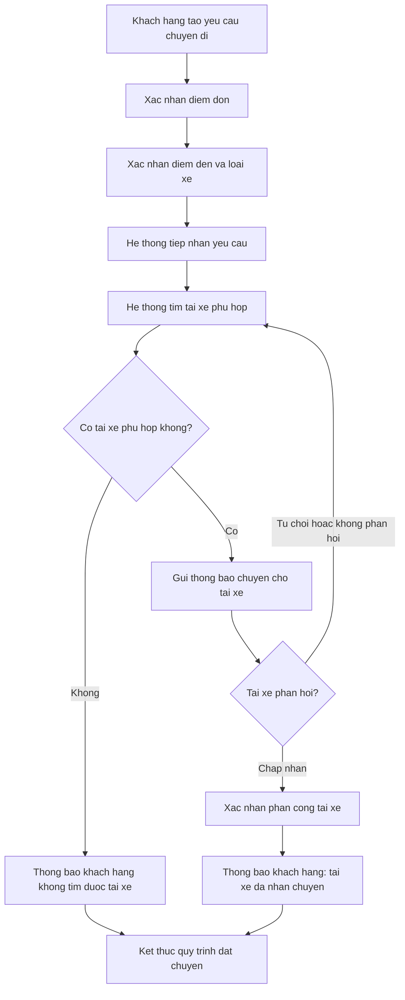
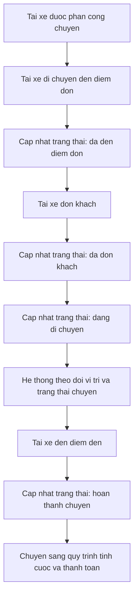
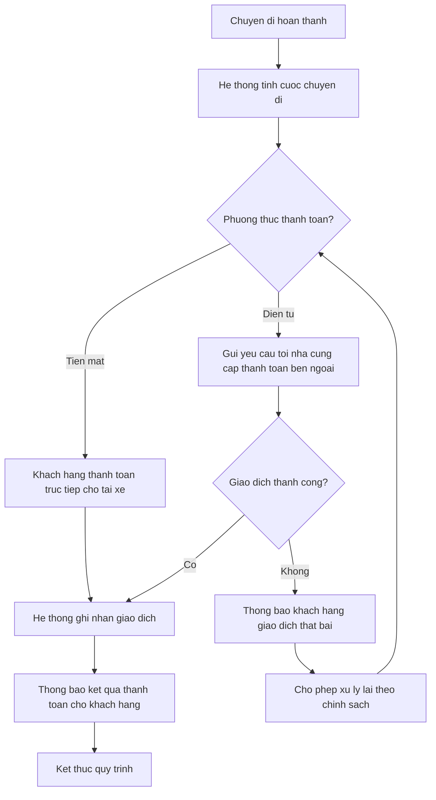
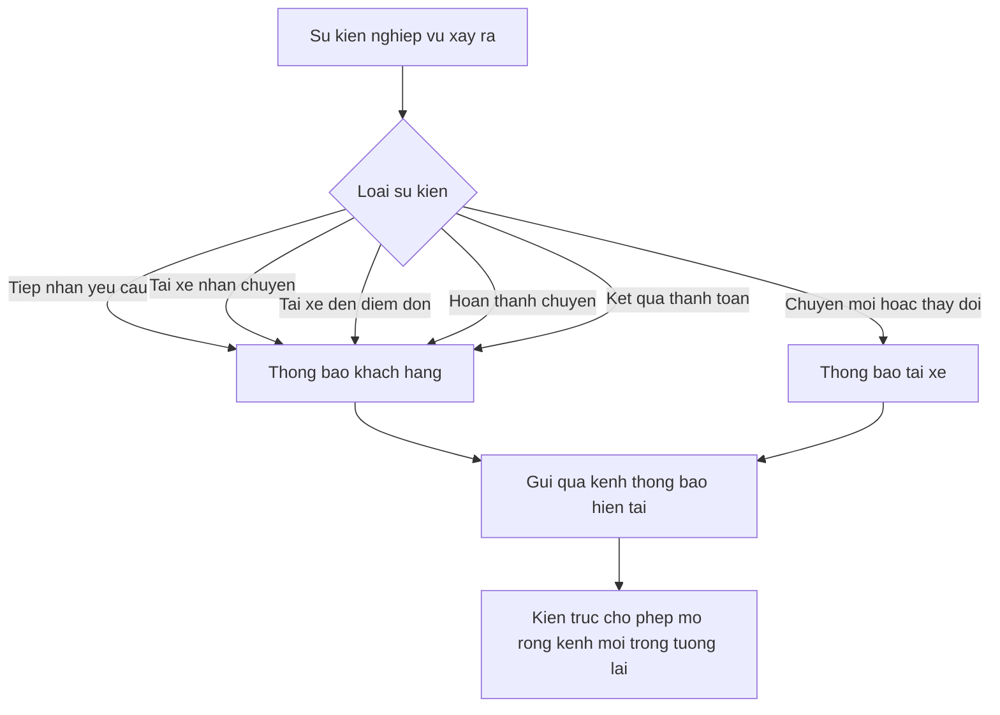
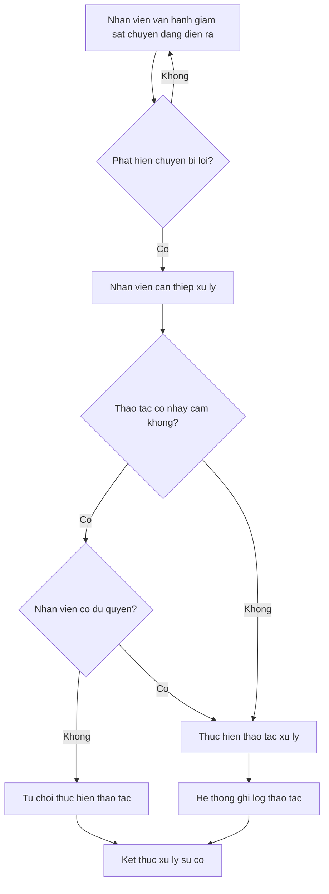
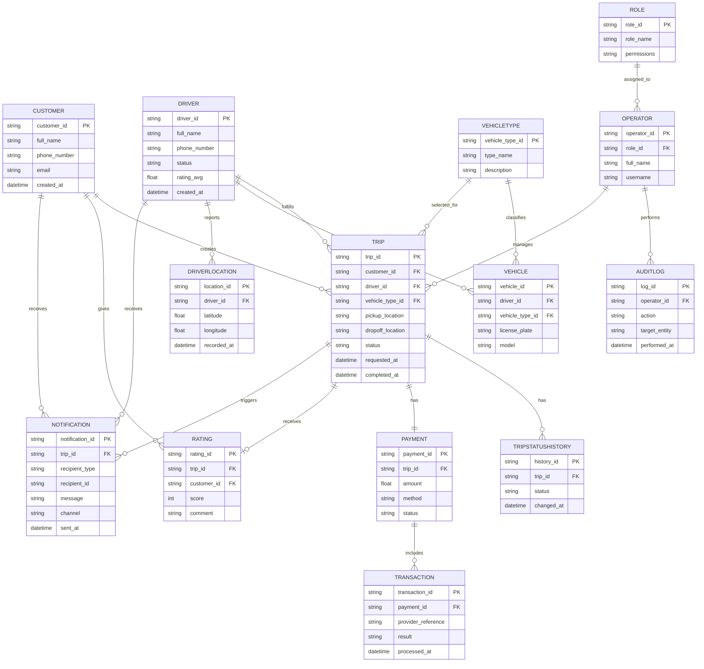
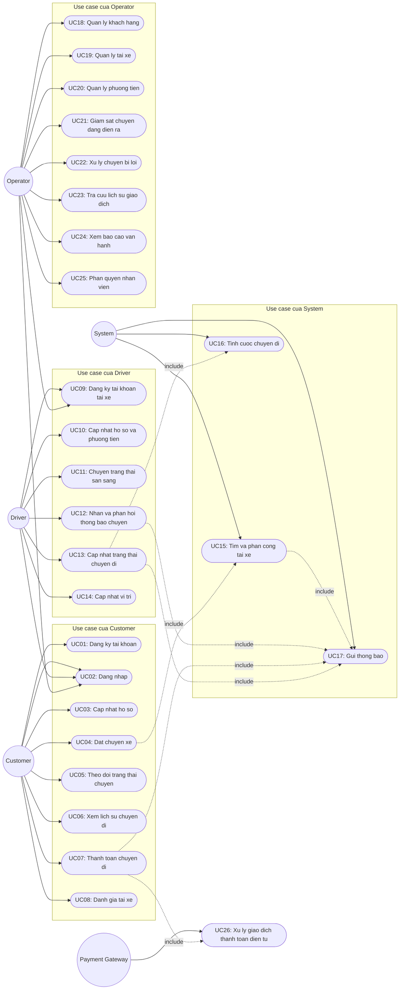

### Xây dựng hệ thống cơ bản
**Đóng vai trò:** BA (Business Analyst)

# GIAI ĐOẠN 1: PHÂN TÍCH SƠ KHỞI YÊU CẦU KHÁCH HÀNG

## 1. Business Context (Ngữ cảnh nghiệp vụ)

### 1.1. Thông tin tổng quan

| Mục | Nội dung |
|---|---|
| Khách hàng | Công ty ABC |
| Lĩnh vực | Dịch vụ đặt xe trực tuyến (ride-hailing) |
| Tên dự án | CAB System - Nền tảng đặt xe |
| Thời gian triển khai | 7 tuần (MVB) |
| Loại hình | Xây dựng mới, thay thế hệ thống hiện tại |

### 1.2. Hiện trạng nghiệp vụ (As-Is)

Công ty ABC hiện đang vận hành dịch vụ đặt xe thông qua hai kênh song song:

- Tổng đài (liên hệ trực tiếp để yêu cầu xe)
- Một ứng dụng đặt xe ở mức đơn giản

Quy trình vận hành hiện tại mang tính thủ công, cụ thể:

- Việc phân công tài xế cho khách hàng chủ yếu do con người thực hiện, chưa có cơ chế tự động hóa dựa trên vị trí hoặc trạng thái tài xế
- Khách hàng không có công cụ để theo dõi trạng thái chuyến đi theo thời gian thực
- Thông tin thanh toán chưa được tập trung hóa, dẫn đến khó khăn trong việc quản lý và đối soát
- Bộ phận vận hành gặp trở ngại kỹ thuật/quy trình khi muốn mở rộng quy mô hệ thống

### 1.3. Các bên liên quan (Stakeholders) được xác định sơ bộ

| Nhóm | Vai trò trong hệ thống |
|---|---|
| Khách hàng (Customer) | Người sử dụng dịch vụ đặt xe |
| Tài xế (Driver) | Người cung cấp dịch vụ vận chuyển |
| Nhân viên vận hành (Operator/Admin) | Quản lý, giám sát và xử lý sự cố vận hành |
| Ban lãnh đạo Công ty ABC | Người ra quyết định, kỳ vọng về báo cáo và khả năng mở rộng |
| Nhà cung cấp thanh toán bên ngoài | Đối tác tích hợp xử lý giao dịch điện tử |

### 1.4. Ràng buộc nghiệp vụ đã biết tại thời điểm này

- Thời gian triển khai giới hạn trong 7 tuần cho bản MVB
- Hệ thống phải phục vụ được số lượng lớn khách hàng và tài xế (yêu cầu về khả năng mở rộng ngay từ đầu)
- Không được lưu trữ trực tiếp thông tin thanh toán nhạy cảm (thẻ/tài khoản) trong hệ thống CAB
- Kiến trúc phải đủ linh hoạt để bổ sung loại dịch vụ mới, phương thức thanh toán mới, kênh thông báo mới trong tương lai mà không phải xây dựng lại toàn bộ hệ thống
- Các thành phần hệ thống cần có khả năng mở rộng độc lập, lỗi ở một chức năng (ví dụ thanh toán, thông báo) không được làm gián đoạn toàn bộ hệ thống

---

## 2. Business Purpose (Vấn đề nghiệp vụ)

### 2.1. Vấn đề cốt lõi cần giải quyết

| Vấn đề hiện tại | Tác động nghiệp vụ |
|---|---|
| Phân công tài xế thủ công | Chậm trễ, thiếu tối ưu, khó mở rộng theo quy mô |
| Không có cơ chế theo dõi chuyến đi thời gian thực | Trải nghiệm khách hàng kém, tăng số lượng liên hệ hỗ trợ |
| Thông tin thanh toán phân tán, không tập trung | Khó đối soát, khó kiểm soát rủi ro tài chính |
| Hệ thống hiện tại khó mở rộng | Hạn chế khả năng tăng trưởng số lượng khách hàng/tài xế |
| Thiếu công cụ quản trị và báo cáo tập trung | Ban lãnh đạo và vận hành thiếu dữ liệu để ra quyết định |

### 2.2. Mục tiêu nghiệp vụ mà hệ thống mới hướng tới

- Tự động hóa quy trình tìm và phân công tài xế dựa trên vị trí, trạng thái sẵn sàng và tiêu chí vận hành
- Cho phép khách hàng theo dõi toàn bộ vòng đời chuyến đi: từ lúc gửi yêu cầu, tìm tài xế, tài xế nhận chuyến, di chuyển, đến hoàn thành và thanh toán
- Tập trung hóa việc quản lý thanh toán và tính cước, hỗ trợ cả tiền mặt và thanh toán điện tử qua đối tác bên ngoài
- Cung cấp giao diện quản trị tập trung cho nhân viên vận hành để quản lý khách hàng, tài xế, phương tiện, chuyến đi và xử lý sự cố
- Cung cấp hệ thống báo cáo cho ban lãnh đạo về số lượng chuyến, doanh thu, tỷ lệ hoàn thành, tỷ lệ hủy và hiệu quả hoạt động tài xế
- Xây dựng kiến trúc có khả năng mở rộng (scale độc lập theo thành phần) và mở rộng chức năng trong tương lai mà không gây gián đoạn hệ thống đang vận hành
- Đảm bảo an toàn thông tin: xác thực người dùng, phân quyền thao tác quản trị, bảo vệ dữ liệu cá nhân/vị trí/giao dịch, và lưu vết (audit log) các thao tác quan trọng

### 2.3. Giá trị kỳ vọng đối với các nhóm liên quan

| Nhóm | Giá trị kỳ vọng |
|---|---|
| Khách hàng | Đặt xe nhanh, theo dõi chuyến minh bạch, thanh toán thuận tiện |
| Tài xế | Nhận chuyến rõ ràng, cập nhật trạng thái dễ dàng, minh bạch về chuyến được phân công |
| Nhân viên vận hành | Công cụ giám sát và xử lý sự cố tập trung, phân quyền rõ ràng |
| Ban lãnh đạo | Dữ liệu báo cáo để đánh giá hiệu quả vận hành và ra quyết định mở rộng |

# GIAI ĐOẠN 1 (tiếp theo): XÁC ĐỊNH STAKEHOLDERS

## 1. Danh sách Stakeholders và Vai trò

| Stakeholder | Vai trò |
|---|---|
| Khách hàng (Customer) | Người sử dụng dịch vụ đặt xe, tạo yêu cầu chuyến đi, thanh toán và đánh giá tài xế |
| Tài xế (Driver) | Người cung cấp dịch vụ vận chuyển, nhận và thực hiện chuyến đi |
| Nhân viên vận hành (Operator) | Quản lý khách hàng, tài xế, phương tiện, chuyến đi; xử lý sự cố vận hành hàng ngày |
| Ban lãnh đạo Công ty ABC (Sponsor/Management) | Phê duyệt phạm vi dự án, ra quyết định chiến lược, tiêu thụ báo cáo doanh thu và hiệu quả hoạt động |
| Nhà cung cấp thanh toán bên ngoài (Payment Gateway Provider) | Đối tác tích hợp xử lý giao dịch thanh toán điện tử |
| Business Analyst (BA) | Phân tích, làm rõ yêu cầu, xác định phạm vi, tài liệu hóa SRS |
| Đội ngũ phát triển (Development Team) | Thiết kế và xây dựng hệ thống dựa trên yêu cầu được BA tài liệu hóa |
| Bộ phận quản trị hệ thống/kỹ thuật (Technical/IT Admin) | Vận hành hạ tầng, đảm bảo khả năng mở rộng và ổn định hệ thống |

## 2. Stakeholder Matrix (Mức độ ảnh hưởng - Mức độ quan tâm)

Ma trận dưới đây phân loại stakeholders theo hai trục: **Power (Mức độ ảnh hưởng/quyền quyết định)** và **Interest (Mức độ quan tâm/tác động trực tiếp bởi hệ thống)**.

## 3. Diễn giải ma trận

| Nhóm | Power (Ảnh hưởng) | Interest (Quan tâm) | Chiến lược tương tác |
|---|---|---|---|
| Ban lãnh đạo Công ty ABC | Cao | Cao | Quản lý chặt chẽ, báo cáo định kỳ, cần phê duyệt các quyết định lớn |
| Nhân viên vận hành | Cao | Cao | Tham gia sâu vào giai đoạn thu thập yêu cầu, là người dùng chính của phân hệ quản trị |
| Nhà cung cấp thanh toán bên ngoài | Cao | Thấp | Cần đáp ứng yêu cầu tích hợp kỹ thuật, giữ hài lòng về ràng buộc bảo mật |
| Bộ phận quản trị hệ thống/IT | Cao | Thấp | Đảm bảo yêu cầu phi chức năng (khả năng mở rộng, ổn định) được đáp ứng |
| Khách hàng | Thấp | Cao | Thông tin thường xuyên qua sản phẩm, thu thập phản hồi trải nghiệm |
| Tài xế | Thấp | Cao | Thông tin thường xuyên qua sản phẩm, thu thập phản hồi vận hành |
| Đội ngũ phát triển | Thấp | Thấp | Giám sát tối thiểu ở giai đoạn phân tích, chủ động ở giai đoạn xây dựng |

# GIAI ĐOẠN 1 (tiếp theo): XÁC ĐỊNH MỤC TIÊU NGHIỆP VỤ (BUSINESS GOALS)

## Danh sách Business Goals

| Mã | Mục tiêu nghiệp vụ | Mô tả |
|---|---|---|
| BG01 | Tự động tìm và phân công tài xế | Hệ thống tự động xác định và đề xuất tài xế phù hợp dựa trên vị trí, trạng thái sẵn sàng và tiêu chí vận hành, có cơ chế tìm tài xế khác khi tài xế được đề xuất không phản hồi hoặc từ chối |
| BG02 | Hỗ trợ thanh toán đa phương thức | Cho phép khách hàng thanh toán bằng tiền mặt hoặc thanh toán điện tử thông qua nhà cung cấp thanh toán bên ngoài, không lưu trữ trực tiếp thông tin nhạy cảm của thẻ/tài khoản trong hệ thống CAB |
| BG03 | Theo dõi chuyến đi theo thời gian thực | Cho phép khách hàng và tài xế theo dõi, cập nhật trạng thái chuyến đi xuyên suốt từ khi tạo yêu cầu đến khi hoàn thành |
| BG04 | Tập trung hóa quản trị vận hành | Cung cấp giao diện quản trị cho nhân viên vận hành để quản lý khách hàng, tài xế, phương tiện, chuyến đi và xử lý các trường hợp chuyến bị lỗi |
| BG05 | Cung cấp hệ thống thông báo đa kênh | Gửi thông báo tới khách hàng và tài xế tại các mốc quan trọng của chuyến đi (tiếp nhận yêu cầu, tài xế nhận chuyến, tài xế đến điểm đón, hoàn thành chuyến, kết quả thanh toán), có khả năng mở rộng thêm kênh trong tương lai |
| BG06 | Cung cấp báo cáo và thống kê vận hành | Cung cấp cho ban lãnh đạo báo cáo về số lượng chuyến, doanh thu, tỷ lệ chuyến hoàn thành, tỷ lệ hủy và hiệu quả hoạt động của tài xế |
| BG07 | Đảm bảo khả năng mở rộng và ổn định hệ thống | Xây dựng kiến trúc cho phép các thành phần mở rộng độc lập, hạn chế ảnh hưởng dây chuyền khi một chức năng gặp lỗi, và cho phép triển khai tính năng mới từng phần |
| BG08 | Đảm bảo an toàn và bảo mật thông tin | Xác thực người dùng trước khi sử dụng chức năng yêu cầu tài khoản, kiểm soát quyền truy cập với thao tác quản trị, bảo vệ dữ liệu cá nhân/phương tiện/vị trí/giao dịch, và lưu vết các thao tác quan trọng |

## Sơ đồ liên kết Business Goals

# GIAI ĐOẠN 1 (tiếp theo): B4 - XÁC ĐỊNH PHẠM VI DỰ ÁN (SCOPE)

## 1. Trong phạm vi (In-Scope) - Các module cơ bản cho MVB (7 tuần)

| STT | Module | Nội dung |
|---|---|---|
| 1 | Quản lý tài khoản khách hàng | Đăng ký, đăng nhập, cập nhật thông tin cá nhân |
| 2 | Quản lý tài khoản tài xế | Đăng ký hoặc được vận hành tạo tài khoản, cập nhật hồ sơ, phương tiện, trạng thái hoạt động |
| 3 | Đặt chuyến xe | Nhập điểm đón, điểm đến, chọn loại xe, gửi yêu cầu đặt xe |
| 4 | Tìm và phân công tài xế | Xác định tài xế phù hợp theo vị trí và trạng thái sẵn sàng; xử lý khi tài xế từ chối/không phản hồi |
| 5 | Theo dõi trạng thái chuyến đi | Cập nhật trạng thái theo thời gian thực cho khách hàng và tài xế |
| 6 | Tính cước và thanh toán | Tính số tiền phải trả; thanh toán tiền mặt và điện tử qua cổng thanh toán ngoài |
| 7 | Thông báo | Thông báo cho khách hàng và tài xế tại các mốc quan trọng của chuyến đi |
| 8 | Lịch sử chuyến đi và đánh giá | Xem lịch sử chuyến, số tiền đã thanh toán, đánh giá tài xế sau chuyến |
| 9 | Giao diện quản trị vận hành | Quản lý khách hàng, tài xế, phương tiện, chuyến đi |
| 10 | Phân quyền quản trị | Giới hạn thao tác nhạy cảm chỉ dành cho nhân viên được cấp quyền |
| 11 | Báo cáo vận hành | Số lượng chuyến, doanh thu, tỷ lệ hoàn thành, tỷ lệ hủy, hiệu quả tài xế |
| 12 | Xác thực và bảo mật cơ bản | Xác thực người dùng, kiểm soát truy cập, lưu vết thao tác quan trọng |

## 2. Ngoài phạm vi (Out-of-Scope) đề xuất cho MVB - cần xác nhận với khách hàng

> Lưu ý: Tài liệu gốc của khách hàng chưa nêu rõ các mục loại trừ. Danh sách dưới đây là đề xuất của BA dựa trên ràng buộc thời gian 7 tuần, cần được xác nhận lại với khách hàng trước khi chốt phạm vi chính thức.

| STT | Hạng mục | Lý do đề xuất loại trừ khỏi MVB |
|---|---|---|
| 1 | Đặt xe hộ người khác, đặt xe đặt trước (lịch trong tương lai) | Không được đề cập trong yêu cầu gốc; tăng độ phức tạp nghiệp vụ |
| 2 | Chat trực tiếp giữa khách hàng và tài xế | Không được đề cập; thuộc nhóm tính năng mở rộng sau MVB |
| 3 | Chương trình khuyến mãi, mã giảm giá, tích điểm | Không được đề cập trong yêu cầu gốc |
| 4 | Đa dạng nhiều cổng/ví thanh toán cùng lúc | Yêu cầu gốc chỉ đề cập tích hợp với một nhà cung cấp thanh toán bên ngoài |
| 5 | Dashboard báo cáo nâng cao, phân tích chuyên sâu (BI) | Yêu cầu gốc chỉ đề cập các chỉ số báo cáo cơ bản |
| 6 | Đa kênh thông báo đầy đủ ngay từ đầu (chỉ triển khai một kênh cơ bản, kiến trúc chừa chỗ mở rộng) | Yêu cầu gốc nêu rõ "mở rộng thêm kênh thông báo trong tương lai", ngụ ý MVB chỉ cần một kênh |
| 7 | Quản lý đội xe nâng cao (fleet management, nhiều phương tiện/tài xế) | Không được đề cập trong yêu cầu gốc |
| 8 | Đa ngôn ngữ, đa khu vực tiền tệ | Không được đề cập trong yêu cầu gốc |

---

# B5 - CHUYỂN ĐỔI THÀNH YÊU CẦU NGHIỆP VỤ (BUSINESS REQUIREMENTS)

| Mã | Tên yêu cầu | Diễn giải |
|---|---|---|
| BR01 | Đăng ký / Đăng nhập khách hàng | Khách hàng có thể tạo tài khoản và đăng nhập vào hệ thống để sử dụng dịch vụ |
| BR02 | Cập nhật thông tin cá nhân khách hàng | Khách hàng có thể chỉnh sửa thông tin hồ sơ cá nhân của mình |
| BR03 | Đặt chuyến xe | Khách hàng nhập điểm đón, điểm đến, chọn loại xe và gửi yêu cầu đặt xe |
| BR04 | Theo dõi trạng thái chuyến đi | Khách hàng xem được trạng thái hiện tại của chuyến (đang tìm tài xế, tài xế đã nhận, thời gian dự kiến đến, v.v.) |
| BR05 | Xem lịch sử chuyến đi | Khách hàng tra cứu các chuyến đã thực hiện và số tiền đã thanh toán |
| BR06 | Đánh giá tài xế | Khách hàng đánh giá tài xế sau khi hoàn thành chuyến |
| BR07 | Đăng ký / Tạo tài khoản tài xế | Tài xế tự đăng ký hoặc được nhân viên vận hành tạo tài khoản |
| BR08 | Cập nhật hồ sơ và phương tiện của tài xế | Tài xế cập nhật thông tin cá nhân, thông tin phương tiện, trạng thái hoạt động |
| BR09 | Chuyển trạng thái sẵn sàng nhận chuyến | Tài xế chuyển đổi giữa trạng thái sẵn sàng và không sẵn sàng nhận chuyến |
| BR10 | Nhận và phản hồi thông báo chuyến mới | Tài xế nhận thông báo khi có chuyến phù hợp và có thể chấp nhận hoặc từ chối |
| BR11 | Cập nhật trạng thái thực hiện chuyến | Tài xế cập nhật các mốc: đã đến điểm đón, đã đón khách, đang di chuyển, hoàn thành chuyến |
| BR12 | Ghi nhận vị trí tài xế | Hệ thống lưu vị trí tài xế để hỗ trợ tìm tài xế gần khách hàng và dự kiến thời gian đến |
| BR13 | Tìm và phân công tài xế tự động | Hệ thống xác định tài xế phù hợp dựa trên vị trí, trạng thái sẵn sàng; tự động tìm tài xế khác nếu tài xế trước không phản hồi/từ chối |
| BR14 | Tính cước chuyến đi | Hệ thống xác định số tiền khách hàng phải trả dựa trên loại dịch vụ và thông tin chuyến đi |
| BR15 | Thanh toán bằng tiền mặt | Khách hàng có thể thanh toán trực tiếp bằng tiền mặt cho tài xế |
| BR16 | Thanh toán điện tử | Khách hàng thanh toán qua nhà cung cấp thanh toán bên ngoài, không lưu thông tin nhạy cảm trong hệ thống CAB |
| BR17 | Xử lý thanh toán thất bại | Hệ thống thông báo cho khách hàng và cho phép xử lý lại khi giao dịch điện tử thất bại |
| BR18 | Thông báo cho khách hàng | Gửi thông báo tại các mốc: tiếp nhận yêu cầu, tài xế nhận chuyến, tài xế đến điểm đón, hoàn thành chuyến, kết quả thanh toán |
| BR19 | Thông báo cho tài xế | Gửi thông báo về chuyến mới hoặc thay đổi liên quan đến chuyến đang thực hiện |
| BR20 | Quản lý dữ liệu vận hành | Nhân viên vận hành quản lý khách hàng, tài xế, phương tiện, chuyến đi qua giao diện quản trị |
| BR21 | Phân quyền chức năng quản trị | Giới hạn các thao tác nhạy cảm chỉ cho nhân viên được cấp quyền phù hợp |
| BR22 | Báo cáo vận hành | Cung cấp báo cáo số lượng chuyến, doanh thu, tỷ lệ hoàn thành, tỷ lệ hủy, hiệu quả tài xế cho ban lãnh đạo |
| BR23 | Xác thực người dùng | Khách hàng và tài xế phải được xác thực trước khi sử dụng các chức năng yêu cầu tài khoản |
| BR24 | Lưu vết thao tác quan trọng | Hệ thống ghi log các thao tác quan trọng phục vụ kiểm tra khi có sự cố |

---

# B6 - XÂY DỰNG QUY TRÌNH NGHIỆP VỤ (BUSINESS PROCESS)

## Quy trình 1: Đặt chuyến và tìm tài xế (Booking & Driver Matching)

**Các bước:**
1. Khách hàng tạo yêu cầu chuyến đi
2. Khách hàng xác nhận điểm đón
3. Khách hàng xác nhận điểm đến và loại xe
4. Hệ thống tiếp nhận và xác nhận yêu cầu
5. Hệ thống tìm tài xế phù hợp (theo vị trí, trạng thái sẵn sàng, tiêu chí vận hành)
6. Hệ thống gửi thông báo chuyến cho tài xế được đề xuất
7. Tài xế chấp nhận hoặc từ chối/không phản hồi
8. Nếu chấp nhận: xác nhận phân công, thông báo cho khách hàng
9. Nếu từ chối/không phản hồi: hệ thống tự động tìm tài xế khác (không yêu cầu khách hàng tạo lại yêu cầu)
10. Nếu không tìm được tài xế sau các lần thử: thông báo rõ ràng cho khách hàng

## Quy trình 2: Thực hiện chuyến đi (Trip Execution)

**Các bước:**
1. Tài xế đã được phân công di chuyển đến điểm đón
2. Tài xế cập nhật trạng thái "đã đến điểm đón"
3. Tài xế đón khách, cập nhật trạng thái "đã đón khách"
4. Tài xế cập nhật trạng thái "đang di chuyển"
5. Khách hàng và hệ thống theo dõi hành trình theo thời gian thực (dựa trên vị trí tài xế)
6. Tài xế cập nhật trạng thái "hoàn thành chuyến" khi đến điểm đến
7. Hệ thống chuyển sang quy trình tính cước và thanh toán

## Quy trình 3: Tính cước và thanh toán (Fare Calculation & Payment)

**Các bước:**
1. Chuyến đi hoàn thành
2. Hệ thống tính số tiền phải trả dựa trên loại dịch vụ và thông tin chuyến đi
3. Khách hàng chọn phương thức thanh toán: tiền mặt hoặc điện tử
4. Nếu tiền mặt: khách hàng thanh toán trực tiếp cho tài xế, hệ thống ghi nhận giao dịch
5. Nếu điện tử: hệ thống gửi yêu cầu thanh toán tới nhà cung cấp thanh toán bên ngoài
6. Nếu giao dịch điện tử thành công: hệ thống ghi nhận, thông báo kết quả cho khách hàng
7. Nếu giao dịch điện tử thất bại: hệ thống thông báo khách hàng và cho phép xử lý lại theo chính sách doanh nghiệp

## Quy trình 4: Thông báo (Notification Process)

**Các bước:**
1. Hệ thống xác định sự kiện cần thông báo (tiếp nhận yêu cầu, tài xế nhận chuyến, tài xế đến điểm đón, hoàn thành chuyến, kết quả thanh toán, chuyến mới/thay đổi cho tài xế)
2. Hệ thống xác định đối tượng nhận (khách hàng hoặc tài xế)
3. Hệ thống gửi thông báo qua kênh hiện có
4. Kiến trúc cho phép bổ sung kênh thông báo mới trong tương lai mà không ảnh hưởng luồng hiện tại

## Quy trình 5: Quản trị và xử lý sự cố chuyến đi (Operator Handling)

**Các bước:**
1. Nhân viên vận hành giám sát các chuyến đang diễn ra và trạng thái tài xế
2. Khi phát hiện chuyến bị lỗi (ví dụ: tài xế mất kết nối, chuyến bị treo), nhân viên can thiệp xử lý
3. Nhân viên tra cứu lịch sử giao dịch liên quan nếu cần
4. Các thao tác nhạy cảm chỉ thực hiện được nếu nhân viên có quyền phù hợp
5. Hệ thống ghi log thao tác xử lý để phục vụ kiểm tra sau này

# GIAI ĐOẠN 2: PHÂN RÃ YÊU CẦU VÀ THIẾT KẾ CHI TIẾT

## B7 - PHÂN RÃ YÊU CẦU CHỨC NĂNG (FUNCTIONAL REQUIREMENTS - FR)

Mỗi Business Requirement (BR) ở giai đoạn trước được phân rã thành các Functional Requirement (FR) cụ thể, mô tả hành vi kỹ thuật/chức năng mà hệ thống phải thực hiện.

### FR nhóm BR01-BR02: Quản lý tài khoản khách hàng

| Mã | Tên FR | Diễn giải |
|---|---|---|
| FR01 | Đăng ký tài khoản khách hàng | Hệ thống cho phép khách hàng tạo tài khoản mới với thông tin cơ bản (họ tên, số điện thoại, mật khẩu) |
| FR02 | Đăng nhập khách hàng | Hệ thống xác thực khách hàng qua số điện thoại/email và mật khẩu |
| FR03 | Cập nhật hồ sơ khách hàng | Hệ thống cho phép khách hàng chỉnh sửa thông tin cá nhân đã đăng ký |

### FR nhóm BR03: Đặt chuyến xe

| Mã | Tên FR | Diễn giải |
|---|---|---|
| FR04 | Nhập điểm đón | Khách hàng nhập hoặc chọn điểm đón trên bản đồ |
| FR05 | Nhập điểm đến | Khách hàng nhập hoặc chọn điểm đến trên bản đồ |
| FR06 | Chọn loại xe | Khách hàng chọn loại dịch vụ/loại xe mong muốn |
| FR07 | Gửi yêu cầu đặt xe | Hệ thống ghi nhận yêu cầu đặt xe và chuyển sang trạng thái tìm tài xế |

### FR nhóm BR13: Tìm và phân công tài xế (Driver Matching)

| Mã | Tên FR | Diễn giải |
|---|---|---|
| FR08 | Xác định vị trí của khách hàng | Hệ thống lấy tọa độ điểm đón làm gốc để tìm kiếm |
| FR09 | Xác định tài xế online trong bán kính | Hệ thống lọc các tài xế đang ở trạng thái sẵn sàng, trong bán kính tìm kiếm quanh điểm đón |
| FR10 | Lọc theo loại xe khách hàng đã chọn | Hệ thống chỉ chọn các tài xế có phương tiện phù hợp với loại xe khách hàng yêu cầu |
| FR11 | Lọc theo đánh giá tài xế (điều kiện) | Nếu yêu cầu đặt xe có tiêu chí "tài xế đánh giá cao", hệ thống ưu tiên/lọc tài xế theo rating; nếu không có tiêu chí này thì bỏ qua bước lọc |
| FR12 | Sắp xếp và đề xuất tài xế | Hệ thống xếp hạng danh sách tài xế phù hợp (theo khoảng cách, rating nếu có) và gửi đề xuất cho tài xế đầu danh sách |
| FR13 | Xử lý phản hồi của tài xế | Hệ thống ghi nhận tài xế chấp nhận hoặc từ chối chuyến |
| FR14 | Tìm tài xế thay thế | Nếu tài xế từ chối hoặc không phản hồi trong thời hạn, hệ thống tự động chuyển đề xuất sang tài xế tiếp theo trong danh sách |
| FR15 | Thông báo không tìm được tài xế | Nếu không còn tài xế phù hợp sau các lần thử, hệ thống thông báo cho khách hàng |

### FR nhóm BR07-BR12: Quản lý tài xế và thực hiện chuyến

| Mã | Tên FR | Diễn giải |
|---|---|---|
| FR16 | Đăng ký/tạo tài khoản tài xế | Tài xế tự đăng ký hoặc được nhân viên vận hành tạo tài khoản |
| FR17 | Cập nhật hồ sơ và phương tiện | Tài xế cập nhật thông tin cá nhân và thông tin phương tiện |
| FR18 | Chuyển trạng thái sẵn sàng | Tài xế bật/tắt trạng thái sẵn sàng nhận chuyến |
| FR19 | Cập nhật vị trí tài xế | Hệ thống ghi nhận vị trí hiện tại của tài xế theo chu kỳ khi đang hoạt động |
| FR20 | Cập nhật trạng thái chuyến đi | Tài xế cập nhật các mốc: đã đến điểm đón, đã đón khách, đang di chuyển, hoàn thành chuyến |

### FR nhóm BR14-BR17: Tính cước và thanh toán

| Mã | Tên FR | Diễn giải |
|---|---|---|
| FR21 | Tính cước chuyến đi | Hệ thống tính số tiền phải trả dựa trên loại dịch vụ và thông tin hành trình |
| FR22 | Thanh toán tiền mặt | Hệ thống ghi nhận giao dịch thanh toán tiền mặt sau khi khách hàng trả trực tiếp cho tài xế |
| FR23 | Thanh toán điện tử | Hệ thống gửi yêu cầu thanh toán tới cổng thanh toán bên ngoài và nhận kết quả |
| FR24 | Xử lý thanh toán thất bại | Hệ thống thông báo khách hàng và cho phép thử lại giao dịch khi thanh toán điện tử thất bại |

### FR nhóm BR18-BR19: Thông báo

| Mã | Tên FR | Diễn giải |
|---|---|---|
| FR25 | Gửi thông báo cho khách hàng | Hệ thống gửi thông báo tại các mốc: tiếp nhận yêu cầu, tài xế nhận chuyến, tài xế đến điểm đón, hoàn thành chuyến, kết quả thanh toán |
| FR26 | Gửi thông báo cho tài xế | Hệ thống gửi thông báo về chuyến mới hoặc thay đổi liên quan chuyến đang thực hiện |

### FR nhóm BR20-BR22: Quản trị vận hành

| Mã | Tên FR | Diễn giải |
|---|---|---|
| FR27 | Xem danh sách chuyến đang diễn ra | Nhân viên vận hành xem trạng thái các chuyến hiện tại |
| FR28 | Kiểm tra trạng thái tài xế | Nhân viên vận hành tra cứu trạng thái hoạt động của tài xế |
| FR29 | Xử lý chuyến bị lỗi | Nhân viên vận hành can thiệp thủ công vào chuyến gặp sự cố |
| FR30 | Tra cứu lịch sử giao dịch | Nhân viên vận hành tìm kiếm lịch sử chuyến và thanh toán |
| FR31 | Phân quyền chức năng | Hệ thống giới hạn thao tác nhạy cảm theo vai trò nhân viên |
| FR32 | Xem báo cáo vận hành | Hệ thống hiển thị báo cáo số chuyến, doanh thu, tỷ lệ hoàn thành/hủy, hiệu quả tài xế |

### FR nhóm BR23-BR24: Bảo mật

| Mã | Tên FR | Diễn giải |
|---|---|---|
| FR33 | Xác thực người dùng | Hệ thống yêu cầu đăng nhập trước khi truy cập chức năng có tài khoản |
| FR34 | Ghi log thao tác quan trọng | Hệ thống lưu vết các thao tác quản trị và giao dịch quan trọng |

---

## B8 - QUY TẮC NGHIỆP VỤ (BUSINESS RULES) VÀ NGOẠI LỆ (EXCEPTIONS)

### 1. Business Rules

| Mã | Quy tắc nghiệp vụ |
|---|---|
| BRule01 | Chỉ tài xế đang ở trạng thái sẵn sàng (online) mới được hệ thống đề xuất nhận chuyến |
| BRule02 | Một tài xế chỉ được nhận một chuyến tại một thời điểm |
| BRule03 | Hệ thống chỉ đề xuất chuyến cho tài xế có loại phương tiện khớp với loại xe khách hàng đã chọn |
| BRule04 | Nếu yêu cầu đặt xe có tiêu chí rating cao, chỉ đề xuất tài xế đạt ngưỡng đánh giá tối thiểu (ngưỡng cụ thể - *TBD*, cần xác nhận với khách hàng) |
| BRule05 | Tài xế phải phản hồi (chấp nhận/từ chối) trong một khoảng thời gian giới hạn (thời hạn cụ thể - *TBD*, cần xác nhận với khách hàng); quá thời hạn được xem như từ chối |
| BRule06 | Thông tin thanh toán nhạy cảm (số thẻ, tài khoản) không được lưu trực tiếp trong hệ thống CAB, chỉ lưu tham chiếu giao dịch từ cổng thanh toán |
| BRule07 | Chỉ nhân viên vận hành có quyền phù hợp mới được thực hiện các thao tác quản trị nhạy cảm |
| BRule08 | Mọi thao tác quản trị và giao dịch quan trọng đều phải được ghi log để phục vụ kiểm tra |
| BRule09 | Cước phí chuyến đi được tính dựa trên loại dịch vụ và thông tin hành trình đã hoàn thành (công thức cụ thể - *TBD*, cần xác nhận với khách hàng) |
| BRule10 | Trạng thái chuyến đi phải tuân theo trình tự: tạo yêu cầu -> tìm tài xế -> đã phân công -> đến điểm đón -> đã đón khách -> đang di chuyển -> hoàn thành |

### 2. Exceptions (Ngoại lệ) và cách xử lý

| Mã | Tình huống ngoại lệ | Cách xử lý (đề xuất, cần xác nhận với khách hàng) |
|---|---|---|
| EX01 | Tài xế được đề xuất không phản hồi trong thời hạn quy định | Hệ thống tự động chuyển đề xuất sang tài xế tiếp theo trong danh sách phù hợp (theo FR14) |
| EX02 | Tài xế từ chối chuyến | Hệ thống tự động tìm và đề xuất tài xế khác, không yêu cầu khách hàng tạo lại yêu cầu |
| EX03 | Không tìm được tài xế phù hợp nào trong khu vực | Hệ thống thông báo rõ cho khách hàng rằng không tìm được tài xế, đề xuất khách hàng thử lại sau |
| EX04 | Khách hàng chờ tìm tài xế quá lâu | Cần định nghĩa ngưỡng thời gian chờ tối đa; khi vượt ngưỡng, hệ thống tự động hủy yêu cầu và thông báo khách hàng (chính sách cụ thể - *TBD*) |
| EX05 | Giao dịch thanh toán điện tử thất bại | Hệ thống thông báo khách hàng, cho phép chọn phương thức thanh toán khác hoặc thử lại theo chính sách doanh nghiệp |
| EX06 | Tài xế mất kết nối mạng trong khi thực hiện chuyến | Hệ thống đánh dấu chuyến ở trạng thái cần theo dõi, nhân viên vận hành có thể can thiệp thủ công (chính sách xử lý cụ thể - *TBD*) |
| EX07 | Khách hàng muốn hủy chuyến sau khi đã có tài xế nhận | Cần chính sách hủy chuyến cụ thể (phí hủy, thời điểm được phép hủy) - *TBD*, cần xác nhận với khách hàng |
| EX08 | Tài xế hủy chuyến giữa chừng sau khi đã nhận | Hệ thống cần đưa chuyến trở lại quy trình tìm tài xế mới, đồng thời ghi nhận hành vi hủy để phục vụ đánh giá hiệu quả tài xế (chính sách xử phạt cụ thể - *TBD*) |
| EX09 | Nhân viên vận hành không đủ quyền thực hiện thao tác nhạy cảm | Hệ thống từ chối thao tác và ghi log lần thử truy cập |
| EX10 | Hệ thống thanh toán hoặc thông báo gặp sự cố | Chức năng đặt xe và thực hiện chuyến vẫn phải hoạt động bình thường (theo yêu cầu phi chức năng về khả năng chịu lỗi độc lập giữa các thành phần) |

> Các mục đánh dấu *TBD* (To Be Determined) cần được Business Analyst làm rõ với khách hàng trước khi đội phát triển triển khai, theo đúng ghi nhận trong tài liệu yêu cầu gốc.

---

## B9 - DATA MODELING (MÔ HÌNH DỮ LIỆU)

### 1. Danh sách thực thể (Entities) chính

| Thực thể | Mô tả |
|---|---|
| Customer | Khách hàng sử dụng dịch vụ |
| Driver | Tài xế cung cấp dịch vụ |
| Vehicle | Phương tiện của tài xế |
| VehicleType | Loại xe/dịch vụ (ví dụ: tiêu chuẩn, cao cấp) |
| Trip | Chuyến đi, thực thể trung tâm của hệ thống |
| TripStatusHistory | Lịch sử thay đổi trạng thái của một chuyến |
| DriverLocation | Lịch sử/hiện trạng vị trí của tài xế |
| Payment | Thông tin thanh toán của một chuyến |
| Transaction | Giao dịch cụ thể gắn với một lần thanh toán (có thể có nhiều lần thử) |
| Notification | Thông báo gửi tới khách hàng hoặc tài xế |
| Rating | Đánh giá của khách hàng dành cho tài xế sau chuyến |
| Operator | Nhân viên vận hành |
| Role | Vai trò/quyền hạn của nhân viên vận hành |
| AuditLog | Nhật ký ghi vết các thao tác quan trọng |

### 2. Sơ đồ ERD (Entity Relationship Diagram)

### 3. Ghi chú thiết kế dữ liệu

- Thông tin nhạy cảm của thanh toán (số thẻ, mã CVV, tài khoản ngân hàng) **không** được lưu trong `PAYMENT` hoặc `TRANSACTION`; chỉ lưu tham chiếu (`provider_reference`) trả về từ nhà cung cấp thanh toán bên ngoài, đúng theo BRule06
- `TRIPSTATUSHISTORY` phục vụ việc theo dõi chuyến đi theo thời gian thực và truy vết khi xử lý sự cố (FR27-FR29)
- `DRIVERLOCATION` có thể thiết kế dưới dạng bảng lưu vết lịch sử hoặc bảng chỉ lưu vị trí hiện tại tùy theo yêu cầu phi chức năng về hiệu năng - cần làm rõ thêm ở giai đoạn thiết kế kỹ thuật
- `ROLE` và `OPERATOR` phục vụ yêu cầu phân quyền (BR21, BRule07); `AUDITLOG` phục vụ yêu cầu lưu vết (BR24, BRule08)
- Các trường liên quan tới chính sách còn *TBD* (ví dụ thời hạn phản hồi tài xế, công thức tính cước) chưa được đưa thành cấu hình cụ thể trong mô hình, sẽ được bổ sung sau khi xác nhận với khách hàng
- 

# GIAI ĐOẠN 2 (tiếp theo): B10 - NON-FUNCTIONAL REQUIREMENTS (NFR)

## Nguyên tắc áp dụng cho MVB (7 tuần)

Ở giai đoạn MVB, hệ thống ưu tiên đúng chức năng nghiệp vụ cốt lõi và kiến trúc "đủ tốt để mở rộng sau", không đặt mục tiêu tối ưu hiệu năng cực đoan hay triển khai kiến trúc phức tạp (ví dụ microservices đầy đủ) ngay từ đầu. Các NFR dưới đây được viết ở mức "chấp nhận được cho MVB" và ghi chú rõ phần nào để dành cho giai đoạn mở rộng sau.

## Danh sách Non-Functional Requirements

| Mã | Nhóm | Yêu cầu | Ghi chú áp dụng cho MVB |
|---|---|---|---|
| NFR01 | Hiệu năng (Performance) | Thời gian phản hồi cho các thao tác thông thường (đăng nhập, đặt chuyến, xem trạng thái) ở mức chấp nhận được cho người dùng, không yêu cầu ngưỡng dưới 1 giây | Không tối ưu real-time ở mức mili-giây trong MVB; ưu tiên đúng và ổn định trước, tối ưu tốc độ sau |
| NFR02 | Khả năng mở rộng (Scalability) | Kiến trúc phải cho phép các thành phần (đặt chuyến, thanh toán, thông báo) có thể tách và scale độc lập trong tương lai | MVB có thể triển khai dạng monolith module hóa rõ ràng (modular monolith), chưa cần tách microservices ngay; ranh giới module phải rõ để dễ tách sau |
| NFR03 | Độ tin cậy / Khả năng chịu lỗi (Reliability / Fault Isolation) | Lỗi ở chức năng thanh toán hoặc thông báo không được làm gián đoạn chức năng đặt xe và thực hiện chuyến | Áp dụng cơ chế cô lập lỗi cơ bản (ví dụ: gọi bất đồng bộ, retry, timeout) ngay từ MVB dù chưa cần hạ tầng phức tạp (message queue đầy đủ) |
| NFR04 | Khả năng dùng lại/mở rộng chức năng (Extensibility) | Có thể bổ sung loại dịch vụ mới, phương thức thanh toán mới, kênh thông báo mới mà không viết lại toàn bộ hệ thống | Thiết kế theo hướng interface/abstraction cho các điểm tích hợp (thanh toán, thông báo) ngay từ MVB |
| NFR05 | Triển khai từng phần (Deployability) | Có thể triển khai tính năng mới từng phần, hạn chế ảnh hưởng tới chức năng đang hoạt động | MVB áp dụng versioning API cơ bản và tách rõ module, chưa cần CI/CD phức tạp đa dịch vụ |
| NFR06 | Bảo mật (Security) | Xác thực người dùng trước khi truy cập chức năng có tài khoản; kiểm soát quyền truy cập cho thao tác quản trị | Áp dụng cơ chế xác thực chuẩn (ví dụ token-based) và phân quyền theo vai trò (role-based) ngay từ MVB |
| NFR07 | Bảo vệ dữ liệu (Data Protection) | Dữ liệu cá nhân, phương tiện, vị trí, giao dịch phải được bảo vệ; không lưu trực tiếp thông tin thanh toán nhạy cảm | Mã hóa dữ liệu nhạy cảm ở tầng lưu trữ và truyền tải (HTTPS); không lưu số thẻ/CVV trong hệ thống CAB |
| NFR08 | Khả năng theo dõi/kiểm tra (Auditability) | Ghi log các thao tác quản trị và giao dịch quan trọng để phục vụ kiểm tra khi có sự cố | Log tối thiểu gồm: người thực hiện, hành động, đối tượng, thời gian |
| NFR09 | Khả năng sẵn sàng (Availability) | Hệ thống cần hoạt động ổn định vào thời điểm nhu cầu tăng cao | MVB không cam kết SLA uptime cụ thể (%), nhưng thiết kế tránh single point of failure ở mức cơ bản nhất có thể trong 7 tuần |
| NFR10 | Khả năng sử dụng (Usability) | Giao diện khách hàng và tài xế đơn giản, dễ thao tác trên thiết bị di động | Ưu tiên luồng thao tác tối thiểu (ít bước) cho đặt xe và nhận chuyến |
| NFR11 | Khả năng tương thích tích hợp (Interoperability) | Hệ thống phải tích hợp được với nhà cung cấp thanh toán bên ngoài qua API chuẩn | MVB tích hợp với một nhà cung cấp duy nhất, thiết kế interface để dễ thêm nhà cung cấp khác sau |
| NFR12 | Khả năng bảo trì (Maintainability) | Code và cấu trúc dữ liệu phải được tổ chức rõ ràng theo module nghiệp vụ để dễ bảo trì trong thời gian ngắn 7 tuần | Ưu tiên cấu trúc module hóa rõ ràng hơn là tối ưu kiến trúc phân tán phức tạp |

> Các ngưỡng số liệu cụ thể (% uptime, thời gian phản hồi tối đa, số lượng người dùng đồng thời) hiện chưa được khách hàng chốt, cần làm rõ thêm ở giai đoạn xác nhận yêu cầu phi chức năng chi tiết.

---

# B11 - USE CASE: SƠ ĐỒ VÀ ĐẶC TẢ

## 1. Danh sách tác nhân (Actors)

| Actor | Mô tả |
|---|---|
| Customer | Khách hàng sử dụng dịch vụ đặt xe |
| Driver | Tài xế thực hiện chuyến đi |
| Operator | Nhân viên vận hành quản trị hệ thống |
| System (Matching Engine) | Actor hệ thống nội bộ, đại diện cho tiến trình tìm/phân công tài xế và tính cước tự động |
| Payment Gateway | Actor bên ngoài, nhà cung cấp thanh toán điện tử |

## 2. Danh sách Use Case

| Mã | Tên Use Case | Actor chính |
|---|---|---|
| UC01 | Đăng ký tài khoản khách hàng | Customer |
| UC02 | Đăng nhập | Customer / Driver / Operator |
| UC03 | Cập nhật hồ sơ cá nhân | Customer |
| UC04 | Đặt chuyến xe | Customer |
| UC05 | Theo dõi trạng thái chuyến đi | Customer |
| UC06 | Xem lịch sử chuyến đi | Customer |
| UC07 | Thanh toán chuyến đi | Customer |
| UC08 | Đánh giá tài xế | Customer |
| UC09 | Đăng ký / tạo tài khoản tài xế | Driver / Operator |
| UC10 | Cập nhật hồ sơ và phương tiện | Driver |
| UC11 | Chuyển trạng thái sẵn sàng | Driver |
| UC12 | Nhận và phản hồi thông báo chuyến | Driver |
| UC13 | Cập nhật trạng thái chuyến đi | Driver |
| UC14 | Cập nhật vị trí tài xế | Driver |
| UC15 | Tìm và phân công tài xế | System |
| UC16 | Tính cước chuyến đi | System |
| UC17 | Gửi thông báo | System |
| UC18 | Quản lý khách hàng | Operator |
| UC19 | Quản lý tài xế | Operator |
| UC20 | Quản lý phương tiện | Operator |
| UC21 | Giám sát chuyến đang diễn ra | Operator |
| UC22 | Xử lý chuyến bị lỗi | Operator |
| UC23 | Tra cứu lịch sử giao dịch | Operator |
| UC24 | Xem báo cáo vận hành | Operator |
| UC25 | Phân quyền nhân viên | Operator |
| UC26 | Xử lý giao dịch thanh toán điện tử | Payment Gateway |

## 3. Sơ đồ Use Case tổng thể

## 4. Đặc tả Use Case (Use Case Specification)

### UC01 - Đăng ký tài khoản khách hàng

| Thành phần | Nội dung |
|---|---|
| Actor chính | Customer |
| Mô tả | Khách hàng tạo tài khoản mới để sử dụng dịch vụ |
| Tiền điều kiện | Khách hàng chưa có tài khoản trong hệ thống |
| Luồng chính | 1. Khách hàng chọn đăng ký 2. Nhập thông tin cá nhân (họ tên, số điện thoại, mật khẩu) 3. Hệ thống xác thực dữ liệu hợp lệ 4. Hệ thống tạo tài khoản và thông báo thành công |
| Luồng ngoại lệ | Số điện thoại đã tồn tại: hệ thống báo lỗi và yêu cầu nhập lại |
| Hậu điều kiện | Tài khoản khách hàng được tạo, khách hàng có thể đăng nhập |

### UC02 - Đăng nhập

| Thành phần | Nội dung |
|---|---|
| Actor chính | Customer / Driver / Operator |
| Mô tả | Người dùng xác thực để truy cập hệ thống |
| Tiền điều kiện | Người dùng đã có tài khoản |
| Luồng chính | 1. Người dùng nhập thông tin đăng nhập 2. Hệ thống xác thực 3. Hệ thống cấp quyền truy cập tương ứng vai trò |
| Luồng ngoại lệ | Sai thông tin đăng nhập: hệ thống báo lỗi, không cấp quyền truy cập |
| Hậu điều kiện | Người dùng được xác thực và truy cập chức năng theo vai trò (UC33 - liên quan NFR06) |

### UC03 - Cập nhật hồ sơ cá nhân

| Thành phần | Nội dung |
|---|---|
| Actor chính | Customer |
| Mô tả | Khách hàng chỉnh sửa thông tin cá nhân |
| Tiền điều kiện | Khách hàng đã đăng nhập (UC02) |
| Luồng chính | 1. Khách hàng mở màn hình hồ sơ 2. Chỉnh sửa thông tin 3. Hệ thống lưu thay đổi |
| Luồng ngoại lệ | Dữ liệu không hợp lệ: hệ thống báo lỗi và giữ nguyên dữ liệu cũ |
| Hậu điều kiện | Thông tin hồ sơ được cập nhật |

### UC04 - Đặt chuyến xe

| Thành phần | Nội dung |
|---|---|
| Actor chính | Customer |
| Use case liên quan | Include UC15 (Tìm và phân công tài xế) |
| Mô tả | Khách hàng tạo yêu cầu đặt xe |
| Tiền điều kiện | Khách hàng đã đăng nhập |
| Luồng chính | 1. Khách hàng nhập điểm đón 2. Nhập điểm đến 3. Chọn loại xe (và tiêu chí tài xế rating cao nếu có) 4. Gửi yêu cầu 5. Hệ thống thực hiện UC15 để tìm tài xế |
| Luồng ngoại lệ | Không tìm được tài xế (liên hệ EX03): hệ thống thông báo khách hàng |
| Hậu điều kiện | Chuyến đi được tạo ở trạng thái đang tìm/đã phân công tài xế |

### UC05 - Theo dõi trạng thái chuyến đi

| Thành phần | Nội dung |
|---|---|
| Actor chính | Customer |
| Mô tả | Khách hàng xem trạng thái hiện tại của chuyến đang thực hiện |
| Tiền điều kiện | Chuyến đi đã được tạo (UC04) |
| Luồng chính | 1. Khách hàng mở màn hình theo dõi chuyến 2. Hệ thống hiển thị trạng thái hiện tại và vị trí tài xế (nếu có) |
| Luồng ngoại lệ | Mất kết nối dữ liệu vị trí: hệ thống hiển thị trạng thái gần nhất đã ghi nhận |
| Hậu điều kiện | Khách hàng nắm được trạng thái chuyến hiện tại |

### UC06 - Xem lịch sử chuyến đi

| Thành phần | Nội dung |
|---|---|
| Actor chính | Customer |
| Mô tả | Khách hàng tra cứu các chuyến đã thực hiện |
| Tiền điều kiện | Khách hàng đã đăng nhập, có ít nhất một chuyến đã hoàn thành |
| Luồng chính | 1. Khách hàng mở màn hình lịch sử 2. Hệ thống hiển thị danh sách chuyến kèm số tiền đã thanh toán |
| Luồng ngoại lệ | Không có chuyến nào: hệ thống hiển thị danh sách rỗng |
| Hậu điều kiện | Khách hàng xem được lịch sử chuyến đi |

### UC07 - Thanh toán chuyến đi

| Thành phần | Nội dung |
|---|---|
| Actor chính | Customer |
| Use case liên quan | Include UC26 (Xử lý giao dịch thanh toán điện tử - nếu chọn hình thức điện tử); Include UC17 (Gửi thông báo kết quả) |
| Mô tả | Khách hàng thanh toán chi phí sau khi hoàn thành chuyến |
| Tiền điều kiện | Chuyến đi đã hoàn thành và đã được tính cước (UC16) |
| Luồng chính | 1. Hệ thống hiển thị số tiền cần thanh toán 2. Khách hàng chọn phương thức (tiền mặt/điện tử) 3. Nếu điện tử: hệ thống gọi UC26 4. Hệ thống ghi nhận kết quả thanh toán |
| Luồng ngoại lệ | Giao dịch điện tử thất bại (EX05): hệ thống thông báo và cho phép thử lại |
| Hậu điều kiện | Giao dịch thanh toán được ghi nhận, chuyến chuyển sang trạng thái hoàn tất |

### UC08 - Đánh giá tài xế

| Thành phần | Nội dung |
|---|---|
| Actor chính | Customer |
| Mô tả | Khách hàng đánh giá tài xế sau khi hoàn thành chuyến |
| Tiền điều kiện | Chuyến đi đã hoàn thành và đã thanh toán |
| Luồng chính | 1. Hệ thống hiển thị màn hình đánh giá 2. Khách hàng chọn điểm đánh giá và nhận xét (tùy chọn) 3. Hệ thống lưu đánh giá và cập nhật rating trung bình của tài xế |
| Luồng ngoại lệ | Khách hàng bỏ qua đánh giá: hệ thống không bắt buộc, chuyến vẫn được xem là hoàn tất |
| Hậu điều kiện | Đánh giá được lưu, rating tài xế được cập nhật |

### UC09 - Đăng ký / tạo tài khoản tài xế

| Thành phần | Nội dung |
|---|---|
| Actor chính | Driver, Operator |
| Mô tả | Tài xế tự đăng ký hoặc được nhân viên vận hành tạo tài khoản |
| Tiền điều kiện | Tài xế chưa có tài khoản |
| Luồng chính | 1. Tài xế (hoặc Operator) nhập thông tin cá nhân và phương tiện 2. Hệ thống xác thực dữ liệu 3. Hệ thống tạo tài khoản tài xế |
| Luồng ngoại lệ | Thông tin phương tiện không hợp lệ: hệ thống báo lỗi | 
| Hậu điều kiện | Tài khoản tài xế được tạo |

### UC10 - Cập nhật hồ sơ và phương tiện

| Thành phần | Nội dung |
|---|---|
| Actor chính | Driver |
| Mô tả | Tài xế cập nhật thông tin cá nhân và phương tiện |
| Tiền điều kiện | Tài xế đã đăng nhập |
| Luồng chính | 1. Tài xế mở màn hình hồ sơ 2. Chỉnh sửa thông tin cá nhân/phương tiện 3. Hệ thống lưu thay đổi |
| Luồng ngoại lệ | Dữ liệu không hợp lệ: hệ thống báo lỗi | 
| Hậu điều kiện | Hồ sơ và phương tiện được cập nhật |

### UC11 - Chuyển trạng thái sẵn sàng

| Thành phần | Nội dung |
|---|---|
| Actor chính | Driver |
| Mô tả | Tài xế bật/tắt trạng thái sẵn sàng nhận chuyến |
| Tiền điều kiện | Tài xế đã đăng nhập |
| Luồng chính | 1. Tài xế bấm chuyển trạng thái 2. Hệ thống cập nhật trạng thái hoạt động của tài xế |
| Luồng ngoại lệ | Tài xế đang trong một chuyến: hệ thống không cho phép chuyển sang trạng thái không sẵn sàng cho đến khi hoàn thành chuyến (business rule) |
| Hậu điều kiện | Trạng thái tài xế được cập nhật, ảnh hưởng tới việc được đề xuất trong UC15 |

### UC12 - Nhận và phản hồi thông báo chuyến

| Thành phần | Nội dung |
|---|---|
| Actor chính | Driver |
| Use case liên quan | Include UC17 (nhận thông báo) |
| Mô tả | Tài xế nhận đề xuất chuyến mới và chấp nhận/từ chối |
| Tiền điều kiện | Tài xế ở trạng thái sẵn sàng và được hệ thống đề xuất (UC15) |
| Luồng chính | 1. Hệ thống gửi thông báo chuyến 2. Tài xế xem thông tin chuyến 3. Tài xế chọn chấp nhận 4. Hệ thống xác nhận phân công |
| Luồng ngoại lệ | Tài xế từ chối hoặc không phản hồi trong thời hạn (EX01, EX02): hệ thống chuyển đề xuất sang tài xế khác (UC15) |
| Hậu điều kiện | Chuyến được xác nhận phân công cho tài xế, hoặc chuyển tiếp cho tài xế khác |

### UC13 - Cập nhật trạng thái chuyến đi

| Thành phần | Nội dung |
|---|---|
| Actor chính | Driver |
| Use case liên quan | Include UC16 (khi hoàn thành chuyến, hệ thống tính cước); Include UC17 (thông báo thay đổi trạng thái) |
| Mô tả | Tài xế cập nhật các mốc trạng thái trong quá trình thực hiện chuyến |
| Tiền điều kiện | Tài xế đã nhận chuyến (UC12) |
| Luồng chính | 1. Tài xế cập nhật "đã đến điểm đón" 2. Cập nhật "đã đón khách" 3. Cập nhật "đang di chuyển" 4. Cập nhật "hoàn thành chuyến" 5. Hệ thống thực hiện UC16 tính cước |
| Luồng ngoại lệ | Mất kết nối mạng giữa chừng (EX06): trạng thái tạm dừng cập nhật, Operator có thể can thiệp qua UC22 |
| Hậu điều kiện | Trạng thái chuyến được cập nhật đầy đủ đến khi hoàn thành |

### UC14 - Cập nhật vị trí tài xế

| Thành phần | Nội dung |
|---|---|
| Actor chính | Driver |
| Mô tả | Hệ thống ghi nhận vị trí hiện tại của tài xế khi đang hoạt động |
| Tiền điều kiện | Tài xế đã đăng nhập và bật ứng dụng |
| Luồng chính | 1. Ứng dụng tài xế gửi tọa độ định kỳ 2. Hệ thống lưu vị trí mới nhất |
| Luồng ngoại lệ | Mất tín hiệu GPS/mạng: hệ thống giữ vị trí gần nhất đã ghi nhận | 
| Hậu điều kiện | Vị trí tài xế được cập nhật, phục vụ UC15 và UC05 |

### UC15 - Tìm và phân công tài xế

| Thành phần | Nội dung |
|---|---|
| Actor chính | System |
| Mô tả | Hệ thống tự động xác định và đề xuất tài xế phù hợp cho một yêu cầu đặt xe |
| Tiền điều kiện | Yêu cầu đặt xe đã được tạo (UC04) |
| Luồng chính | 1. Xác định vị trí khách hàng (FR08) 2. Lọc tài xế online trong bán kính (FR09) 3. Lọc theo loại xe (FR10) 4. Lọc theo rating nếu có yêu cầu (FR11) 5. Sắp xếp và đề xuất tài xế đầu danh sách (FR12) 6. Gửi đề xuất qua UC12 |
| Luồng ngoại lệ | Không còn tài xế phù hợp trong danh sách (EX03): hệ thống dừng tìm kiếm và thông báo khách hàng |
| Hậu điều kiện | Chuyến được phân công cho một tài xế, hoặc khách hàng được thông báo không tìm được tài xế |

### UC16 - Tính cước chuyến đi

| Thành phần | Nội dung |
|---|---|
| Actor chính | System |
| Mô tả | Hệ thống tự động tính số tiền khách hàng phải trả sau khi chuyến hoàn thành |
| Tiền điều kiện | Chuyến đi đã ở trạng thái hoàn thành (UC13) |
| Luồng chính | 1. Hệ thống lấy thông tin loại dịch vụ và hành trình 2. Áp dụng công thức tính cước 3. Ghi nhận số tiền vào chuyến |
| Luồng ngoại lệ | Thiếu dữ liệu hành trình: hệ thống đánh dấu cần Operator xử lý thủ công (UC22) |
| Hậu điều kiện | Số tiền cước được xác định, sẵn sàng cho UC07 |

### UC17 - Gửi thông báo

| Thành phần | Nội dung |
|---|---|
| Actor chính | System |
| Mô tả | Hệ thống gửi thông báo tới khách hàng hoặc tài xế khi có sự kiện liên quan |
| Tiền điều kiện | Một sự kiện nghiệp vụ xảy ra (tạo yêu cầu, phân công, đến điểm đón, hoàn thành, kết quả thanh toán, chuyến mới) |
| Luồng chính | 1. Hệ thống xác định loại sự kiện và đối tượng nhận 2. Soạn nội dung thông báo 3. Gửi qua kênh hiện có |
| Luồng ngoại lệ | Gửi thông báo thất bại: hệ thống ghi log lỗi, không chặn luồng nghiệp vụ chính (theo NFR03) |
| Hậu điều kiện | Thông báo được gửi tới đối tượng liên quan |

### UC18 - Quản lý khách hàng

| Thành phần | Nội dung |
|---|---|
| Actor chính | Operator |
| Mô tả | Nhân viên vận hành xem và quản lý thông tin khách hàng |
| Tiền điều kiện | Operator đã đăng nhập và có quyền phù hợp |
| Luồng chính | 1. Operator tìm kiếm/xem danh sách khách hàng 2. Xem chi tiết hoặc chỉnh sửa thông tin khi cần |
| Luồng ngoại lệ | Operator không đủ quyền chỉnh sửa (EX09): hệ thống từ chối thao tác |
| Hậu điều kiện | Thông tin khách hàng được quản lý/cập nhật, thao tác được ghi log |

### UC19 - Quản lý tài xế

| Thành phần | Nội dung |
|---|---|
| Actor chính | Operator |
| Mô tả | Nhân viên vận hành xem và quản lý thông tin tài xế |
| Tiền điều kiện | Operator đã đăng nhập và có quyền phù hợp |
| Luồng chính | 1. Operator tìm kiếm/xem danh sách tài xế 2. Xem chi tiết, kiểm tra trạng thái, chỉnh sửa khi cần |
| Luồng ngoại lệ | Operator không đủ quyền (EX09): hệ thống từ chối thao tác |
| Hậu điều kiện | Thông tin tài xế được quản lý, thao tác được ghi log |

### UC20 - Quản lý phương tiện

| Thành phần | Nội dung |
|---|---|
| Actor chính | Operator |
| Mô tả | Nhân viên vận hành quản lý thông tin phương tiện gắn với tài xế |
| Tiền điều kiện | Operator đã đăng nhập và có quyền phù hợp |
| Luồng chính | 1. Operator xem danh sách phương tiện 2. Cập nhật/xác minh thông tin phương tiện khi cần |
| Luồng ngoại lệ | Thông tin phương tiện không hợp lệ: hệ thống báo lỗi | 
| Hậu điều kiện | Thông tin phương tiện được cập nhật |

### UC21 - Giám sát chuyến đang diễn ra

| Thành phần | Nội dung |
|---|---|
| Actor chính | Operator |
| Mô tả | Nhân viên vận hành theo dõi các chuyến đang thực hiện theo thời gian thực |
| Tiền điều kiện | Operator đã đăng nhập |
| Luồng chính | 1. Operator mở màn hình giám sát 2. Hệ thống hiển thị danh sách chuyến đang diễn ra và trạng thái |
| Luồng ngoại lệ | Không có chuyến nào đang diễn ra: hệ thống hiển thị danh sách rỗng | 
| Hậu điều kiện | Operator nắm được tình trạng vận hành hiện tại |

### UC22 - Xử lý chuyến bị lỗi

| Thành phần | Nội dung |
|---|---|
| Actor chính | Operator |
| Mô tả | Nhân viên vận hành can thiệp thủ công khi chuyến gặp sự cố |
| Tiền điều kiện | Một chuyến được đánh dấu hoặc phát hiện có lỗi (ví dụ EX06) |
| Luồng chính | 1. Operator xác định chuyến bị lỗi 2. Kiểm tra thông tin liên quan 3. Thực hiện thao tác xử lý (ví dụ: hủy chuyến, gán lại tài xế) |
| Luồng ngoại lệ | Thao tác thuộc nhóm nhạy cảm và Operator không đủ quyền (EX09): hệ thống từ chối | 
| Hậu điều kiện | Chuyến được xử lý, thao tác được ghi log (UC34 - AuditLog) |

### UC23 - Tra cứu lịch sử giao dịch

| Thành phần | Nội dung |
|---|---|
| Actor chính | Operator |
| Mô tả | Nhân viên vận hành tìm kiếm lịch sử chuyến và giao dịch thanh toán |
| Tiền điều kiện | Operator đã đăng nhập và có quyền phù hợp |
| Luồng chính | 1. Operator nhập điều kiện tìm kiếm 2. Hệ thống trả về danh sách giao dịch phù hợp |
| Luồng ngoại lệ | Không tìm thấy kết quả: hệ thống hiển thị danh sách rỗng | 
| Hậu điều kiện | Operator xem được thông tin giao dịch cần tra cứu |

### UC24 - Xem báo cáo vận hành

| Thành phần | Nội dung |
|---|---|
| Actor chính | Operator |
| Mô tả | Xem các chỉ số vận hành: số chuyến, doanh thu, tỷ lệ hoàn thành/hủy, hiệu quả tài xế |
| Tiền điều kiện | Operator đã đăng nhập và có quyền xem báo cáo |
| Luồng chính | 1. Operator chọn khoảng thời gian/loại báo cáo 2. Hệ thống tổng hợp và hiển thị số liệu |
| Luồng ngoại lệ | Không đủ dữ liệu trong khoảng thời gian chọn: hệ thống hiển thị báo cáo rỗng hoặc cảnh báo | 
| Hậu điều kiện | Operator có dữ liệu để đánh giá hiệu quả vận hành |

### UC25 - Phân quyền nhân viên

| Thành phần | Nội dung |
|---|---|
| Actor chính | Operator (cấp quản trị cao hơn) |
| Mô tả | Gán vai trò/quyền hạn cho các tài khoản nhân viên vận hành |
| Tiền điều kiện | Operator thực hiện thao tác có quyền quản trị cấp cao | 
| Luồng chính | 1. Operator chọn nhân viên 2. Gán vai trò/quyền phù hợp 3. Hệ thống lưu thay đổi |
| Luồng ngoại lệ | Operator hiện tại không đủ quyền để phân quyền cho người khác (EX09): hệ thống từ chối | 
| Hậu điều kiện | Quyền hạn của nhân viên được cập nhật, thao tác được ghi log |

### UC26 - Xử lý giao dịch thanh toán điện tử

| Thành phần | Nội dung |
|---|---|
| Actor chính | Payment Gateway (hệ thống bên ngoài) |
| Mô tả | Xử lý yêu cầu thanh toán điện tử được gửi từ hệ thống CAB |
| Tiền điều kiện | Khách hàng chọn thanh toán điện tử (UC07) |
| Luồng chính | 1. Hệ thống CAB gửi yêu cầu thanh toán kèm số tiền 2. Payment Gateway xử lý giao dịch 3. Payment Gateway trả kết quả về hệ thống CAB |
| Luồng ngoại lệ | Giao dịch thất bại (EX05): hệ thống CAB nhận kết quả thất bại và xử lý theo UC07 | 
| Hậu điều kiện | Kết quả giao dịch được ghi nhận vào hệ thống CAB (không lưu thông tin thẻ/tài khoản nhạy cảm) |

# GIAI ĐOẠN 2 (tiếp theo): B13 - ACCEPTANCE CRITERIA (AC) - TIÊU CHÍ CHẤP NHẬN

## Nguyên tắc xây dựng AC

Mỗi Acceptance Criteria (AC) được viết theo định dạng **Given - When - Then** để đảm bảo tính rõ ràng, đo lường được, và làm căn cứ nghiệm thu cho Business Requirement (BR) tương ứng. Mỗi BR có thể có nhiều AC.

---

## AC nhóm BR01-BR02: Quản lý tài khoản khách hàng

| Mã | Tên AC | Điều kiện chấp nhận (Given - When - Then) |
|---|---|---|
| AC01 | Đăng ký thành công | Given khách hàng chưa có tài khoản, When nhập đầy đủ thông tin hợp lệ và gửi đăng ký, Then hệ thống tạo tài khoản mới và cho phép đăng nhập |
| AC02 | Đăng ký thất bại do trùng số điện thoại | Given số điện thoại đã tồn tại trong hệ thống, When khách hàng đăng ký bằng số điện thoại đó, Then hệ thống từ chối và hiển thị thông báo lỗi rõ ràng |
| AC03 | Cập nhật hồ sơ thành công | Given khách hàng đã đăng nhập, When chỉnh sửa thông tin cá nhân hợp lệ và lưu, Then hệ thống cập nhật thông tin và hiển thị xác nhận |

## AC nhóm BR03: Đặt chuyến xe

| Mã | Tên AC | Điều kiện chấp nhận (Given - When - Then) |
|---|---|---|
| AC04 | Tạo yêu cầu đặt xe thành công | Given khách hàng đã nhập điểm đón, điểm đến và chọn loại xe hợp lệ, When gửi yêu cầu, Then hệ thống tạo chuyến ở trạng thái "đang tìm tài xế" |
| AC05 | Không cho gửi yêu cầu thiếu thông tin | Given khách hàng chưa nhập đủ điểm đón hoặc điểm đến, When cố gắng gửi yêu cầu, Then hệ thống ngăn gửi và yêu cầu bổ sung thông tin |

## AC nhóm BR13: Tìm và phân công tài xế

| Mã | Tên AC | Điều kiện chấp nhận (Given - When - Then) |
|---|---|---|
| AC06 | Đề xuất đúng tài xế phù hợp | Given có tài xế đang ở trạng thái sẵn sàng, trong bán kính tìm kiếm, đúng loại xe yêu cầu, When hệ thống thực hiện tìm tài xế, Then hệ thống đề xuất chuyến cho tài xế đó |
| AC07 | Lọc theo rating khi có yêu cầu | Given yêu cầu đặt xe có tiêu chí "tài xế rating cao", When hệ thống tìm tài xế, Then chỉ những tài xế đạt ngưỡng rating quy định mới được đề xuất |
| AC08 | Không lọc rating khi không có yêu cầu | Given yêu cầu đặt xe không có tiêu chí rating, When hệ thống tìm tài xế, Then hệ thống không áp dụng bộ lọc rating |
| AC09 | Tự động chuyển tài xế khi bị từ chối | Given tài xế được đề xuất từ chối chuyến, When hệ thống nhận phản hồi từ chối, Then hệ thống tự động đề xuất chuyến cho tài xế tiếp theo mà không yêu cầu khách hàng tạo lại yêu cầu |
| AC10 | Tự động chuyển tài xế khi không phản hồi | Given tài xế được đề xuất không phản hồi trong thời hạn quy định, When thời hạn kết thúc, Then hệ thống coi như từ chối và chuyển đề xuất sang tài xế tiếp theo |
| AC11 | Thông báo khi không tìm được tài xế | Given không còn tài xế phù hợp nào trong danh sách, When hệ thống đã thử hết các tài xế khả dụng, Then hệ thống thông báo rõ ràng cho khách hàng rằng không tìm được tài xế |

## AC nhóm BR07-BR12: Tài xế và thực hiện chuyến

| Mã | Tên AC | Điều kiện chấp nhận (Given - When - Then) |
|---|---|---|
| AC12 | Tạo tài khoản tài xế thành công | Given thông tin tài xế và phương tiện hợp lệ, When tài xế hoặc Operator gửi đăng ký, Then hệ thống tạo tài khoản tài xế |
| AC13 | Chỉ tài xế sẵn sàng mới nhận được đề xuất | Given tài xế đang ở trạng thái không sẵn sàng, When hệ thống tìm tài xế cho một chuyến, Then tài xế đó không được đưa vào danh sách đề xuất |
| AC14 | Không cho chuyển trạng thái khi đang có chuyến | Given tài xế đang thực hiện một chuyến, When tài xế cố gắng chuyển sang trạng thái không sẵn sàng, Then hệ thống từ chối hoặc trì hoãn cho đến khi chuyến hoàn thành |
| AC15 | Cập nhật trạng thái chuyến đúng trình tự | Given chuyến đang ở trạng thái "đã phân công", When tài xế cập nhật trạng thái tiếp theo, Then hệ thống chỉ chấp nhận các trạng thái hợp lệ theo đúng trình tự quy định (BRule10) |
| AC16 | Ghi nhận vị trí tài xế | Given tài xế đang hoạt động và bật ứng dụng, When ứng dụng gửi tọa độ định kỳ, Then hệ thống lưu vị trí mới nhất của tài xế |

## AC nhóm BR14-BR17: Tính cước và thanh toán

| Mã | Tên AC | Điều kiện chấp nhận (Given - When - Then) |
|---|---|---|
| AC17 | Tính cước sau khi hoàn thành chuyến | Given chuyến đã chuyển sang trạng thái "hoàn thành", When hệ thống thực hiện tính cước, Then số tiền được xác định và gắn với chuyến trước khi hiển thị cho khách hàng |
| AC18 | Thanh toán tiền mặt được ghi nhận | Given khách hàng chọn thanh toán tiền mặt, When khách hàng xác nhận đã thanh toán cho tài xế, Then hệ thống ghi nhận giao dịch ở trạng thái hoàn tất |
| AC19 | Thanh toán điện tử thành công | Given khách hàng chọn thanh toán điện tử, When cổng thanh toán trả về kết quả thành công, Then hệ thống ghi nhận giao dịch thành công và không lưu thông tin thẻ/tài khoản nhạy cảm |
| AC20 | Xử lý thanh toán điện tử thất bại | Given giao dịch thanh toán điện tử thất bại, When hệ thống nhận kết quả thất bại từ cổng thanh toán, Then hệ thống thông báo khách hàng và cho phép thử lại theo chính sách |

## AC nhóm BR18-BR19: Thông báo

| Mã | Tên AC | Điều kiện chấp nhận (Given - When - Then) |
|---|---|---|
| AC21 | Thông báo khách hàng đúng thời điểm | Given một trong các sự kiện: tiếp nhận yêu cầu, tài xế nhận chuyến, tài xế đến điểm đón, hoàn thành chuyến, kết quả thanh toán xảy ra, When sự kiện được ghi nhận, Then hệ thống gửi thông báo tương ứng cho khách hàng |
| AC22 | Thông báo tài xế đúng thời điểm | Given có chuyến mới phù hợp hoặc thay đổi liên quan đến chuyến đang thực hiện, When sự kiện xảy ra, Then hệ thống gửi thông báo cho tài xế liên quan |
| AC23 | Lỗi gửi thông báo không chặn luồng chính | Given hệ thống thông báo gặp sự cố, When một sự kiện nghiệp vụ cần gửi thông báo xảy ra, Then luồng nghiệp vụ chính (đặt xe, thực hiện chuyến) vẫn tiếp tục hoạt động bình thường |

## AC nhóm BR20-BR22: Quản trị vận hành

| Mã | Tên AC | Điều kiện chấp nhận (Given - When - Then) |
|---|---|---|
| AC24 | Operator xem được chuyến đang diễn ra | Given có chuyến đang ở trạng thái thực hiện, When Operator mở màn hình giám sát, Then hệ thống hiển thị danh sách chuyến kèm trạng thái hiện tại |
| AC25 | Operator xử lý chuyến bị lỗi | Given một chuyến được xác định gặp sự cố, When Operator có quyền phù hợp thực hiện thao tác xử lý, Then hệ thống áp dụng thay đổi và ghi log thao tác |
| AC26 | Ngăn thao tác nhạy cảm khi không đủ quyền | Given Operator không có quyền phù hợp, When Operator cố gắng thực hiện thao tác nhạy cảm, Then hệ thống từ chối thao tác và ghi log lần thử |
| AC27 | Tra cứu lịch sử giao dịch chính xác | Given điều kiện tìm kiếm hợp lệ, When Operator thực hiện tra cứu, Then hệ thống trả về đúng danh sách giao dịch phù hợp điều kiện |
| AC28 | Báo cáo vận hành hiển thị đúng số liệu | Given có dữ liệu chuyến và thanh toán trong khoảng thời gian được chọn, When Operator xem báo cáo, Then hệ thống hiển thị đúng số lượng chuyến, doanh thu, tỷ lệ hoàn thành/hủy và hiệu quả tài xế tương ứng khoảng thời gian đó |

## AC nhóm BR23-BR24: Bảo mật

| Mã | Tên AC | Điều kiện chấp nhận (Given - When - Then) |
|---|---|---|
| AC29 | Chặn truy cập khi chưa xác thực | Given người dùng chưa đăng nhập, When cố gắng truy cập chức năng yêu cầu tài khoản, Then hệ thống từ chối và yêu cầu đăng nhập |
| AC30 | Ghi log thao tác quan trọng | Given một thao tác quản trị hoặc giao dịch quan trọng được thực hiện, When thao tác hoàn tất (thành công hoặc bị từ chối), Then hệ thống ghi log đầy đủ người thực hiện, hành động, đối tượng, thời gian |

---

## Bảng tổng hợp liên kết BR - AC

| Mã BR | Số lượng AC tương ứng | Mã AC liên quan |
|---|---|---|
| BR01, BR02 | 3 | AC01, AC02, AC03 |
| BR03 | 2 | AC04, AC05 |
| BR13 | 6 | AC06, AC07, AC08, AC09, AC10, AC11 |
| BR07-BR12 | 5 | AC12, AC13, AC14, AC15, AC16 |
| BR14-BR17 | 4 | AC17, AC18, AC19, AC20 |
| BR18-BR19 | 3 | AC21, AC22, AC23 |
| BR20-BR22 | 5 | AC24, AC25, AC26, AC27, AC28 |
| BR23-BR24 | 2 | AC29, AC30 |

> Ghi chú: Các AC liên quan tới ngưỡng cụ thể (thời hạn phản hồi tài xế, ngưỡng rating tối thiểu, công thức tính cước, chính sách hủy chuyến) hiện dùng mô tả định tính vì các thông số này còn *TBD*, cần bổ sung giá trị cụ thể sau khi xác nhận với khách hàng, trước khi đội QA dùng để kiểm thử nghiệm thu chính thức.

# GIAI ĐOẠN 2 (tiếp theo): B14 - REQUIREMENTS TRACEABILITY MATRIX (RTM)

## Mục đích

Ma trận truy xuất nguồn gốc yêu cầu (RTM) cho phép truy vết một yêu cầu xuyên suốt vòng đời: từ **mục tiêu nghiệp vụ (BG)** → **yêu cầu nghiệp vụ (BR)** → **yêu cầu chức năng (FR)** → **use case (UC)** → **tiêu chí chấp nhận (AC)** → **test case (TC)**. Nhờ đó, khi kiểm thử một TC thất bại, có thể lần ngược lại để biết nó ảnh hưởng tới AC, UC, FR, BR và mục tiêu nghiệp vụ (BG) nào.

## Quy ước

- Mỗi AC được gán một Test Case tương ứng cùng số thứ tự (ví dụ AC06 → TC06). Đây là test case ở mức tổng hợp/đại diện; khi bước sang giai đoạn thiết kế kiểm thử chi tiết, một AC có thể được triển khai thành nhiều TC con (TC06.1, TC06.2...).
- Một số BR (BR01, BR02, BR05, BR06, BR07-BR09) không gắn trực tiếp với một BG đánh số cụ thể trong danh sách BG01-BG08 mà đóng vai trò nền tảng hỗ trợ nhiều mục tiêu; các trường hợp này được ghi chú rõ trong bảng.
- Bổ sung FR35-FR37 và AC31-AC33 để lấp đầy các BR chưa có FR/AC tương ứng ở các bước trước (BR04, BR05, BR06), đảm bảo RTM không có khoảng trống truy xuất.

## Bổ sung FR và AC còn thiếu (để RTM đầy đủ)

| Mã | Nội dung |
|---|---|
| FR35 | Hiển thị trạng thái chuyến đi hiện tại cho khách hàng (thuộc BR04) |
| FR36 | Truy xuất lịch sử chuyến đi của khách hàng (thuộc BR05) |
| FR37 | Ghi nhận đánh giá và cập nhật rating trung bình của tài xế (thuộc BR06) |

| Mã | Nội dung |
|---|---|
| AC31 | Given chuyến đang thực hiện, When khách hàng mở màn hình theo dõi, Then hệ thống hiển thị đúng trạng thái hiện tại của chuyến (thuộc BR04) |
| AC32 | Given khách hàng có các chuyến đã hoàn thành, When mở màn hình lịch sử, Then hệ thống hiển thị đầy đủ, chính xác danh sách chuyến kèm số tiền đã thanh toán (thuộc BR05) |
| AC33 | Given khách hàng gửi đánh giá hợp lệ, When hệ thống ghi nhận đánh giá, Then rating trung bình của tài xế được cập nhật chính xác (thuộc BR06) |

---

## Ma trận truy xuất yêu cầu (RTM)

| BG | BR | FR | UC | AC | TC |
|---|---|---|---|---|---|
| Nền tảng chung (hỗ trợ mọi BG, gắn với BG08 - bảo mật) | BR01: Đăng ký/Đăng nhập khách hàng | FR01, FR02 | UC01, UC02 | AC01, AC02 | TC01, TC02 |
| Nền tảng chung | BR02: Cập nhật thông tin cá nhân khách hàng | FR03 | UC03 | AC03 | TC03 |
| BG01: Tự động tìm và phân công tài xế | BR03: Đặt chuyến xe | FR04, FR05, FR06, FR07 | UC04 | AC04, AC05 | TC04, TC05 |
| BG03: Theo dõi chuyến đi theo thời gian thực | BR04: Theo dõi trạng thái chuyến đi | FR35 | UC05 | AC31 | TC31 |
| BG03: Theo dõi chuyến đi theo thời gian thực | BR05: Xem lịch sử chuyến đi | FR36 | UC06 | AC32 | TC32 |
| BG06: Báo cáo và thống kê vận hành | BR06: Đánh giá tài xế | FR37 | UC08 | AC33 | TC33 |
| BG01: Tự động tìm và phân công tài xế | BR07: Đăng ký/Tạo tài khoản tài xế | FR16 | UC09 | AC12 | TC12 |
| BG01: Tự động tìm và phân công tài xế | BR08: Cập nhật hồ sơ và phương tiện tài xế | FR17 | UC10 | AC13 | TC13 |
| BG01: Tự động tìm và phân công tài xế | BR09: Chuyển trạng thái sẵn sàng | FR18 | UC11 | AC14 | TC14 |
| BG01: Tự động tìm và phân công tài xế | BR10: Nhận và phản hồi thông báo chuyến mới | FR13 | UC12 | AC09, AC10 | TC09, TC10 |
| BG03: Theo dõi chuyến đi theo thời gian thực | BR11: Cập nhật trạng thái thực hiện chuyến | FR20 | UC13 | AC15 | TC15 |
| BG03: Theo dõi chuyến đi theo thời gian thực | BR12: Ghi nhận vị trí tài xế | FR19 | UC14 | AC16 | TC16 |
| BG01: Tự động tìm và phân công tài xế | BR13: Tìm và phân công tài xế tự động | FR08, FR09, FR10, FR11, FR12, FR14, FR15 | UC15 | AC06, AC07, AC08, AC11 | TC06, TC07, TC08, TC11 |
| BG02: Hỗ trợ thanh toán đa phương thức | BR14: Tính cước chuyến đi | FR21 | UC16 | AC17 | TC17 |
| BG02: Hỗ trợ thanh toán đa phương thức | BR15: Thanh toán tiền mặt | FR22 | UC07 | AC18 | TC18 |
| BG02: Hỗ trợ thanh toán đa phương thức | BR16: Thanh toán điện tử | FR23 | UC07, UC26 | AC19 | TC19 |
| BG02: Hỗ trợ thanh toán đa phương thức | BR17: Xử lý thanh toán thất bại | FR24 | UC07 | AC20 | TC20 |
| BG05: Hệ thống thông báo đa kênh | BR18: Thông báo cho khách hàng | FR25 | UC17 | AC21 | TC21 |
| BG05: Hệ thống thông báo đa kênh | BR19: Thông báo cho tài xế | FR26 | UC17 | AC22 | TC22 |
| BG04: Tập trung hóa quản trị vận hành | BR20: Quản lý dữ liệu vận hành | FR27, FR28, FR29, FR30 | UC18, UC19, UC20, UC21, UC22 | AC24, AC25, AC27 | TC24, TC25, TC27 |
| BG04: Tập trung hóa quản trị vận hành | BR21: Phân quyền chức năng quản trị | FR31 | UC25 | AC26 | TC26 |
| BG06: Báo cáo và thống kê vận hành | BR22: Báo cáo vận hành | FR32 | UC23, UC24 | AC28 | TC28 |
| BG08: An toàn và bảo mật thông tin | BR23: Xác thực người dùng | FR33 | UC02 | AC29 | TC29 |
| BG08: An toàn và bảo mật thông tin | BR24: Lưu vết thao tác quan trọng | FR34 | UC18-UC25 (mọi thao tác quản trị) | AC30 | TC30 |

---

## Ghi chú bổ sung: NFR không truy xuất qua BR trực tiếp

Một số Business Goal liên quan tới chất lượng hệ thống (không sinh ra BR/FR/UC cụ thể mà thể hiện qua Non-Functional Requirements đã định nghĩa ở B10):

| BG | Không có BR tương ứng trực tiếp | Được đảm bảo bởi |
|---|---|---|
| BG07: Đảm bảo khả năng mở rộng và ổn định hệ thống | N/A | NFR02, NFR03, NFR05, NFR09 |
| (Toàn bộ BG) - yêu cầu bảo trì, tương thích | N/A | NFR11, NFR12 |

## Ghi chú về khoảng trống cần theo dõi (Traceability Gaps)

- Các test case TC01-TC33 hiện ở mức đại diện theo AC; **Test Case Specification chi tiết** (bước dữ liệu vào, bước thực hiện, kết quả mong đợi cụ thể) sẽ được xây dựng ở giai đoạn kiểm thử, dựa trực tiếp trên nội dung Given-When-Then của từng AC.
- Các giá trị còn *TBD* (ngưỡng thời gian phản hồi tài xế, công thức tính cước, chính sách hủy chuyến, ngưỡng rating) đã được đánh dấu từ B8; khi các giá trị này được khách hàng xác nhận, cần cập nhật lại nội dung tương ứng trong FR13/FR14, BRule04/BRule05/BRule09, AC07/AC09/AC10, và các TC liên quan.

  
