### Xây dựng hệ thống cơ bản
**Đóng vai trò:** BA (Business Analyst)

# GIAI ĐOẠN 1: PHÂN TÍCH SƠ KHỞI YÊU CẦU KHÁCH HÀNG

## 1. Business Context (Ngữ cảnh nghiệp vụ)

### 1.1. Thông tin tổng quan

| Mục | Nội dung |
|---|---|
| Khách hàng | Công ty ABC |
| Lĩnh vực | Dịch vụ đặt xe trực tuyến (ride-hailing) |
| Tên dự án | CAB System - Nền tảng đặt xe |
| Thời gian triển khai | 7 tuần (MVB) |
| Loại hình | Xây dựng mới, thay thế hệ thống hiện tại |

### 1.2. Hiện trạng nghiệp vụ (As-Is)

Công ty ABC hiện đang vận hành dịch vụ đặt xe thông qua hai kênh song song:

- Tổng đài (liên hệ trực tiếp để yêu cầu xe)
- Một ứng dụng đặt xe ở mức đơn giản

Quy trình vận hành hiện tại mang tính thủ công, cụ thể:

- Việc phân công tài xế cho khách hàng chủ yếu do con người thực hiện, chưa có cơ chế tự động hóa dựa trên vị trí hoặc trạng thái tài xế
- Khách hàng không có công cụ để theo dõi trạng thái chuyến đi theo thời gian thực
- Thông tin thanh toán chưa được tập trung hóa, dẫn đến khó khăn trong việc quản lý và đối soát
- Bộ phận vận hành gặp trở ngại kỹ thuật/quy trình khi muốn mở rộng quy mô hệ thống

### 1.3. Các bên liên quan (Stakeholders) được xác định sơ bộ

| Nhóm | Vai trò trong hệ thống |
|---|---|
| Khách hàng (Customer) | Người sử dụng dịch vụ đặt xe |
| Tài xế (Driver) | Người cung cấp dịch vụ vận chuyển |
| Nhân viên vận hành (Operator/Admin) | Quản lý, giám sát và xử lý sự cố vận hành |
| Ban lãnh đạo Công ty ABC | Người ra quyết định, kỳ vọng về báo cáo và khả năng mở rộng |
| Nhà cung cấp thanh toán bên ngoài | Đối tác tích hợp xử lý giao dịch điện tử |

### 1.4. Ràng buộc nghiệp vụ đã biết tại thời điểm này

- Thời gian triển khai giới hạn trong 7 tuần cho bản MVB
- Hệ thống phải phục vụ được số lượng lớn khách hàng và tài xế (yêu cầu về khả năng mở rộng ngay từ đầu)
- Không được lưu trữ trực tiếp thông tin thanh toán nhạy cảm (thẻ/tài khoản) trong hệ thống CAB
- Kiến trúc phải đủ linh hoạt để bổ sung loại dịch vụ mới, phương thức thanh toán mới, kênh thông báo mới trong tương lai mà không phải xây dựng lại toàn bộ hệ thống
- Các thành phần hệ thống cần có khả năng mở rộng độc lập, lỗi ở một chức năng (ví dụ thanh toán, thông báo) không được làm gián đoạn toàn bộ hệ thống

---

## 2. Business Purpose (Vấn đề nghiệp vụ)

### 2.1. Vấn đề cốt lõi cần giải quyết

| Vấn đề hiện tại | Tác động nghiệp vụ |
|---|---|
| Phân công tài xế thủ công | Chậm trễ, thiếu tối ưu, khó mở rộng theo quy mô |
| Không có cơ chế theo dõi chuyến đi thời gian thực | Trải nghiệm khách hàng kém, tăng số lượng liên hệ hỗ trợ |
| Thông tin thanh toán phân tán, không tập trung | Khó đối soát, khó kiểm soát rủi ro tài chính |
| Hệ thống hiện tại khó mở rộng | Hạn chế khả năng tăng trưởng số lượng khách hàng/tài xế |
| Thiếu công cụ quản trị và báo cáo tập trung | Ban lãnh đạo và vận hành thiếu dữ liệu để ra quyết định |

### 2.2. Mục tiêu nghiệp vụ mà hệ thống mới hướng tới

- Tự động hóa quy trình tìm và phân công tài xế dựa trên vị trí, trạng thái sẵn sàng và tiêu chí vận hành
- Cho phép khách hàng theo dõi toàn bộ vòng đời chuyến đi: từ lúc gửi yêu cầu, tìm tài xế, tài xế nhận chuyến, di chuyển, đến hoàn thành và thanh toán
- Tập trung hóa việc quản lý thanh toán và tính cước, hỗ trợ cả tiền mặt và thanh toán điện tử qua đối tác bên ngoài
- Cung cấp giao diện quản trị tập trung cho nhân viên vận hành để quản lý khách hàng, tài xế, phương tiện, chuyến đi và xử lý sự cố
- Cung cấp hệ thống báo cáo cho ban lãnh đạo về số lượng chuyến, doanh thu, tỷ lệ hoàn thành, tỷ lệ hủy và hiệu quả hoạt động tài xế
- Xây dựng kiến trúc có khả năng mở rộng (scale độc lập theo thành phần) và mở rộng chức năng trong tương lai mà không gây gián đoạn hệ thống đang vận hành
- Đảm bảo an toàn thông tin: xác thực người dùng, phân quyền thao tác quản trị, bảo vệ dữ liệu cá nhân/vị trí/giao dịch, và lưu vết (audit log) các thao tác quan trọng

### 2.3. Giá trị kỳ vọng đối với các nhóm liên quan

| Nhóm | Giá trị kỳ vọng |
|---|---|
| Khách hàng | Đặt xe nhanh, theo dõi chuyến minh bạch, thanh toán thuận tiện |
| Tài xế | Nhận chuyến rõ ràng, cập nhật trạng thái dễ dàng, minh bạch về chuyến được phân công |
| Nhân viên vận hành | Công cụ giám sát và xử lý sự cố tập trung, phân quyền rõ ràng |
| Ban lãnh đạo | Dữ liệu báo cáo để đánh giá hiệu quả vận hành và ra quyết định mở rộng |

# GIAI ĐOẠN 1 (tiếp theo): XÁC ĐỊNH STAKEHOLDERS

## 1. Danh sách Stakeholders và Vai trò

| Stakeholder | Vai trò |
|---|---|
| Khách hàng (Customer) | Người sử dụng dịch vụ đặt xe, tạo yêu cầu chuyến đi, thanh toán và đánh giá tài xế |
| Tài xế (Driver) | Người cung cấp dịch vụ vận chuyển, nhận và thực hiện chuyến đi |
| Nhân viên vận hành (Operator) | Quản lý khách hàng, tài xế, phương tiện, chuyến đi; xử lý sự cố vận hành hàng ngày |
| Ban lãnh đạo Công ty ABC (Sponsor/Management) | Phê duyệt phạm vi dự án, ra quyết định chiến lược, tiêu thụ báo cáo doanh thu và hiệu quả hoạt động |
| Nhà cung cấp thanh toán bên ngoài (Payment Gateway Provider) | Đối tác tích hợp xử lý giao dịch thanh toán điện tử |
| Business Analyst (BA) | Phân tích, làm rõ yêu cầu, xác định phạm vi, tài liệu hóa SRS |
| Đội ngũ phát triển (Development Team) | Thiết kế và xây dựng hệ thống dựa trên yêu cầu được BA tài liệu hóa |
| Bộ phận quản trị hệ thống/kỹ thuật (Technical/IT Admin) | Vận hành hạ tầng, đảm bảo khả năng mở rộng và ổn định hệ thống |

## 2. Stakeholder Matrix (Mức độ ảnh hưởng - Mức độ quan tâm)

Ma trận dưới đây phân loại stakeholders theo hai trục: **Power (Mức độ ảnh hưởng/quyền quyết định)** và **Interest (Mức độ quan tâm/tác động trực tiếp bởi hệ thống)**.

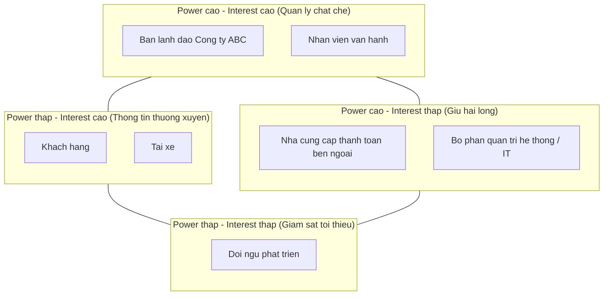

## 3. Diễn giải ma trận

| Nhóm | Power (Ảnh hưởng) | Interest (Quan tâm) | Chiến lược tương tác |
|---|---|---|---|
| Ban lãnh đạo Công ty ABC | Cao | Cao | Quản lý chặt chẽ, báo cáo định kỳ, cần phê duyệt các quyết định lớn |
| Nhân viên vận hành | Cao | Cao | Tham gia sâu vào giai đoạn thu thập yêu cầu, là người dùng chính của phân hệ quản trị |
| Nhà cung cấp thanh toán bên ngoài | Cao | Thấp | Cần đáp ứng yêu cầu tích hợp kỹ thuật, giữ hài lòng về ràng buộc bảo mật |
| Bộ phận quản trị hệ thống/IT | Cao | Thấp | Đảm bảo yêu cầu phi chức năng (khả năng mở rộng, ổn định) được đáp ứng |
| Khách hàng | Thấp | Cao | Thông tin thường xuyên qua sản phẩm, thu thập phản hồi trải nghiệm |
| Tài xế | Thấp | Cao | Thông tin thường xuyên qua sản phẩm, thu thập phản hồi vận hành |
| Đội ngũ phát triển | Thấp | Thấp | Giám sát tối thiểu ở giai đoạn phân tích, chủ động ở giai đoạn xây dựng |

# GIAI ĐOẠN 1 (tiếp theo): XÁC ĐỊNH MỤC TIÊU NGHIỆP VỤ (BUSINESS GOALS)

## Danh sách Business Goals

| Mã | Mục tiêu nghiệp vụ | Mô tả |
|---|---|---|
| BG01 | Tự động tìm và phân công tài xế | Hệ thống tự động xác định và đề xuất tài xế phù hợp dựa trên vị trí, trạng thái sẵn sàng và tiêu chí vận hành, có cơ chế tìm tài xế khác khi tài xế được đề xuất không phản hồi hoặc từ chối |
| BG02 | Hỗ trợ thanh toán đa phương thức | Cho phép khách hàng thanh toán bằng tiền mặt hoặc thanh toán điện tử thông qua nhà cung cấp thanh toán bên ngoài, không lưu trữ trực tiếp thông tin nhạy cảm của thẻ/tài khoản trong hệ thống CAB |
| BG03 | Theo dõi chuyến đi theo thời gian thực | Cho phép khách hàng và tài xế theo dõi, cập nhật trạng thái chuyến đi xuyên suốt từ khi tạo yêu cầu đến khi hoàn thành |
| BG04 | Tập trung hóa quản trị vận hành | Cung cấp giao diện quản trị cho nhân viên vận hành để quản lý khách hàng, tài xế, phương tiện, chuyến đi và xử lý các trường hợp chuyến bị lỗi |
| BG05 | Cung cấp hệ thống thông báo đa kênh | Gửi thông báo tới khách hàng và tài xế tại các mốc quan trọng của chuyến đi (tiếp nhận yêu cầu, tài xế nhận chuyến, tài xế đến điểm đón, hoàn thành chuyến, kết quả thanh toán), có khả năng mở rộng thêm kênh trong tương lai |
| BG06 | Cung cấp báo cáo và thống kê vận hành | Cung cấp cho ban lãnh đạo báo cáo về số lượng chuyến, doanh thu, tỷ lệ chuyến hoàn thành, tỷ lệ hủy và hiệu quả hoạt động của tài xế |
| BG07 | Đảm bảo khả năng mở rộng và ổn định hệ thống | Xây dựng kiến trúc cho phép các thành phần mở rộng độc lập, hạn chế ảnh hưởng dây chuyền khi một chức năng gặp lỗi, và cho phép triển khai tính năng mới từng phần |
| BG08 | Đảm bảo an toàn và bảo mật thông tin | Xác thực người dùng trước khi sử dụng chức năng yêu cầu tài khoản, kiểm soát quyền truy cập với thao tác quản trị, bảo vệ dữ liệu cá nhân/phương tiện/vị trí/giao dịch, và lưu vết các thao tác quan trọng |

## Sơ đồ liên kết Business Goals

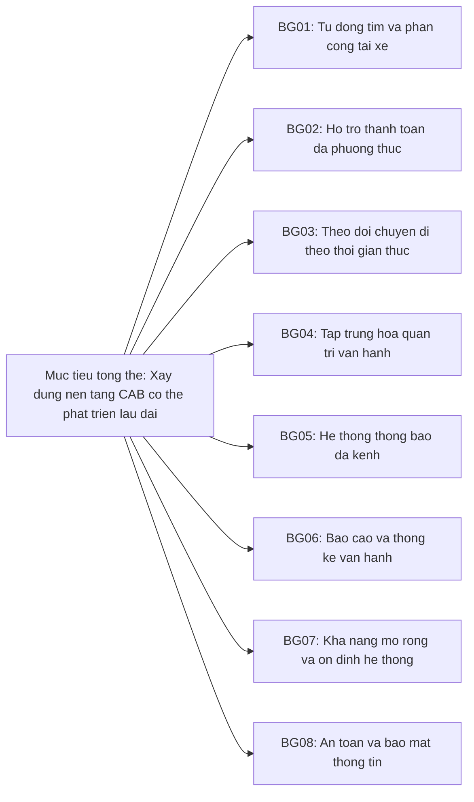

# GIAI ĐOẠN 1 (tiếp theo): B4 - XÁC ĐỊNH PHẠM VI DỰ ÁN (SCOPE)

## 1. Trong phạm vi (In-Scope) - Các module cơ bản cho MVB (7 tuần)

| STT | Module | Nội dung |
|---|---|---|
| 1 | Quản lý tài khoản khách hàng | Đăng ký, đăng nhập, cập nhật thông tin cá nhân |
| 2 | Quản lý tài khoản tài xế | Đăng ký hoặc được vận hành tạo tài khoản, cập nhật hồ sơ, phương tiện, trạng thái hoạt động |
| 3 | Đặt chuyến xe | Nhập điểm đón, điểm đến, chọn loại xe, gửi yêu cầu đặt xe |
| 4 | Tìm và phân công tài xế | Xác định tài xế phù hợp theo vị trí và trạng thái sẵn sàng; xử lý khi tài xế từ chối/không phản hồi |
| 5 | Theo dõi trạng thái chuyến đi | Cập nhật trạng thái theo thời gian thực cho khách hàng và tài xế |
| 6 | Tính cước và thanh toán | Tính số tiền phải trả; thanh toán tiền mặt và điện tử qua cổng thanh toán ngoài |
| 7 | Thông báo | Thông báo cho khách hàng và tài xế tại các mốc quan trọng của chuyến đi |
| 8 | Lịch sử chuyến đi và đánh giá | Xem lịch sử chuyến, số tiền đã thanh toán, đánh giá tài xế sau chuyến |
| 9 | Giao diện quản trị vận hành | Quản lý khách hàng, tài xế, phương tiện, chuyến đi |
| 10 | Phân quyền quản trị | Giới hạn thao tác nhạy cảm chỉ dành cho nhân viên được cấp quyền |
| 11 | Báo cáo vận hành | Số lượng chuyến, doanh thu, tỷ lệ hoàn thành, tỷ lệ hủy, hiệu quả tài xế |
| 12 | Xác thực và bảo mật cơ bản | Xác thực người dùng, kiểm soát truy cập, lưu vết thao tác quan trọng |

## 2. Ngoài phạm vi (Out-of-Scope) đề xuất cho MVB - cần xác nhận với khách hàng

> Lưu ý: Tài liệu gốc của khách hàng chưa nêu rõ các mục loại trừ. Danh sách dưới đây là đề xuất của BA dựa trên ràng buộc thời gian 7 tuần, cần được xác nhận lại với khách hàng trước khi chốt phạm vi chính thức.

| STT | Hạng mục | Lý do đề xuất loại trừ khỏi MVB |
|---|---|---|
| 1 | Đặt xe hộ người khác, đặt xe đặt trước (lịch trong tương lai) | Không được đề cập trong yêu cầu gốc; tăng độ phức tạp nghiệp vụ |
| 2 | Chat trực tiếp giữa khách hàng và tài xế | Không được đề cập; thuộc nhóm tính năng mở rộng sau MVB |
| 3 | Chương trình khuyến mãi, mã giảm giá, tích điểm | Không được đề cập trong yêu cầu gốc |
| 4 | Đa dạng nhiều cổng/ví thanh toán cùng lúc | Yêu cầu gốc chỉ đề cập tích hợp với một nhà cung cấp thanh toán bên ngoài |
| 5 | Dashboard báo cáo nâng cao, phân tích chuyên sâu (BI) | Yêu cầu gốc chỉ đề cập các chỉ số báo cáo cơ bản |
| 6 | Đa kênh thông báo đầy đủ ngay từ đầu (chỉ triển khai một kênh cơ bản, kiến trúc chừa chỗ mở rộng) | Yêu cầu gốc nêu rõ "mở rộng thêm kênh thông báo trong tương lai", ngụ ý MVB chỉ cần một kênh |
| 7 | Quản lý đội xe nâng cao (fleet management, nhiều phương tiện/tài xế) | Không được đề cập trong yêu cầu gốc |
| 8 | Đa ngôn ngữ, đa khu vực tiền tệ | Không được đề cập trong yêu cầu gốc |

---

# B5 - CHUYỂN ĐỔI THÀNH YÊU CẦU NGHIỆP VỤ (BUSINESS REQUIREMENTS)

| Mã | Tên yêu cầu | Diễn giải |
|---|---|---|
| BR01 | Đăng ký / Đăng nhập khách hàng | Khách hàng có thể tạo tài khoản và đăng nhập vào hệ thống để sử dụng dịch vụ |
| BR02 | Cập nhật thông tin cá nhân khách hàng | Khách hàng có thể chỉnh sửa thông tin hồ sơ cá nhân của mình |
| BR03 | Đặt chuyến xe | Khách hàng nhập điểm đón, điểm đến, chọn loại xe và gửi yêu cầu đặt xe |
| BR04 | Theo dõi trạng thái chuyến đi | Khách hàng xem được trạng thái hiện tại của chuyến (đang tìm tài xế, tài xế đã nhận, thời gian dự kiến đến, v.v.) |
| BR05 | Xem lịch sử chuyến đi | Khách hàng tra cứu các chuyến đã thực hiện và số tiền đã thanh toán |
| BR06 | Đánh giá tài xế | Khách hàng đánh giá tài xế sau khi hoàn thành chuyến |
| BR07 | Đăng ký / Tạo tài khoản tài xế | Tài xế tự đăng ký hoặc được nhân viên vận hành tạo tài khoản |
| BR08 | Cập nhật hồ sơ và phương tiện của tài xế | Tài xế cập nhật thông tin cá nhân, thông tin phương tiện, trạng thái hoạt động |
| BR09 | Chuyển trạng thái sẵn sàng nhận chuyến | Tài xế chuyển đổi giữa trạng thái sẵn sàng và không sẵn sàng nhận chuyến |
| BR10 | Nhận và phản hồi thông báo chuyến mới | Tài xế nhận thông báo khi có chuyến phù hợp và có thể chấp nhận hoặc từ chối |
| BR11 | Cập nhật trạng thái thực hiện chuyến | Tài xế cập nhật các mốc: đã đến điểm đón, đã đón khách, đang di chuyển, hoàn thành chuyến |
| BR12 | Ghi nhận vị trí tài xế | Hệ thống lưu vị trí tài xế để hỗ trợ tìm tài xế gần khách hàng và dự kiến thời gian đến |
| BR13 | Tìm và phân công tài xế tự động | Hệ thống xác định tài xế phù hợp dựa trên vị trí, trạng thái sẵn sàng; tự động tìm tài xế khác nếu tài xế trước không phản hồi/từ chối |
| BR14 | Tính cước chuyến đi | Hệ thống xác định số tiền khách hàng phải trả dựa trên loại dịch vụ và thông tin chuyến đi |
| BR15 | Thanh toán bằng tiền mặt | Khách hàng có thể thanh toán trực tiếp bằng tiền mặt cho tài xế |
| BR16 | Thanh toán điện tử | Khách hàng thanh toán qua nhà cung cấp thanh toán bên ngoài, không lưu thông tin nhạy cảm trong hệ thống CAB |
| BR17 | Xử lý thanh toán thất bại | Hệ thống thông báo cho khách hàng và cho phép xử lý lại khi giao dịch điện tử thất bại |
| BR18 | Thông báo cho khách hàng | Gửi thông báo tại các mốc: tiếp nhận yêu cầu, tài xế nhận chuyến, tài xế đến điểm đón, hoàn thành chuyến, kết quả thanh toán |
| BR19 | Thông báo cho tài xế | Gửi thông báo về chuyến mới hoặc thay đổi liên quan đến chuyến đang thực hiện |
| BR20 | Quản lý dữ liệu vận hành | Nhân viên vận hành quản lý khách hàng, tài xế, phương tiện, chuyến đi qua giao diện quản trị |
| BR21 | Phân quyền chức năng quản trị | Giới hạn các thao tác nhạy cảm chỉ cho nhân viên được cấp quyền phù hợp |
| BR22 | Báo cáo vận hành | Cung cấp báo cáo số lượng chuyến, doanh thu, tỷ lệ hoàn thành, tỷ lệ hủy, hiệu quả tài xế cho ban lãnh đạo |
| BR23 | Xác thực người dùng | Khách hàng và tài xế phải được xác thực trước khi sử dụng các chức năng yêu cầu tài khoản |
| BR24 | Lưu vết thao tác quan trọng | Hệ thống ghi log các thao tác quan trọng phục vụ kiểm tra khi có sự cố |

---

# B6 - XÂY DỰNG QUY TRÌNH NGHIỆP VỤ (BUSINESS PROCESS)

## Quy trình 1: Đặt chuyến và tìm tài xế (Booking & Driver Matching)

**Các bước:**
1. Khách hàng tạo yêu cầu chuyến đi
2. Khách hàng xác nhận điểm đón
3. Khách hàng xác nhận điểm đến và loại xe
4. Hệ thống tiếp nhận và xác nhận yêu cầu
5. Hệ thống tìm tài xế phù hợp (theo vị trí, trạng thái sẵn sàng, tiêu chí vận hành)
6. Hệ thống gửi thông báo chuyến cho tài xế được đề xuất
7. Tài xế chấp nhận hoặc từ chối/không phản hồi
8. Nếu chấp nhận: xác nhận phân công, thông báo cho khách hàng
9. Nếu từ chối/không phản hồi: hệ thống tự động tìm tài xế khác (không yêu cầu khách hàng tạo lại yêu cầu)
10. Nếu không tìm được tài xế sau các lần thử: thông báo rõ ràng cho khách hàng

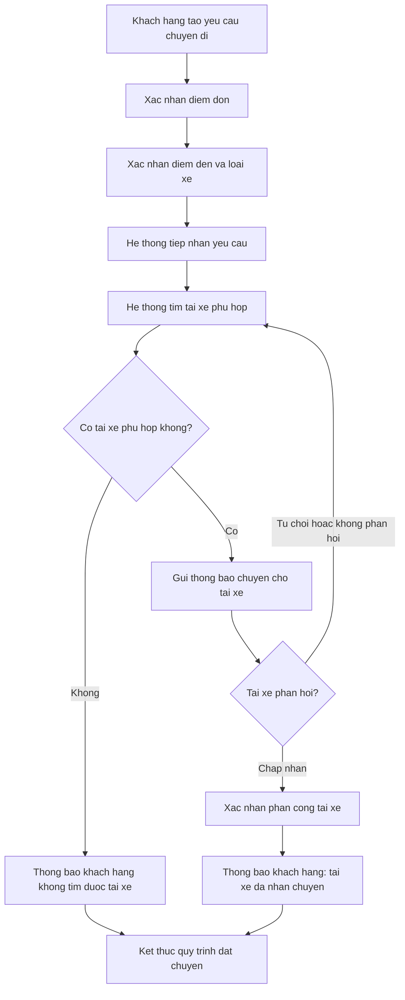

## Quy trình 2: Thực hiện chuyến đi (Trip Execution)

**Các bước:**
1. Tài xế đã được phân công di chuyển đến điểm đón
2. Tài xế cập nhật trạng thái "đã đến điểm đón"
3. Tài xế đón khách, cập nhật trạng thái "đã đón khách"
4. Tài xế cập nhật trạng thái "đang di chuyển"
5. Khách hàng và hệ thống theo dõi hành trình theo thời gian thực (dựa trên vị trí tài xế)
6. Tài xế cập nhật trạng thái "hoàn thành chuyến" khi đến điểm đến
7. Hệ thống chuyển sang quy trình tính cước và thanh toán

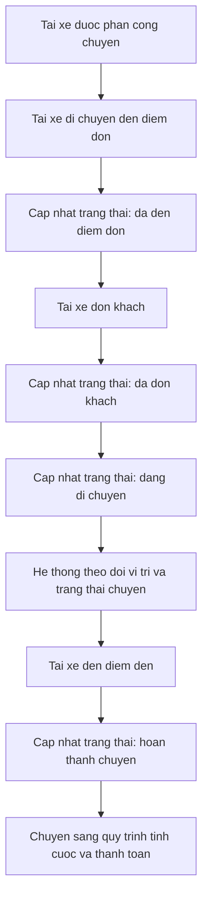

## Quy trình 3: Tính cước và thanh toán (Fare Calculation & Payment)

**Các bước:**
1. Chuyến đi hoàn thành
2. Hệ thống tính số tiền phải trả dựa trên loại dịch vụ và thông tin chuyến đi
3. Khách hàng chọn phương thức thanh toán: tiền mặt hoặc điện tử
4. Nếu tiền mặt: khách hàng thanh toán trực tiếp cho tài xế, hệ thống ghi nhận giao dịch
5. Nếu điện tử: hệ thống gửi yêu cầu thanh toán tới nhà cung cấp thanh toán bên ngoài
6. Nếu giao dịch điện tử thành công: hệ thống ghi nhận, thông báo kết quả cho khách hàng
7. Nếu giao dịch điện tử thất bại: hệ thống thông báo khách hàng và cho phép xử lý lại theo chính sách doanh nghiệp

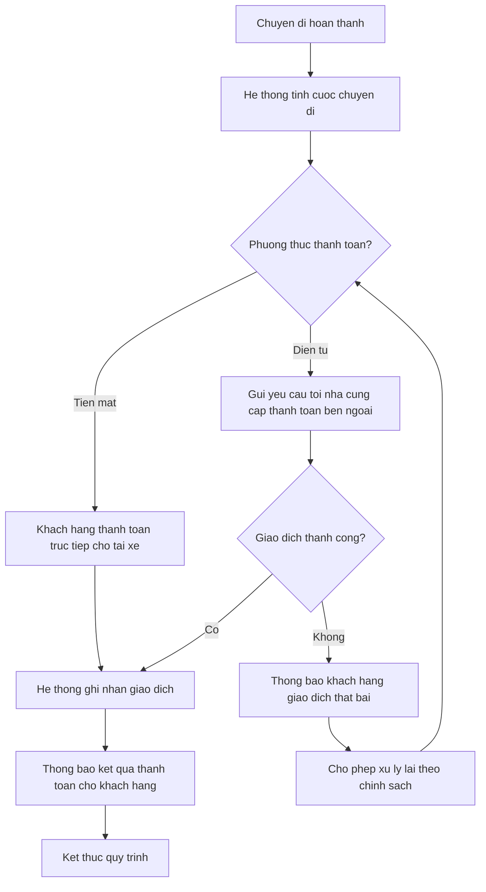

## Quy trình 4: Thông báo (Notification Process)

**Các bước:**
1. Hệ thống xác định sự kiện cần thông báo (tiếp nhận yêu cầu, tài xế nhận chuyến, tài xế đến điểm đón, hoàn thành chuyến, kết quả thanh toán, chuyến mới/thay đổi cho tài xế)
2. Hệ thống xác định đối tượng nhận (khách hàng hoặc tài xế)
3. Hệ thống gửi thông báo qua kênh hiện có
4. Kiến trúc cho phép bổ sung kênh thông báo mới trong tương lai mà không ảnh hưởng luồng hiện tại

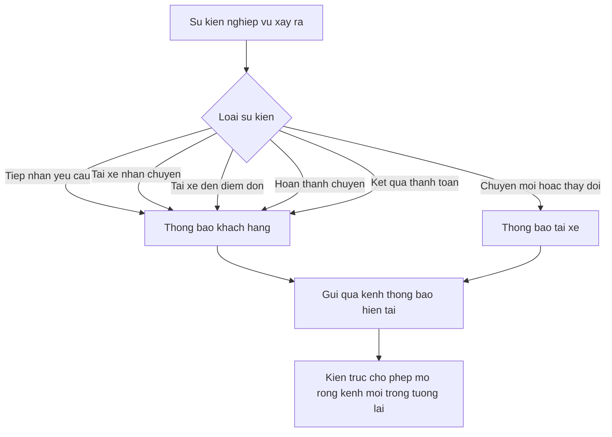

## Quy trình 5: Quản trị và xử lý sự cố chuyến đi (Operator Handling)

**Các bước:**
1. Nhân viên vận hành giám sát các chuyến đang diễn ra và trạng thái tài xế
2. Khi phát hiện chuyến bị lỗi (ví dụ: tài xế mất kết nối, chuyến bị treo), nhân viên can thiệp xử lý
3. Nhân viên tra cứu lịch sử giao dịch liên quan nếu cần
4. Các thao tác nhạy cảm chỉ thực hiện được nếu nhân viên có quyền phù hợp
5. Hệ thống ghi log thao tác xử lý để phục vụ kiểm tra sau này

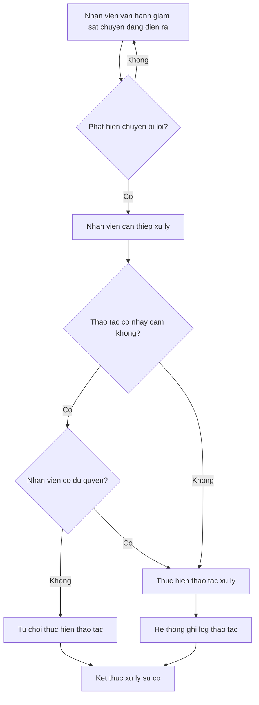

#### Bước 7: Phân rã thành Yêu cầu chức năng (Functional Requirements - FR)

Từ mỗi Yêu cầu nghiệp vụ (BN) đã xác định ở Bước 5, BA tiếp tục phân rã thành các **Yêu cầu chức năng (Functional Requirements - FR)** — mô tả chi tiết từng bước xử lý cụ thể mà hệ thống phải thực hiện, làm cơ sở cho đội phát triển thiết kế và xây dựng.

##### 7.1 Nhóm Tài khoản & Hồ sơ (từ BN01, BN02)

- **FR01:** Cho phép khách hàng đăng ký tài khoản bằng số điện thoại/email
- **FR02:** Cho phép khách hàng/tài xế đăng nhập bằng tài khoản đã đăng ký
- **FR03:** Cho phép nhân viên vận hành tạo tài khoản thay cho tài xế
- **FR04:** Cho phép khách hàng cập nhật thông tin cá nhân (họ tên, số điện thoại, email...)
- **FR05:** Cho phép tài xế cập nhật hồ sơ cá nhân và thông tin phương tiện (biển số, loại xe, hãng xe...)
- **FR06:** Cho phép tài xế chuyển đổi trạng thái hoạt động: sẵn sàng nhận chuyến / không sẵn sàng

##### 7.2 Nhóm Đặt xe & Tìm tài xế (từ BN03, BN04, BN05, BN06)

**Đặt chuyến (BN03):**
- **FR07:** Cho phép khách hàng nhập điểm đón (chọn trên bản đồ hoặc nhập địa chỉ)
- **FR08:** Cho phép khách hàng nhập điểm đến
- **FR09:** Cho phép khách hàng chọn loại xe (vd: xe máy, xe 4 chỗ, xe 7 chỗ...)
- **FR10:** Cho phép khách hàng gửi yêu cầu đặt xe sau khi xác nhận đầy đủ thông tin

**Tìm tài xế (BN04) — ví dụ minh họa của bạn:**
- **FR11:** Xác định vị trí hiện tại của khách hàng (lấy từ điểm đón)
- **FR12:** Tìm các tài xế đang ở trạng thái online/sẵn sàng trong bán kính xung quanh vị trí khách hàng
- **FR13:** Lọc tài xế theo loại xe khách hàng đã chọn
- **FR14:** *(Điều kiện)* Nếu yêu cầu của khách hàng có tiêu chí "tài xế rating cao" → lọc thêm theo điểm đánh giá tối thiểu; nếu không có tiêu chí này → bỏ qua bước lọc rating
- **FR15:** Sắp xếp danh sách tài xế phù hợp theo khoảng cách gần nhất
- **FR16:** Gửi thông báo mời chuyến lần lượt đến tài xế theo thứ tự ưu tiên
- **FR17:** Đặt thời gian giới hạn chờ phản hồi cho mỗi tài xế được mời
- **FR18:** Nếu tài xế từ chối hoặc hết thời gian chờ → loại khỏi danh sách và mời tài xế tiếp theo (quay lại FR16)
- **FR19:** Nếu không còn tài xế phù hợp trong danh sách → dừng tìm kiếm

**Không tìm được tài xế (BN05):**
- **FR20:** Thông báo rõ ràng cho khách hàng khi không tìm được tài xế phù hợp
- **FR21:** Cho phép khách hàng thử lại yêu cầu đặt xe sau khi nhận thông báo

**Tài xế phản hồi (BN06):**
- **FR22:** Hiển thị thông tin chuyến mời (điểm đón, điểm đến, loại xe, cước dự kiến) cho tài xế
- **FR23:** Cho phép tài xế chấp nhận chuyến
- **FR24:** Cho phép tài xế từ chối chuyến
- **FR25:** Xác nhận tài xế chính thức cho chuyến sau khi chấp nhận, khóa chuyến không cho tài xế khác nhận trùng

##### 7.3 Nhóm Thực hiện chuyến đi (từ BN07, BN08, BN09, BN17)

- **FR26:** Cho phép tài xế cập nhật trạng thái "đã đến điểm đón"
- **FR27:** Cho phép tài xế cập nhật trạng thái "đã đón khách"
- **FR28:** Cho phép tài xế cập nhật trạng thái "đang di chuyển"
- **FR29:** Cho phép tài xế cập nhật trạng thái "hoàn thành chuyến"
- **FR30:** Hiển thị cho khách hàng trạng thái chuyến đi theo thời gian thực
- **FR31:** Hiển thị thời gian dự kiến tài xế đến điểm đón (ETA)
- **FR32:** Ghi nhận vị trí tài xế định kỳ (vd: mỗi vài giây) trong suốt chuyến đi
- **FR33:** Cho phép khách hàng xem lại danh sách các chuyến đã thực hiện
- **FR34:** Hiển thị chi tiết một chuyến trong lịch sử (điểm đón, điểm đến, số tiền, tài xế, thời gian)

##### 7.4 Nhóm Tính cước & Thanh toán (từ BN10, BN11, BN12, BN13)

- **FR35:** Tính khoảng cách và thời gian di chuyển thực tế của chuyến đi
- **FR36:** Tính số tiền phải trả dựa trên loại dịch vụ và công thức cước cơ bản (khoảng cách/thời gian)
- **FR37:** Hiển thị số tiền cần thanh toán cho khách hàng sau khi chuyến hoàn thành
- **FR38:** Cho phép khách hàng chọn phương thức thanh toán: tiền mặt hoặc điện tử
- **FR39:** Ghi nhận xác nhận của tài xế khi khách hàng thanh toán tiền mặt
- **FR40:** Gửi yêu cầu thanh toán điện tử đến nhà cung cấp thanh toán bên ngoài (qua API/tích hợp)
- **FR41:** Nhận kết quả giao dịch từ nhà cung cấp thanh toán (thành công/thất bại)
- **FR42:** Thông báo lỗi cho khách hàng khi giao dịch điện tử thất bại
- **FR43:** Cho phép khách hàng thử thanh toán lại hoặc đổi phương thức khi giao dịch thất bại
- **FR44:** Không lưu trữ trực tiếp thông tin thẻ/tài khoản thanh toán nhạy cảm trong hệ thống CAB

##### 7.5 Nhóm Thông báo (từ BN14, BN15)

- **FR45:** Gửi thông báo cho khách hàng khi yêu cầu đặt xe được tiếp nhận
- **FR46:** Gửi thông báo cho khách hàng khi tài xế nhận chuyến
- **FR47:** Gửi thông báo cho khách hàng khi tài xế đến điểm đón
- **FR48:** Gửi thông báo cho khách hàng khi chuyến hoàn thành
- **FR49:** Gửi thông báo cho khách hàng khi có kết quả thanh toán
- **FR50:** Gửi thông báo cho tài xế khi có chuyến mới phù hợp
- **FR51:** Gửi thông báo cho tài xế khi có thay đổi liên quan đến chuyến đang thực hiện
- **FR52:** Thiết kế module thông báo dạng độc lập (service riêng) để dễ bổ sung kênh gửi mới sau này

##### 7.6 Nhóm Đánh giá tài xế (từ BN16)

- **FR53:** Hiển thị lời mời đánh giá cho khách hàng sau khi thanh toán thành công
- **FR54:** Cho phép khách hàng chọn số sao đánh giá (vd: 1–5 sao)
- **FR55:** Cho phép khách hàng nhập nhận xét (tùy chọn)
- **FR56:** Lưu đánh giá và cập nhật điểm đánh giá trung bình của tài xế
- **FR57:** Cho phép khách hàng bỏ qua bước đánh giá

##### 7.7 Nhóm Quản trị & Vận hành (từ BN18, BN19, BN20, BN21)

- **FR58:** Hiển thị danh sách khách hàng, tài xế, phương tiện cho nhân viên vận hành
- **FR59:** Cho phép nhân viên vận hành tìm kiếm/lọc thông tin khách hàng, tài xế, chuyến đi
- **FR60:** Hiển thị danh sách các chuyến đang diễn ra theo thời gian thực
- **FR61:** Hiển thị trạng thái hiện tại của từng tài xế
- **FR62:** Cho phép nhân viên vận hành can thiệp xử lý chuyến gặp sự cố (vd: hủy chuyến, gán lại tài xế)
- **FR63:** Cho phép tra cứu lịch sử giao dịch theo khách hàng/tài xế/khoảng thời gian
- **FR64:** Kiểm tra quyền của nhân viên trước khi cho thực hiện thao tác nhạy cảm
- **FR65:** Tạo báo cáo số lượng chuyến theo khoảng thời gian
- **FR66:** Tạo báo cáo doanh thu theo khoảng thời gian
- **FR67:** Tạo báo cáo tỷ lệ chuyến hoàn thành / tỷ lệ hủy
- **FR68:** Tạo báo cáo hiệu quả hoạt động của từng tài xế (số chuyến, điểm đánh giá trung bình)

##### 7.8 Nhóm Bảo mật & Kiểm soát dữ liệu (từ BN22, BN23, BN24, BN25)

- **FR69:** Xác thực khách hàng/tài xế bằng tài khoản (mật khẩu/OTP) trước khi truy cập chức năng yêu cầu đăng nhập
- **FR70:** Kiểm tra vai trò (role) người dùng trước khi cho phép thực hiện thao tác quản trị
- **FR71:** Mã hóa/bảo vệ dữ liệu cá nhân, dữ liệu vị trí và dữ liệu giao dịch khi lưu trữ và truyền tải
- **FR72:** Ghi log mọi thao tác quan trọng (ai thực hiện, thời gian, hành động) vào Audit Trail
- **FR73:** Cho phép nhân viên có quyền phù hợp tra cứu Audit Trail khi cần điều tra sự cố

##### 7.9 Nhóm Kiến trúc & Khả năng mở rộng (từ BN26, BN27, BN28, BN29)

> *Ghi chú: Nhóm này thiên về yêu cầu phi chức năng (NFR) hơn là FR, nhưng được liệt kê dưới dạng yêu cầu kỹ thuật cụ thể để đội phát triển có cơ sở thiết kế kiến trúc.*

- **FR74:** Tách các module (đặt xe, thanh toán, thông báo, quản trị...) thành các service độc lập, có thể scale riêng
- **FR75:** Thiết kế cơ chế cô lập lỗi (vd: circuit breaker, timeout, retry) giữa các service để lỗi một module không lan sang module khác
- **FR76:** Thiết kế API/kiến trúc dạng module hóa để có thể triển khai (deploy) cập nhật từng phần
- **FR77:** Thiết kế lớp tích hợp thanh toán (payment adapter) và thông báo (notification adapter) theo dạng plug-in để dễ bổ sung nhà cung cấp mới

##### 7.10 Bảng tổng hợp liên kết FR → BN

| Nhóm FR | Business Requirement gốc |
|---|---|
| 7.1 (FR01–FR06) | BN01, BN02 |
| 7.2 (FR07–FR25) | BN03, BN04, BN05, BN06 |
| 7.3 (FR26–FR34) | BN07, BN08, BN09, BN17 |
| 7.4 (FR35–FR44) | BN10, BN11, BN12, BN13 |
| 7.5 (FR45–FR52) | BN14, BN15 |
| 7.6 (FR53–FR57) | BN16 |
| 7.7 (FR58–FR68) | BN18, BN19, BN20, BN21 |
| 7.8 (FR69–FR73) | BN22, BN23, BN24, BN25 |
| 7.9 (FR74–FR77) | BN26, BN27, BN28, BN29 |

#### Bước 8: Thiết kế Business Rules & Exception Handling

Sau khi có các Yêu cầu chức năng (FR), BA cần xác định **Business Rules (quy tắc nghiệp vụ)** — các ràng buộc/điều kiện hệ thống phải luôn tuân thủ, và **Exceptions (ngoại lệ)** — các tình huống bất thường có thể xảy ra cùng cách hệ thống xử lý, để đội phát triển không bỏ sót logic quan trọng.

##### 8.1 Business Rules & Exceptions — Nhóm Tài khoản & Hồ sơ

**Business Rules**
- **BR01:** Một số điện thoại/email chỉ được đăng ký cho một tài khoản duy nhất trên hệ thống
- **BR02:** Tài xế phải khai báo đầy đủ thông tin phương tiện (biển số, loại xe) trước khi được chuyển sang trạng thái "sẵn sàng nhận chuyến"

**Exceptions**
- **EX01:** Khách hàng/tài xế nhập số điện thoại/email đã tồn tại khi đăng ký → hệ thống từ chối và thông báo tài khoản đã tồn tại, gợi ý đăng nhập hoặc khôi phục mật khẩu
- **EX02:** Tài xế cố chuyển sang trạng thái "sẵn sàng" khi hồ sơ/phương tiện chưa đầy đủ → hệ thống chặn và yêu cầu bổ sung thông tin còn thiếu

##### 8.2 Business Rules & Exceptions — Nhóm Đặt xe & Tìm tài xế

**Business Rules**
- **BR03:** Chỉ những tài xế đang ở trạng thái **sẵn sàng (online)** mới được hệ thống đề xuất nhận chuyến
- **BR04:** Một tài xế chỉ được nhận **1 chuyến tại một thời điểm** (không được nhận chuyến mới khi đang thực hiện chuyến khác)
- **BR05:** Tài xế được mời chuyến phải phản hồi (chấp nhận/từ chối) trong một khoảng thời gian giới hạn quy định *(giá trị cụ thể — cần xác nhận với khách hàng, xem Open Issues)*
- **BR06:** Hệ thống chỉ đề xuất tài xế có loại xe đúng với loại khách hàng đã chọn khi đặt chuyến

**Exceptions**
- **EX03:** Khách hàng chờ tìm tài xế quá lâu (vượt ngưỡng thời gian chờ tối đa) → hệ thống dừng tìm kiếm và thông báo rõ ràng cho khách hàng rằng chưa tìm được tài xế, đề xuất khách hàng thử lại sau
- **EX04:** Tài xế được đề xuất **không phản hồi trong thời gian quy định** (hết hạn BR05) → hệ thống tự động coi như từ chối, loại tài xế khỏi danh sách đề xuất cho chuyến này, và chuyển sang mời tài xế tiếp theo
- **EX05:** Tài xế **chủ động từ chối** chuyến → hệ thống ngay lập tức chuyển sang mời tài xế tiếp theo trong danh sách, không chờ hết thời gian giới hạn
- **EX06:** Không còn tài xế nào phù hợp trong danh sách đề xuất (đã mời hết) → xử lý như EX03 (thông báo không tìm được tài xế)
- **EX07:** Hai tài xế cùng lúc bấm "chấp nhận" một chuyến (trường hợp tranh chấp/race condition) → hệ thống chỉ xác nhận cho tài xế đầu tiên gửi yêu cầu chấp nhận thành công, tài xế còn lại nhận thông báo "chuyến đã có tài xế khác nhận"

##### 8.3 Business Rules & Exceptions — Nhóm Thực hiện chuyến đi

**Business Rules**
- **BR07:** Tài xế chỉ được cập nhật trạng thái chuyến theo đúng thứ tự: đã đến điểm đón → đã đón khách → đang di chuyển → hoàn thành (không được bỏ qua bước hoặc đảo ngược trạng thái)
- **BR08:** Khách hàng có một khoảng thời gian chờ tối đa tại điểm đón trước khi tài xế được phép báo cáo "khách không có mặt" *(giá trị cụ thể — cần xác nhận, xem Open Issues)*

**Exceptions**
- **EX08:** Tài xế đến điểm đón nhưng khách hàng không có mặt quá thời gian chờ (hết hạn BR08) → hệ thống xử lý theo chính sách chờ/hủy chuyến *(chính sách cụ thể — cần khách hàng xác nhận)*
- **EX09:** Mất kết nối vị trí (GPS) của tài xế trong khi đang thực hiện chuyến → hệ thống giữ nguyên trạng thái chuyến gần nhất đã ghi nhận, thử kết nối lại, và cảnh báo cho nhân viên vận hành nếu mất kết nối quá lâu *(ngưỡng thời gian — cần làm rõ)*
- **EX10:** Tài xế/khách hàng thoát ứng dụng giữa chuyến (mất kết nối mạng) → hệ thống không tự hủy chuyến ngay, cho phép resume khi kết nối lại trong một khoảng thời gian nhất định *(cần làm rõ chi tiết xử lý mất kết nối)*

##### 8.4 Business Rules & Exceptions — Nhóm Tính cước & Thanh toán

**Business Rules**
- **BR09:** Cước phí chỉ được tính **sau khi** chuyến đi ở trạng thái "hoàn thành"
- **BR10:** Thông tin thẻ/tài khoản thanh toán nhạy cảm **không được lưu trữ trực tiếp** trong hệ thống CAB, chỉ lưu token/tham chiếu từ nhà cung cấp thanh toán bên ngoài
- **BR11:** Một chuyến đi chỉ được xác nhận thanh toán thành công **một lần**, không cho phép trừ tiền/thu tiền trùng lặp

**Exceptions**
- **EX11:** Giao dịch thanh toán điện tử thất bại (lỗi mạng, thẻ không đủ tiền, timeout từ nhà cung cấp...) → hệ thống thông báo lỗi cho khách hàng và cho phép thử lại hoặc đổi phương thức thanh toán, theo BR11 không tính tiền trùng
- **EX12:** Khách hàng chọn thanh toán tiền mặt nhưng không đủ tiền mặt tại chỗ → xử lý theo chính sách của doanh nghiệp *(chưa được chốt — cần làm rõ)*
- **EX13:** Nhà cung cấp thanh toán bên ngoài gặp sự cố / không phản hồi (timeout) → hệ thống không để khách hàng chờ vô thời hạn, hiển thị thông báo lỗi tạm thời và gợi ý phương thức thanh toán khác (vd: tiền mặt)

##### 8.5 Business Rules & Exceptions — Nhóm Thông báo

**Business Rules**
- **BR12:** Mỗi sự kiện nghiệp vụ quan trọng (BN14, BN15) phải kích hoạt đúng **một** thông báo tương ứng, không gửi trùng lặp

**Exceptions**
- **EX14:** Gửi thông báo thất bại (do lỗi kênh gửi, mất kết nối thiết bị...) → hệ thống ghi log lỗi gửi thông báo và thử gửi lại theo cơ chế retry có giới hạn số lần, không làm gián đoạn luồng nghiệp vụ chính (đúng theo BR nhóm Kiến trúc — cô lập lỗi)

##### 8.6 Business Rules & Exceptions — Nhóm Đánh giá tài xế

**Business Rules**
- **BR13:** Khách hàng chỉ được đánh giá **sau khi** chuyến đã thanh toán thành công
- **BR14:** Mỗi chuyến đi chỉ được đánh giá **một lần**

**Exceptions**
- **EX15:** Khách hàng bỏ qua bước đánh giá → hệ thống không ép buộc, chuyến vẫn được coi là hoàn tất bình thường

##### 8.7 Business Rules & Exceptions — Nhóm Quản trị & Vận hành

**Business Rules**
- **BR15:** Nhân viên vận hành thông thường **không được thực hiện** các thao tác quản trị nhạy cảm (vd: xóa dữ liệu, chỉnh sửa giao dịch tài chính) — chỉ nhân viên có quyền phù hợp mới thực hiện được
- **BR16:** Mọi thao tác can thiệp vào chuyến đi hoặc dữ liệu quan trọng của nhân viên vận hành phải được ghi log vào Audit Trail

**Exceptions**
- **EX16:** Nhân viên không đủ quyền cố thực hiện thao tác nhạy cảm → hệ thống từ chối thao tác và thông báo không đủ quyền, đồng thời ghi log nỗ lực truy cập trái phép
- **EX17:** Chuyến đi bị lỗi không thuộc các exception đã định nghĩa sẵn (trường hợp phát sinh ngoài dự kiến) → nhân viên vận hành có quyền can thiệp thủ công (hủy chuyến, gán lại tài xế), thao tác này bắt buộc ghi log theo BR16

##### 8.8 Business Rules & Exceptions — Nhóm Bảo mật & Dữ liệu

**Business Rules**
- **BR17:** Người dùng chưa xác thực (chưa đăng nhập) không được phép truy cập bất kỳ chức năng nào yêu cầu tài khoản
- **BR18:** Dữ liệu cá nhân, vị trí, giao dịch phải được mã hóa khi lưu trữ và truyền tải

**Exceptions**
- **EX18:** Người dùng cố truy cập chức năng cần tài khoản khi chưa đăng nhập/token hết hạn → hệ thống chặn truy cập, chuyển hướng về màn hình đăng nhập

##### 8.9 Bảng tổng hợp

| Nhóm | Business Rules | Exceptions | Trạng thái làm rõ |
|---|---|---|---|
| Tài khoản & Hồ sơ | BR01–BR02 | EX01–EX02 | Đã rõ |
| Đặt xe & Tìm tài xế | BR03–BR06 | EX03–EX07 | BR05 (thời gian phản hồi) cần chốt giá trị cụ thể |
| Thực hiện chuyến đi | BR07–BR08 | EX08–EX10 | BR08, EX08, EX09, EX10 cần làm rõ (chính sách chờ/hủy, xử lý mất kết nối) |
| Tính cước & Thanh toán | BR09–BR11 | EX11–EX13 | EX12 cần chính sách cụ thể |
| Thông báo | BR12 | EX14 | Đã rõ |
| Đánh giá tài xế | BR13–BR14 | EX15 | Đã rõ |
| Quản trị & Vận hành | BR15–BR16 | EX16–EX17 | Đã rõ |
| Bảo mật & Dữ liệu | BR17–BR18 | EX18 | Đã rõ |

#### Bước 9: Data Modeling (Xây dựng mô hình dữ liệu)

Từ các Business Requirements và Functional Requirements đã xác định, BA xác định các **thực thể dữ liệu (entities)** cốt lõi mà hệ thống cần quản lý, thuộc tính chính của từng thực thể, và mối quan hệ giữa chúng — làm cơ sở cho đội phát triển thiết kế cơ sở dữ liệu.

##### 9.1 Danh sách các thực thể (Entities)

| Thực thể | Mô tả |
|---|---|
| **Account** | Tài khoản đăng nhập chung, dùng chung cho Customer, Driver, OperationsStaff (xác thực) |
| **Customer** | Thông tin khách hàng |
| **Driver** | Thông tin tài xế |
| **Vehicle** | Thông tin phương tiện của tài xế |
| **OperationsStaff** | Nhân viên vận hành |
| **Role** | Vai trò/nhóm quyền (dùng cho phân quyền OperationsStaff) |
| **Trip** | Chuyến đi |
| **TripStatusHistory** | Lịch sử thay đổi trạng thái của một chuyến đi |
| **DriverLocation** | Vị trí tài xế theo thời gian (real-time tracking) |
| **Payment** | Giao dịch thanh toán của một chuyến đi |
| **PaymentMethod** | Phương thức thanh toán (tiền mặt/điện tử) khách hàng đã lưu/sử dụng |
| **Notification** | Thông báo gửi cho khách hàng/tài xế |
| **Rating** | Đánh giá của khách hàng dành cho tài xế sau chuyến |
| **AuditLog** | Nhật ký ghi vết các thao tác quan trọng (đặc biệt của nhân viên vận hành) |

##### 9.2 Thuộc tính chính của từng thực thể

**Account**
- account_id (PK)
- phone_or_email
- password_hash
- account_type (customer / driver / operations_staff)
- created_at
- status (active / locked)

**Customer**
- customer_id (PK)
- account_id (FK)
- full_name
- default_pickup_address *(tuỳ chọn)*
- created_at

**Driver**
- driver_id (PK)
- account_id (FK)
- full_name
- status (available / unavailable / on_trip)
- average_rating
- created_at

**Vehicle**
- vehicle_id (PK)
- driver_id (FK)
- vehicle_type (xe máy / 4 chỗ / 7 chỗ...)
- license_plate
- brand_model
- status (active / inactive)

**OperationsStaff**
- staff_id (PK)
- account_id (FK)
- full_name
- role_id (FK)

**Role**
- role_id (PK)
- role_name
- permissions (danh sách quyền — có thể tách bảng Permission riêng nếu cần chi tiết hơn)

**Trip**
- trip_id (PK)
- customer_id (FK)
- driver_id (FK, nullable — chưa có tài xế nhận)
- vehicle_type_requested
- pickup_location (lat/long, address)
- dropoff_location (lat/long, address)
- current_status (searching / assigned / arrived / picked_up / in_progress / completed / cancelled)
- requested_at
- completed_at
- distance
- duration
- fare_amount

**TripStatusHistory**
- history_id (PK)
- trip_id (FK)
- status
- changed_at
- changed_by (driver_id / system)

**DriverLocation**
- location_id (PK)
- driver_id (FK)
- latitude
- longitude
- recorded_at

**Payment**
- payment_id (PK)
- trip_id (FK, 1-1)
- amount
- payment_method_type (cash / electronic)
- status (pending / success / failed)
- transaction_ref (mã tham chiếu từ nhà cung cấp thanh toán bên ngoài — KHÔNG lưu thông tin thẻ)
- paid_at

**PaymentMethod**
- payment_method_id (PK)
- customer_id (FK)
- method_type (cash / e-wallet / card_token...)
- provider_token (token từ nhà cung cấp thanh toán, không lưu số thẻ thật)
- created_at

**Notification**
- notification_id (PK)
- recipient_type (customer / driver)
- recipient_id
- trip_id (FK, nullable)
- event_type (request_received / driver_assigned / driver_arrived / trip_completed / payment_result / new_trip_offer / trip_update)
- content
- sent_at
- status (sent / failed)

**Rating**
- rating_id (PK)
- trip_id (FK, 1-1)
- customer_id (FK)
- driver_id (FK)
- stars (1–5)
- comment
- created_at

**AuditLog**
- log_id (PK)
- staff_id (FK, nullable)
- action_type
- target_entity
- target_id
- action_detail
- created_at

##### 9.3 Mối quan hệ giữa các thực thể (Relationships)

| Quan hệ | Loại |
|---|---|
| Account – Customer | 1 – 1 |
| Account – Driver | 1 – 1 |
| Account – OperationsStaff | 1 – 1 |
| Role – OperationsStaff | 1 – nhiều |
| Driver – Vehicle | 1 – nhiều (tài xế có thể có nhiều phương tiện, nhưng thường 1 phương tiện đang hoạt động) |
| Customer – Trip | 1 – nhiều |
| Driver – Trip | 1 – nhiều |
| Trip – TripStatusHistory | 1 – nhiều |
| Driver – DriverLocation | 1 – nhiều |
| Trip – Payment | 1 – 1 |
| Customer – PaymentMethod | 1 – nhiều |
| Trip – Rating | 1 – 1 |
| Customer – Rating | 1 – nhiều |
| Driver – Rating | 1 – nhiều |
| Trip – Notification | 1 – nhiều |
| OperationsStaff – AuditLog | 1 – nhiều |

##### 9.4 Sơ đồ ERD (Mermaid)

##### 9.5 Ghi chú thiết kế

- **Account** được tách riêng làm bảng xác thực chung (dùng chung logic đăng nhập/mật khẩu cho cả 3 loại người dùng), đúng với yêu cầu bảo mật BR17 (xác thực trước khi truy cập chức năng cần tài khoản).
- **PaymentMethod.provider_token** chỉ lưu token tham chiếu từ nhà cung cấp thanh toán bên ngoài, tuân thủ đúng BR10 (không lưu thông tin thẻ nhạy cảm trực tiếp).
- **DriverLocation** thiết kế dạng bảng ghi nhận liên tục (time-series) để phục vụ FR32 (theo dõi vị trí thời gian thực) — trong triển khai thực tế có thể cân nhắc dùng cơ sở dữ liệu chuyên biệt (vd: Redis, time-series DB) thay vì RDBMS thông thường để tối ưu hiệu năng, nhưng ở mức data model logic vẫn thể hiện như một entity.
- **Trip.current_status** kết hợp với **TripStatusHistory** giúp vừa truy vấn nhanh trạng thái hiện tại, vừa lưu vết đầy đủ lịch sử thay đổi trạng thái (phục vụ audit và xử lý exception).
- Quan hệ **Trip – Payment** và **Trip – Rating** là 1–1 vì mỗi chuyến chỉ có một giao dịch thanh toán chính thức và một đánh giá duy nhất (theo BR11, BR14).
- Thời gian lưu trữ dữ liệu (data retention) của các bảng như DriverLocation, AuditLog, TripStatusHistory hiện **chưa được khách hàng chốt** — cần bổ sung vào danh sách Open Issues.
- 

#### Bước 10: Xác định Non-Functional Requirements (NFR)

Sau khi có Data Model, BA xác định các **Yêu cầu phi chức năng (NFR)** — mô tả hệ thống phải vận hành **như thế nào** (hiệu năng, khả năng mở rộng, bảo mật, độ tin cậy...) chứ không phải làm được **những gì**. Với ràng buộc **7 tuần cho MVB**, BA cần phân loại rõ NFR nào là **bắt buộc ngay ở MVB** và NFR nào **chưa cần đầu tư ở giai đoạn này**, để đội phát triển không tốn thời gian tối ưu hóa những phần chưa cần thiết.

##### 10.1 Nguyên tắc áp dụng cho giai đoạn MVB

- Ưu tiên đúng luồng nghiệp vụ, dữ liệu chính xác, hệ thống chạy ổn định ở tải thấp/trung bình hơn là tối ưu hiệu năng cực hạn.
- Kiến trúc nên module hóa theo logic (tách rõ ràng theo domain: Trip, Payment, Notification...) để dễ tách thành microservice sau này, nhưng không bắt buộc triển khai microservices thật sự ở MVB — có thể là modular monolith để giảm độ phức tạp vận hành trong 7 tuần, miễn là ranh giới module rõ ràng.
- Các yêu cầu về độ trễ cực thấp, khả năng chịu tải cực lớn, đa vùng địa lý (multi-region) chưa cần thiết ở MVB, để dành cho giai đoạn mở rộng sau khi hệ thống đã chứng minh được mô hình vận hành.

##### 10.2 Bảng Non-Functional Requirements

| Mã | Danh mục | Yêu cầu | Áp dụng ở MVB |
|---|---|---|---|
| NFR01 | Hiệu năng (Performance) | Thời gian phản hồi cho các thao tác thông thường (đăng nhập, đặt chuyến, xem lịch sử) ở mức chấp nhận được cho người dùng (vài giây), không cần tối ưu xuống dưới 1 giây ở giai đoạn MVB | Bắt buộc mức tối thiểu, không cần tối ưu sâu |
| NFR02 | Hiệu năng | Tần suất cập nhật vị trí tài xế (DriverLocation) ở mức đủ dùng để theo dõi chuyến (vd: vài giây/lần), chưa cần tối ưu real-time độ trễ cực thấp | Chưa cần tối ưu sâu |
| NFR03 | Khả năng mở rộng (Scalability) | Kiến trúc module hóa theo domain (Trip, Payment, Notification, Admin...), ranh giới rõ ràng để có thể tách thành microservice trong tương lai | Bắt buộc thiết kế (có thể triển khai dạng modular monolith) |
| NFR04 | Khả năng mở rộng | Triển khai đầy đủ kiến trúc microservices, container orchestration (Kubernetes), auto-scaling theo tải | Không bắt buộc ở MVB |
| NFR05 | Độ tin cậy (Reliability) | Lỗi ở module Thanh toán hoặc Thông báo không được làm sập luồng đặt xe/thực hiện chuyến (cô lập lỗi ở mức logic, có thể chỉ cần try-catch/timeout hợp lý, chưa cần circuit breaker phức tạp) | Bắt buộc mức cơ bản |
| NFR06 | Độ tin cậy | Tỷ lệ uptime hệ thống ở mức chấp nhận được cho môi trường MVB/pilot (không cần SLA 99.9%+ như hệ thống production quy mô lớn) | Bắt buộc mức cơ bản |
| NFR07 | Bảo mật (Security) | Mật khẩu được mã hóa (hash) khi lưu trữ, dữ liệu truyền tải qua HTTPS | Bắt buộc |
| NFR08 | Bảo mật | Phân quyền rõ ràng giữa các vai trò (customer/driver/operations staff), không cho truy cập chéo dữ liệu | Bắt buộc |
| NFR09 | Bảo mật | Không lưu trữ trực tiếp thông tin thẻ/tài khoản thanh toán nhạy cảm (dùng token từ nhà cung cấp thanh toán ngoài) | Bắt buộc |
| NFR10 | Bảo mật | Cơ chế bảo mật nâng cao (mã hóa đầu-cuối, penetration testing định kỳ, chuẩn PCI-DSS đầy đủ) | Chưa cần ở MVB, để giai đoạn sau |
| NFR11 | Khả năng bảo trì (Maintainability) | Code tổ chức theo module rõ ràng, có tài liệu API cơ bản để đội phát triển sau này dễ tiếp tục mở rộng | Bắt buộc mức cơ bản |
| NFR12 | Khả năng triển khai (Deployability) | Có thể triển khai (deploy) các thay đổi nhỏ mà không cần rebuild/redeploy toàn bộ hệ thống cùng lúc | Nên có, mức cơ bản, chưa cần CI/CD phức tạp |
| NFR13 | Khả năng sử dụng (Usability) | Giao diện khách hàng và tài xế đơn giản, dễ thao tác trên thiết bị di động | Bắt buộc |
| NFR14 | Khả năng sử dụng | Hỗ trợ đa ngôn ngữ, đa nền tảng (iOS + Android native đầy đủ) | Không cần ở MVB (đúng theo Out-of-Scope ở Bước 4) |
| NFR15 | Khả năng tương thích (Compatibility) | Tích hợp được với 1 nhà cung cấp thanh toán bên ngoài qua API chuẩn (REST/webhook) | Bắt buộc |
| NFR16 | Khả năng tương thích | Hỗ trợ tích hợp nhiều nhà cung cấp thanh toán/thông báo cùng lúc | Không cần ở MVB |
| NFR17 | Khả năng theo dõi (Observability) | Ghi log cơ bản cho các lỗi hệ thống và audit trail cho thao tác quan trọng (theo BR16) | Bắt buộc mức cơ bản |
| NFR18 | Khả năng theo dõi | Hệ thống giám sát (monitoring/alerting) chuyên sâu, dashboard vận hành thời gian thực nâng cao | Chưa cần ở MVB |
| NFR19 | Khả năng phục hồi (Recoverability) | Có cơ chế backup dữ liệu định kỳ cơ bản | Nên có, mức cơ bản |
| NFR20 | Khả năng phục hồi | Disaster recovery đa vùng (multi-region failover) | Không cần ở MVB |

##### 10.3 Diễn giải nguyên tắc phân loại

- **Bắt buộc ở MVB:** Những NFR ảnh hưởng trực tiếp đến tính đúng đắn, an toàn dữ liệu và trải nghiệm cơ bản của người dùng — không thể bỏ qua dù thời gian gấp.
- **Chưa cần ở MVB:** Những NFR liên quan đến tối ưu hiệu năng cực hạn, hạ tầng phức tạp (microservices đầy đủ, đa vùng, auto-scaling nâng cao) — phù hợp đầu tư khi hệ thống đã có người dùng thực tế và cần mở rộng quy mô, tránh over-engineering trong giai đoạn 7 tuần.
- Các NFR thuộc nhóm "chưa cần" vẫn nên được cân nhắc ở mức thiết kế (vd: module hóa rõ ràng theo domain — NFR03) để không tạo ra nợ kỹ thuật (technical debt) lớn, dù chưa cần triển khai đầy đủ ngay.

##### 10.4 Bảng liên kết NFR với Business Goals

| NFR | Business Goal liên quan |
|---|---|
| NFR01, NFR02 | BG03 (theo dõi thời gian thực) |
| NFR03, NFR04, NFR12 | BG06, BG08 (mở rộng, kiến trúc linh hoạt) |
| NFR05, NFR06 | BG06 (ổn định, cô lập lỗi) |
| NFR07–NFR10 | BG07 (bảo mật) |
| NFR11 | BG08 (kiến trúc linh hoạt, dễ bảo trì) |
| NFR13, NFR14 | Trải nghiệm người dùng chung (không gắn trực tiếp 1 BG cụ thể) |
| NFR15, NFR16 | BG02 (thanh toán), BG04 (thông báo), BG08 |
| NFR17, NFR18 | BG05 (báo cáo vận hành), BG07 (audit) |
| NFR19, NFR20 | BG06 (ổn định hệ thống) |

#### Bước 11: Vẽ Use Case Diagram (Sơ đồ Use Case)

Từ các Functional Requirements (FR) đã phân rã, BA nhóm các chức năng liên quan thành các **Use Case (UC)**, gắn với từng Actor (tác nhân) tương ứng. Mỗi UC được đánh mã theo actor để dễ tra cứu và truy vết.

##### 11.1 Danh sách Actor

| Actor | Mô tả |
|---|---|
| Customer | Khách hàng sử dụng dịch vụ đặt xe |
| Driver | Tài xế thực hiện chuyến đi |
| Operations Staff | Nhân viên vận hành, quản trị hệ thống |
| Payment Gateway | Hệ thống bên ngoài, đóng vai trò actor phụ (external system) xử lý thanh toán điện tử |
| System (Scheduler) | Tác nhân hệ thống nội bộ, tự động thực hiện các use case nền (matching, tính cước...) |

##### 11.2 Danh sách Use Case theo Actor

**Customer**

| Mã | Tên Use Case |
|---|---|
| UC01 | Đăng ký tài khoản |
| UC02 | Đăng nhập |
| UC03 | Cập nhật thông tin cá nhân |
| UC04 | Đặt chuyến xe |
| UC05 | Theo dõi chuyến đi |
| UC06 | Xem lịch sử chuyến đi |
| UC07 | Thanh toán chuyến đi |
| UC08 | Đánh giá tài xế |
| UC09 | Nhận thông báo |

**Driver**

| Mã | Tên Use Case |
|---|---|
| UC10 | Đăng ký / được tạo tài khoản |
| UC11 | Đăng nhập |
| UC12 | Cập nhật hồ sơ & phương tiện |
| UC13 | Cập nhật trạng thái sẵn sàng |
| UC14 | Nhận & phản hồi yêu cầu chuyến |
| UC15 | Cập nhật trạng thái chuyến đi |
| UC16 | Xác nhận thanh toán tiền mặt |
| UC17 | Nhận thông báo |

**Operations Staff**

| Mã | Tên Use Case |
|---|---|
| UC18 | Đăng nhập quản trị |
| UC19 | Quản lý khách hàng |
| UC20 | Quản lý tài xế & phương tiện |
| UC21 | Giám sát chuyến đi đang diễn ra |
| UC22 | Xử lý sự cố chuyến đi |
| UC23 | Tra cứu lịch sử giao dịch |
| UC24 | Xem báo cáo vận hành |
| UC25 | Phân quyền / quản lý vai trò |

**System (Use Case nền - được các UC trên gọi tới)**

| Mã | Tên Use Case |
|---|---|
| UC26 | Tự động tìm tài xế |
| UC27 | Tính cước chuyến đi |
| UC28 | Gửi thông báo |
| UC29 | Ghi Audit Log |
| UC30 | Xử lý giao dịch thanh toán điện tử (với Payment Gateway) |

##### 11.3 Sơ đồ Use Case — Customer

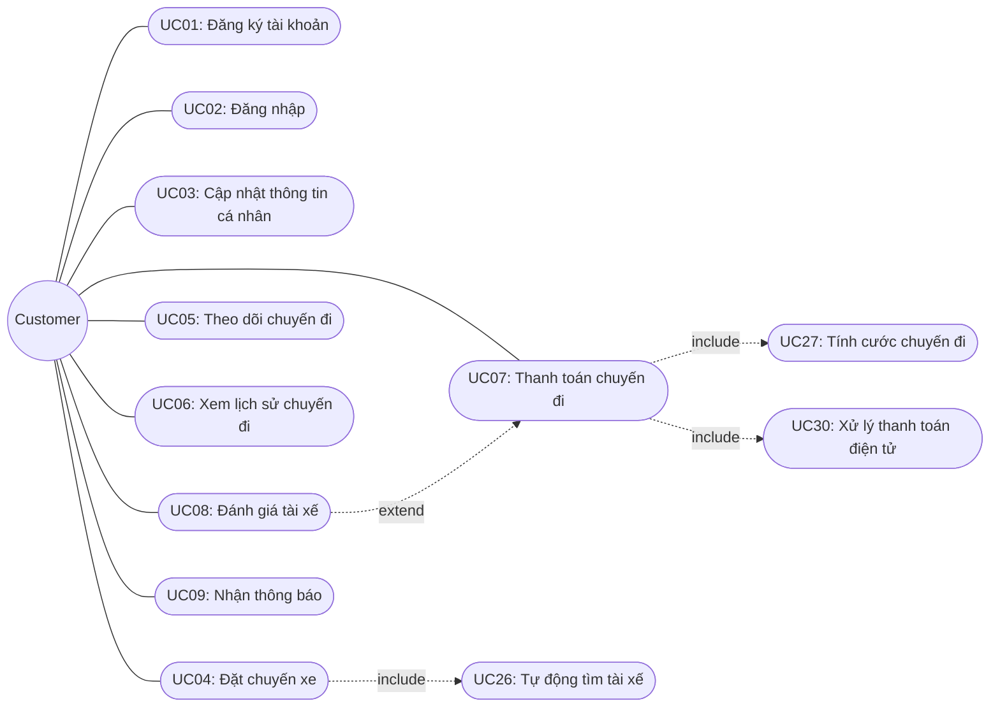

##### 11.4 Sơ đồ Use Case — Driver

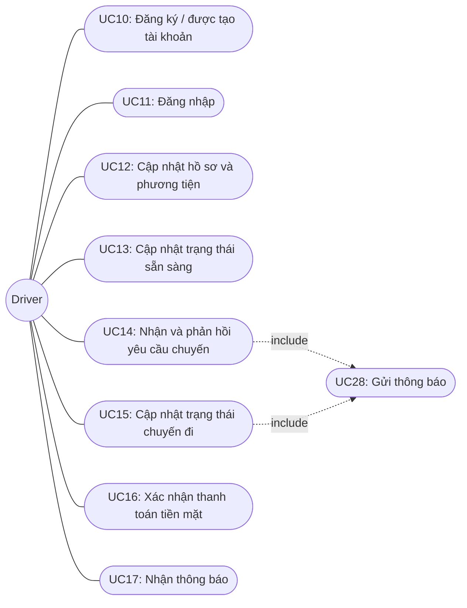

##### 11.5 Sơ đồ Use Case — Operations Staff

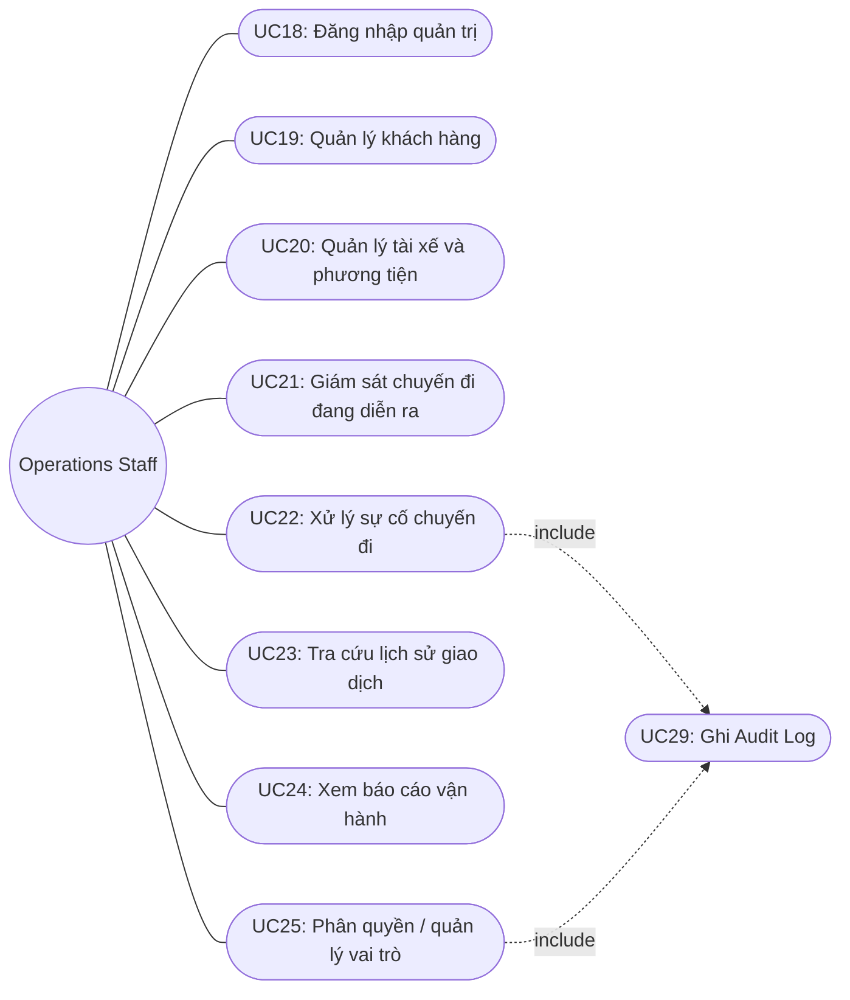

##### 11.6 Sơ đồ Use Case tổng thể (bao gồm quan hệ giữa các Actor và các Use Case nền)

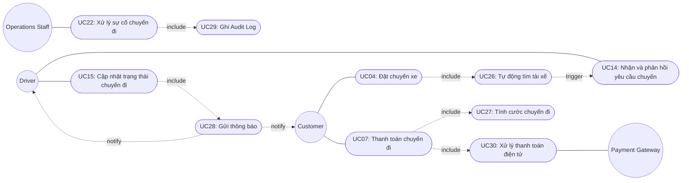

---

#### Bước 12: Đặc tả Use Case (Use Case Specification)

Sau khi vẽ sơ đồ, BA đặc tả chi tiết từng Use Case: điều kiện tiên quyết, luồng chính, luồng phụ, ngoại lệ và điều kiện kết thúc — liên kết ngược lại với FR, BR và EX đã xác định ở các bước trước.

##### UC01 — Đăng ký tài khoản

| Mục | Nội dung |
|---|---|
| Actor | Customer |
| Mô tả | Khách hàng tạo tài khoản mới trên hệ thống |
| Điều kiện tiên quyết | Chưa có tài khoản với số điện thoại/email này |
| Luồng chính | 1. Khách hàng nhập số điện thoại/email, mật khẩu 2. Hệ thống kiểm tra tính hợp lệ (BR01) 3. Hệ thống tạo tài khoản (FR01) 4. Hệ thống xác thực OTP/email (nếu áp dụng) 5. Tài khoản được kích hoạt |
| Luồng phụ | Không có |
| Ngoại lệ | EX01: Số điện thoại/email đã tồn tại → hệ thống từ chối, gợi ý đăng nhập |
| Điều kiện kết thúc | Tài khoản Customer được tạo thành công |
| Liên kết | FR01, BR01, EX01 |

##### UC02 — Đăng nhập

| Mục | Nội dung |
|---|---|
| Actor | Customer |
| Mô tả | Khách hàng đăng nhập vào hệ thống bằng tài khoản đã có |
| Điều kiện tiên quyết | Đã có tài khoản active |
| Luồng chính | 1. Khách hàng nhập thông tin đăng nhập 2. Hệ thống xác thực (FR02, BR17) 3. Hệ thống cấp phiên đăng nhập (token) |
| Luồng phụ | Không có |
| Ngoại lệ | Sai thông tin đăng nhập → thông báo lỗi, không cấp token |
| Điều kiện kết thúc | Khách hàng truy cập được các chức năng cần tài khoản |
| Liên kết | FR02, BR17 |

##### UC03 — Cập nhật thông tin cá nhân

| Mục | Nội dung |
|---|---|
| Actor | Customer |
| Mô tả | Khách hàng chỉnh sửa thông tin cá nhân |
| Điều kiện tiên quyết | Đã đăng nhập (UC02) |
| Luồng chính | 1. Khách hàng mở màn hình hồ sơ 2. Chỉnh sửa thông tin (họ tên, số điện thoại...) 3. Hệ thống lưu thay đổi (FR04) |
| Luồng phụ | Không có |
| Ngoại lệ | Dữ liệu nhập không hợp lệ → thông báo lỗi validate |
| Điều kiện kết thúc | Thông tin cá nhân được cập nhật |
| Liên kết | FR04 |

##### UC04 — Đặt chuyến xe

| Mục | Nội dung |
|---|---|
| Actor | Customer |
| Mô tả | Khách hàng tạo yêu cầu đặt xe và hệ thống tìm tài xế |
| Điều kiện tiên quyết | Đã đăng nhập |
| Luồng chính | 1. Khách hàng nhập điểm đón (FR07) 2. Nhập điểm đến (FR08) 3. Chọn loại xe (FR09) 4. Gửi yêu cầu (FR10) 5. Hệ thống xác nhận yêu cầu, chuyển sang **UC26 - Tự động tìm tài xế** 6. Tài xế nhận chuyến → thông báo khách hàng |
| Luồng phụ | Khách hàng có thể hủy yêu cầu trước khi có tài xế nhận |
| Ngoại lệ | EX03: Chờ quá lâu không có tài xế → thông báo EX06: Hết danh sách tài xế phù hợp → thông báo |
| Điều kiện kết thúc | Chuyến được tạo và có tài xế nhận, hoặc kết thúc với thông báo không tìm được tài xế |
| Liên kết | FR07–FR10, UC26, EX03, EX06 |

##### UC05 — Theo dõi chuyến đi

| Mục | Nội dung |
|---|---|
| Actor | Customer |
| Mô tả | Khách hàng theo dõi trạng thái và vị trí tài xế theo thời gian thực |
| Điều kiện tiên quyết | Chuyến đã được tạo và có/đang tìm tài xế |
| Luồng chính | 1. Hệ thống hiển thị trạng thái hiện tại của chuyến (FR30) 2. Hiển thị thời gian dự kiến tài xế đến (FR31) 3. Cập nhật liên tục khi trạng thái thay đổi |
| Luồng phụ | Không có |
| Ngoại lệ | EX09: Mất tín hiệu vị trí tài xế → hiển thị vị trí gần nhất đã ghi nhận |
| Điều kiện kết thúc | Khách hàng nắm được trạng thái chuyến tại mọi thời điểm |
| Liên kết | FR30, FR31, EX09 |

##### UC06 — Xem lịch sử chuyến đi

| Mục | Nội dung |
|---|---|
| Actor | Customer |
| Mô tả | Khách hàng xem lại các chuyến đã thực hiện |
| Điều kiện tiên quyết | Đã đăng nhập, có ít nhất 1 chuyến đã hoàn thành |
| Luồng chính | 1. Khách hàng mở màn hình lịch sử (FR33) 2. Chọn 1 chuyến để xem chi tiết (FR34) |
| Luồng phụ | Không có |
| Ngoại lệ | Không có |
| Điều kiện kết thúc | Danh sách/chi tiết chuyến được hiển thị |
| Liên kết | FR33, FR34 |

##### UC07 — Thanh toán chuyến đi

| Mục | Nội dung |
|---|---|
| Actor | Customer, Payment Gateway |
| Mô tả | Khách hàng thanh toán cước phí sau khi chuyến hoàn thành |
| Điều kiện tiên quyết | Chuyến ở trạng thái hoàn thành (BR09) |
| Luồng chính | 1. Hệ thống tính cước, gọi **UC27** (FR35, FR36) 2. Hiển thị số tiền cho khách hàng (FR37) 3. Khách hàng chọn phương thức thanh toán (FR38) 4a. Nếu tiền mặt → chờ tài xế xác nhận (UC16) 4b. Nếu điện tử → gọi **UC30** xử lý với Payment Gateway |
| Luồng phụ | Khách hàng đổi phương thức thanh toán nếu thất bại (EX11) |
| Ngoại lệ | EX11: Giao dịch điện tử thất bại → thông báo, cho thử lại EX12: Không đủ tiền mặt → xử lý theo chính sách (Open Issue) EX13: Payment Gateway timeout → gợi ý đổi phương thức |
| Điều kiện kết thúc | Payment.status = success |
| Liên kết | FR35–FR44, BR09–BR11, UC27, UC30, EX11–EX13 |

##### UC08 — Đánh giá tài xế

| Mục | Nội dung |
|---|---|
| Actor | Customer |
| Mô tả | Khách hàng đánh giá tài xế sau khi thanh toán thành công |
| Điều kiện tiên quyết | UC07 hoàn tất thành công (BR13) |
| Luồng chính | 1. Hệ thống mời đánh giá (FR53) 2. Khách hàng chọn sao, nhập nhận xét (FR54, FR55) 3. Hệ thống lưu đánh giá, cập nhật điểm trung bình tài xế (FR56) |
| Luồng phụ | Khách hàng bỏ qua đánh giá (FR57, EX15) |
| Ngoại lệ | EX15: Bỏ qua đánh giá → chuyến vẫn coi là hoàn tất |
| Điều kiện kết thúc | Rating được lưu (nếu có) hoặc chuyến kết thúc không có đánh giá |
| Liên kết | FR53–FR57, BR13, BR14, EX15 |

##### UC09 — Nhận thông báo (Customer)

| Mục | Nội dung |
|---|---|
| Actor | Customer |
| Mô tả | Khách hàng nhận thông báo về các sự kiện của chuyến đi |
| Điều kiện tiên quyết | Có sự kiện nghiệp vụ phát sinh (yêu cầu tiếp nhận, tài xế nhận chuyến...) |
| Luồng chính | Được kích hoạt từ **UC28 - Gửi thông báo** (FR45–FR49) |
| Luồng phụ | Không có |
| Ngoại lệ | EX14: Gửi thông báo thất bại → retry theo cơ chế giới hạn |
| Điều kiện kết thúc | Khách hàng nhận được thông báo tương ứng |
| Liên kết | FR45–FR49, UC28, EX14 |

##### UC10 — Đăng ký / được tạo tài khoản (Driver)

| Mục | Nội dung |
|---|---|
| Actor | Driver, Operations Staff |
| Mô tả | Tài xế tự đăng ký hoặc được nhân viên vận hành tạo tài khoản |
| Điều kiện tiên quyết | Chưa có tài khoản |
| Luồng chính | 1a. Tài xế tự đăng ký (FR01 áp dụng tương tự) 1b. Nhân viên vận hành tạo tài khoản thay (FR03) 2. Hệ thống tạo tài khoản Driver |
| Luồng phụ | Không có |
| Ngoại lệ | EX01: Trùng số điện thoại/email |
| Điều kiện kết thúc | Tài khoản Driver được tạo |
| Liên kết | FR01, FR03, EX01 |

##### UC11 — Đăng nhập (Driver)

| Mục | Nội dung |
|---|---|
| Actor | Driver |
| Mô tả | Tài xế đăng nhập vào ứng dụng |
| Điều kiện tiên quyết | Tài khoản active |
| Luồng chính | Tương tự UC02, áp dụng cho Driver (FR02, BR17) |
| Điều kiện kết thúc | Tài xế truy cập được các chức năng dành cho Driver |
| Liên kết | FR02, BR17 |

##### UC12 — Cập nhật hồ sơ & phương tiện

| Mục | Nội dung |
|---|---|
| Actor | Driver |
| Mô tả | Tài xế cập nhật hồ sơ cá nhân và thông tin phương tiện |
| Điều kiện tiên quyết | Đã đăng nhập |
| Luồng chính | 1. Tài xế cập nhật hồ sơ cá nhân (FR05) 2. Cập nhật thông tin phương tiện (biển số, loại xe...) |
| Ngoại lệ | EX02: Hồ sơ/phương tiện chưa đầy đủ khi cố chuyển trạng thái sẵn sàng → hệ thống chặn (BR02) |
| Điều kiện kết thúc | Hồ sơ/phương tiện được cập nhật đầy đủ |
| Liên kết | FR05, BR02, EX02 |

##### UC13 — Cập nhật trạng thái sẵn sàng

| Mục | Nội dung |
|---|---|
| Actor | Driver |
| Mô tả | Tài xế chuyển đổi giữa trạng thái sẵn sàng/không sẵn sàng nhận chuyến |
| Điều kiện tiên quyết | Hồ sơ và phương tiện đầy đủ (BR02) |
| Luồng chính | 1. Tài xế bật trạng thái sẵn sàng (FR06) 2. Hệ thống bắt đầu ghi nhận vị trí tài xế (FR32) |
| Ngoại lệ | EX02: Hồ sơ chưa đủ điều kiện → chặn chuyển trạng thái |
| Điều kiện kết thúc | Driver.status = available, đủ điều kiện được đề xuất chuyến |
| Liên kết | FR06, FR32, BR02, BR03 |

##### UC14 — Nhận & phản hồi yêu cầu chuyến

| Mục | Nội dung |
|---|---|
| Actor | Driver |
| Mô tả | Tài xế nhận lời mời chuyến và quyết định chấp nhận/từ chối |
| Điều kiện tiên quyết | Driver.status = available (BR03), không đang có chuyến khác (BR04) |
| Luồng chính | 1. Hệ thống gửi lời mời chuyến (FR16, gọi UC28) 2. Hệ thống hiển thị thông tin chuyến (FR22) 3a. Tài xế chấp nhận (FR23) → xác nhận chuyến (FR25) 3b. Tài xế từ chối (FR24) → EX05, tìm tài xế khác |
| Luồng phụ | Không phản hồi trong thời gian giới hạn → EX04 |
| Ngoại lệ | EX04: Hết thời gian phản hồi (BR05) → tự động coi như từ chối EX05: Từ chối chủ động → chuyển ngay sang tài xế kế tiếp EX07: Hai tài xế cùng chấp nhận (race condition) → chỉ xác nhận người đầu tiên |
| Điều kiện kết thúc | Chuyến được gán cho 1 tài xế duy nhất, hoặc chuyển sang tìm tài xế khác |
| Liên kết | FR16, FR22–FR25, BR03–BR05, EX04, EX05, EX07 |

##### UC15 — Cập nhật trạng thái chuyến đi

| Mục | Nội dung |
|---|---|
| Actor | Driver |
| Mô tả | Tài xế cập nhật các mốc trạng thái trong quá trình thực hiện chuyến |
| Điều kiện tiên quyết | Đã nhận chuyến (UC14 thành công) |
| Luồng chính | 1. Đã đến điểm đón (FR26) → gọi UC28 thông báo khách hàng 2. Đã đón khách (FR27) 3. Đang di chuyển (FR28) 4. Hoàn thành chuyến (FR29) → chuyển sang UC07 |
| Luồng phụ | Không có |
| Ngoại lệ | EX08: Khách không có mặt tại điểm đón quá thời gian chờ (BR08) → xử lý theo chính sách chờ/hủy EX09: Mất tín hiệu GPS tài xế EX10: Mất kết nối mạng giữa chuyến |
| Điều kiện kết thúc | Trạng thái chuyến được cập nhật đúng thứ tự (BR07), chuyến chuyển sang bước thanh toán khi hoàn thành |
| Liên kết | FR26–FR29, BR07, BR08, EX08–EX10 |

##### UC16 — Xác nhận thanh toán tiền mặt

| Mục | Nội dung |
|---|---|
| Actor | Driver |
| Mô tả | Tài xế xác nhận đã nhận tiền mặt từ khách hàng |
| Điều kiện tiên quyết | Chuyến đã hoàn thành, khách hàng chọn thanh toán tiền mặt |
| Luồng chính | 1. Khách hàng đưa tiền mặt 2. Tài xế xác nhận trên ứng dụng (FR39) 3. Hệ thống ghi nhận Payment.status = success |
| Ngoại lệ | EX12: Khách hàng không đủ tiền mặt → xử lý theo chính sách (Open Issue) |
| Điều kiện kết thúc | Giao dịch tiền mặt được ghi nhận thành công |
| Liên kết | FR39, BR11, EX12 |

##### UC17 — Nhận thông báo (Driver)

| Mục | Nội dung |
|---|---|
| Actor | Driver |
| Mô tả | Tài xế nhận thông báo về chuyến mới hoặc thay đổi liên quan |
| Điều kiện tiên quyết | Có sự kiện phát sinh liên quan đến tài xế |
| Luồng chính | Được kích hoạt từ **UC28** (FR50, FR51) |
| Ngoại lệ | EX14: Gửi thất bại → retry |
| Điều kiện kết thúc | Tài xế nhận được thông báo |
| Liên kết | FR50, FR51, UC28, EX14 |

##### UC18 — Đăng nhập quản trị

| Mục | Nội dung |
|---|---|
| Actor | Operations Staff |
| Mô tả | Nhân viên vận hành đăng nhập vào hệ thống quản trị |
| Điều kiện tiên quyết | Có tài khoản OperationsStaff với vai trò (Role) được gán |
| Luồng chính | 1. Đăng nhập (FR69) 2. Hệ thống xác định vai trò và quyền tương ứng (FR70) |
| Ngoại lệ | Sai thông tin đăng nhập → từ chối |
| Điều kiện kết thúc | Nhân viên truy cập được các chức năng theo đúng quyền hạn |
| Liên kết | FR69, FR70, BR17 |

##### UC19 — Quản lý khách hàng

| Mục | Nội dung |
|---|---|
| Actor | Operations Staff |
| Mô tả | Nhân viên xem/tìm kiếm/quản lý thông tin khách hàng |
| Điều kiện tiên quyết | Đã đăng nhập quản trị (UC18) |
| Luồng chính | 1. Xem danh sách khách hàng (FR58) 2. Tìm kiếm/lọc (FR59) |
| Ngoại lệ | EX16: Không đủ quyền cho thao tác nhạy cảm (vd: khóa tài khoản) → từ chối |
| Điều kiện kết thúc | Thông tin khách hàng được hiển thị/cập nhật đúng phạm vi quyền |
| Liên kết | FR58, FR59, BR15, EX16 |

##### UC20 — Quản lý tài xế & phương tiện

| Mục | Nội dung |
|---|---|
| Actor | Operations Staff |
| Mô tả | Nhân viên xem/quản lý thông tin tài xế và phương tiện |
| Điều kiện tiên quyết | Đã đăng nhập quản trị |
| Luồng chính | 1. Xem danh sách tài xế, phương tiện (FR58) 2. Tìm kiếm/lọc (FR59) |
| Ngoại lệ | EX16: Không đủ quyền cho thao tác nhạy cảm |
| Điều kiện kết thúc | Thông tin tài xế/phương tiện được hiển thị/cập nhật đúng phạm vi quyền |
| Liên kết | FR58, FR59, BR15, EX16 |

##### UC21 — Giám sát chuyến đi đang diễn ra

| Mục | Nội dung |
|---|---|
| Actor | Operations Staff |
| Mô tả | Nhân viên theo dõi các chuyến đang diễn ra theo thời gian thực |
| Điều kiện tiên quyết | Đã đăng nhập quản trị |
| Luồng chính | 1. Xem danh sách chuyến đang diễn ra (FR60) 2. Xem trạng thái từng tài xế (FR61) |
| Điều kiện kết thúc | Nhân viên nắm được tình hình vận hành hiện tại |
| Liên kết | FR60, FR61 |

##### UC22 — Xử lý sự cố chuyến đi

| Mục | Nội dung |
|---|---|
| Actor | Operations Staff |
| Mô tả | Nhân viên can thiệp xử lý khi chuyến gặp sự cố |
| Điều kiện tiên quyết | Phát hiện chuyến bị lỗi/bất thường (từ UC21 hoặc EX08–EX10, EX17) |
| Luồng chính | 1. Kiểm tra chi tiết chuyến (FR62) 2. Thực hiện thao tác xử lý (hủy chuyến, gán lại tài xế...) 3. Hệ thống gọi **UC29** ghi Audit Log (BR16) |
| Luồng phụ | Thao tác nhạy cảm → chuyển cho nhân viên có quyền phù hợp (EX16) |
| Ngoại lệ | EX16: Không đủ quyền EX17: Sự cố phát sinh ngoài dự kiến → xử lý thủ công, vẫn phải ghi log |
| Điều kiện kết thúc | Sự cố được xử lý và ghi nhận đầy đủ vào Audit Log |
| Liên kết | FR62, BR15, BR16, UC29, EX16, EX17 |

##### UC23 — Tra cứu lịch sử giao dịch

| Mục | Nội dung |
|---|---|
| Actor | Operations Staff |
| Mô tả | Nhân viên tra cứu lịch sử giao dịch/chuyến đi |
| Điều kiện tiên quyết | Đã đăng nhập quản trị |
| Luồng chính | 1. Nhập điều kiện tra cứu (khách hàng/tài xế/thời gian) 2. Hệ thống trả về kết quả (FR63) |
| Điều kiện kết thúc | Kết quả tra cứu được hiển thị |
| Liên kết | FR63 |

##### UC24 — Xem báo cáo vận hành

| Mục | Nội dung |
|---|---|
| Actor | Operations Staff |
| Mô tả | Nhân viên/ban lãnh đạo xem các báo cáo tổng hợp |
| Điều kiện tiên quyết | Đã đăng nhập quản trị, đủ quyền xem báo cáo |
| Luồng chính | 1. Chọn loại báo cáo (số lượng chuyến, doanh thu, tỷ lệ hoàn thành/hủy, hiệu quả tài xế) 2. Hệ thống tổng hợp và hiển thị (FR65–FR68) |
| Điều kiện kết thúc | Báo cáo được hiển thị đúng phạm vi/thời gian yêu cầu |
| Liên kết | FR65–FR68 |

##### UC25 — Phân quyền / quản lý vai trò

| Mục | Nội dung |
|---|---|
| Actor | Operations Staff (quyền quản trị cao) |
| Mô tả | Gán/thu hồi vai trò và quyền hạn cho nhân viên vận hành |
| Điều kiện tiên quyết | Nhân viên có quyền quản trị cao nhất |
| Luồng chính | 1. Chọn nhân viên 2. Gán/thay đổi Role (FR64) 3. Hệ thống gọi **UC29** ghi Audit Log |
| Ngoại lệ | EX16: Không đủ quyền thực hiện thao tác này |
| Điều kiện kết thúc | Vai trò của nhân viên được cập nhật |
| Liên kết | FR64, BR15, BR16, UC29, EX16 |

##### UC26 — Tự động tìm tài xế (Use Case nền)

| Mục | Nội dung |
|---|---|
| Actor | System |
| Mô tả | Hệ thống tự động xác định và đề xuất tài xế phù hợp cho một chuyến |
| Điều kiện tiên quyết | Chuyến ở trạng thái "searching" |
| Luồng chính | 1. Xác định vị trí khách hàng (FR11) 2. Tìm tài xế online trong bán kính (FR12) 3. Lọc theo loại xe (FR13) 4. Lọc theo tiêu chí rating nếu khách hàng yêu cầu (FR14) 5. Sắp xếp theo khoảng cách (FR15) 6. Mời lần lượt từng tài xế, gọi **UC14** |
| Ngoại lệ | EX03, EX06: Không tìm được tài xế phù hợp |
| Điều kiện kết thúc | Chuyến có tài xế nhận, hoặc kết thúc với thông báo không tìm được |
| Liên kết | FR11–FR21, BR03, BR06, EX03–EX07 |

##### UC27 — Tính cước chuyến đi (Use Case nền)

| Mục | Nội dung |
|---|---|
| Actor | System |
| Mô tả | Hệ thống tính số tiền khách hàng phải trả sau khi chuyến hoàn thành |
| Điều kiện tiên quyết | Trip.status = completed (BR09) |
| Luồng chính | 1. Tính khoảng cách/thời gian thực tế (FR35) 2. Áp dụng công thức tính cước cơ bản (FR36) |
| Điều kiện kết thúc | Trip.fare_amount được xác định |
| Liên kết | FR35, FR36, BR09 |

##### UC28 — Gửi thông báo (Use Case nền)

| Mục | Nội dung |
|---|---|
| Actor | System |
| Mô tả | Hệ thống gửi thông báo tương ứng với từng sự kiện nghiệp vụ |
| Điều kiện tiên quyết | Có sự kiện kích hoạt (trip event) |
| Luồng chính | 1. Xác định loại sự kiện 2. Xác định người nhận (Customer/Driver) 3. Gửi thông báo qua kênh cấu hình (FR45–FR52) |
| Ngoại lệ | EX14: Gửi thất bại → retry có giới hạn, không chặn luồng nghiệp vụ chính |
| Điều kiện kết thúc | Notification.status = sent (hoặc failed sau khi hết số lần retry) |
| Liên kết | FR45–FR52, BR12, EX14 |

##### UC29 — Ghi Audit Log (Use Case nền)

| Mục | Nội dung |
|---|---|
| Actor | System |
| Mô tả | Hệ thống tự động ghi log cho các thao tác quan trọng |
| Điều kiện tiên quyết | Có thao tác cần ghi vết (theo BR16) |
| Luồng chính | 1. Ghi nhận actor thực hiện, hành động, đối tượng bị tác động, thời gian (FR72) |
| Điều kiện kết thúc | AuditLog được lưu, có thể tra cứu (FR73) |
| Liên kết | FR72, FR73, BR16 |

##### UC30 — Xử lý giao dịch thanh toán điện tử (Use Case nền)

| Mục | Nội dung |
|---|---|
| Actor | System, Payment Gateway |
| Mô tả | Hệ thống gọi nhà cung cấp thanh toán bên ngoài để xử lý giao dịch điện tử |
| Điều kiện tiên quyết | Khách hàng chọn thanh toán điện tử (UC07) |
| Luồng chính | 1. Gửi yêu cầu thanh toán đến Payment Gateway (FR40) 2. Nhận kết quả giao dịch (FR41) |
| Ngoại lệ | EX11: Giao dịch thất bại EX13: Payment Gateway timeout |
| Điều kiện kết thúc | Payment.status = success hoặc failed |
| Liên kết | FR40–FR44, BR10, BR11, EX11, EX13 |

##### 12.1 Bảng tổng hợp truy vết Use Case

| Nhóm Actor | Use Case | Business Requirement gốc |
|---|---|---|
| Customer | UC01–UC09 | BN01, BN02, BN03–BN06, BN07–BN13, BN16, BN17, BN14 |
| Driver | UC10–UC17 | BN01, BN02, BN04–BN09, BN11, BN15 |
| Operations Staff | UC18–UC25 | BN18–BN21, BN22–BN25 |
| System (nền) | UC26–UC30 | BN04, BN10, BN12–BN14, BN25 |

#### Bước 13: Xác định Tiêu chí chấp nhận (Acceptance Criteria - AC)

Acceptance Criteria là tập hợp các điều kiện và nguyên tắc cụ thể mà một tính năng phải đáp ứng, giúp đội phát triển và khách hàng xác định rõ **khi nào một Business Requirement được coi là hoàn thành và có thể nghiệm thu**. Mỗi AC được viết theo cấu trúc **Given – When – Then** và gắn với mã BN/UC tương ứng.

##### 13.1 Nhóm Tài khoản & Hồ sơ (BN01, BN02)

**AC01** — Đăng ký tài khoản thành công (liên quan UC01)
- Given: Khách hàng chưa có tài khoản trên hệ thống
- When: Khách hàng nhập số điện thoại/email chưa từng đăng ký và mật khẩu hợp lệ, sau đó gửi form đăng ký
- Then: Hệ thống tạo tài khoản mới thành công và cho phép đăng nhập

**AC02** — Từ chối đăng ký trùng thông tin (liên quan UC01, EX01)
- Given: Số điện thoại/email đã tồn tại trên hệ thống
- When: Người dùng cố đăng ký lại với thông tin đó
- Then: Hệ thống từ chối, hiển thị thông báo "tài khoản đã tồn tại" và gợi ý đăng nhập

**AC03** — Đăng nhập thành công (liên quan UC02, UC11)
- Given: Tài khoản đã tồn tại và ở trạng thái active
- When: Người dùng nhập đúng thông tin đăng nhập
- Then: Hệ thống cấp phiên đăng nhập và cho phép truy cập các chức năng tương ứng với vai trò

**AC04** — Chặn chuyển trạng thái sẵn sàng khi hồ sơ chưa đầy đủ (liên quan UC12, UC13, BR02, EX02)
- Given: Tài xế chưa khai báo đầy đủ thông tin phương tiện
- When: Tài xế cố chuyển trạng thái sang "sẵn sàng nhận chuyến"
- Then: Hệ thống chặn thao tác và yêu cầu bổ sung thông tin còn thiếu

##### 13.2 Nhóm Đặt xe & Tìm tài xế (BN03–BN06)

**AC05** — Tạo yêu cầu đặt xe thành công (liên quan UC04)
- Given: Khách hàng đã đăng nhập
- When: Khách hàng nhập đầy đủ điểm đón, điểm đến, chọn loại xe và gửi yêu cầu
- Then: Hệ thống tạo bản ghi Trip với trạng thái "searching" và bắt đầu tìm tài xế

**AC06** — Chỉ đề xuất tài xế đang sẵn sàng (liên quan UC26, BR03)
- Given: Có danh sách tài xế trong bán kính tìm kiếm
- When: Hệ thống lọc tài xế để đề xuất
- Then: Chỉ những tài xế có trạng thái "sẵn sàng (online)" được đưa vào danh sách đề xuất

**AC07** — Một tài xế không nhận đồng thời 2 chuyến (liên quan UC14, BR04)
- Given: Tài xế đang thực hiện một chuyến khác (status = on_trip)
- When: Hệ thống tìm tài xế cho một chuyến mới
- Then: Tài xế đó không được đưa vào danh sách đề xuất cho chuyến mới

**AC08** — Tự động chuyển tài xế khi từ chối (liên quan UC14, EX05)
- Given: Tài xế A được mời chuyến và chủ động từ chối
- When: Hệ thống nhận được phản hồi từ chối
- Then: Hệ thống ngay lập tức mời tài xế tiếp theo trong danh sách, không chờ hết thời gian giới hạn

**AC09** — Tự động chuyển tài xế khi hết thời gian phản hồi (liên quan UC14, BR05, EX04)
- Given: Tài xế A được mời chuyến nhưng không phản hồi trong khoảng thời gian quy định
- When: Thời gian chờ phản hồi kết thúc
- Then: Hệ thống coi như tài xế A từ chối, loại khỏi danh sách đề xuất cho chuyến này và mời tài xế tiếp theo

**AC10** — Thông báo khi không tìm được tài xế (liên quan UC04, UC26, EX03, EX06)
- Given: Hệ thống đã mời hết danh sách tài xế phù hợp mà không ai chấp nhận, hoặc không có tài xế nào phù hợp từ đầu
- When: Điều kiện trên xảy ra
- Then: Hệ thống dừng tìm kiếm và gửi thông báo rõ ràng cho khách hàng rằng không tìm được tài xế

**AC11** — Chỉ 1 tài xế được xác nhận khi có tranh chấp (liên quan UC14, EX07)
- Given: Hai tài xế cùng bấm "chấp nhận" một chuyến gần như đồng thời
- When: Hệ thống xử lý hai yêu cầu chấp nhận
- Then: Chỉ tài xế có yêu cầu được ghi nhận trước được xác nhận cho chuyến; tài xế còn lại nhận thông báo "chuyến đã có tài xế khác nhận"

##### 13.3 Nhóm Thực hiện chuyến đi (BN07–BN09, BN17)

**AC12** — Cập nhật trạng thái đúng thứ tự (liên quan UC15, BR07)
- Given: Chuyến đang ở trạng thái "assigned"
- When: Tài xế cố cập nhật trạng thái không theo đúng thứ tự quy định (vd: nhảy thẳng sang "hoàn thành" khi chưa "đón khách")
- Then: Hệ thống từ chối cập nhật và yêu cầu thực hiện đúng tuần tự

**AC13** — Khách hàng nhận thông báo khi tài xế đến điểm đón (liên quan UC15, UC09)
- Given: Tài xế cập nhật trạng thái "đã đến điểm đón"
- When: Cập nhật được ghi nhận thành công
- Then: Hệ thống gửi thông báo ngay cho khách hàng

**AC14** — Ghi nhận vị trí tài xế liên tục trong chuyến (liên quan UC05, BN09)
- Given: Chuyến đang ở trạng thái "đang di chuyển"
- When: Tài xế di chuyển
- Then: Hệ thống ghi nhận vị trí tài xế định kỳ và khách hàng thấy được cập nhật trên màn hình theo dõi

**AC15** — Xem lịch sử chuyến đầy đủ (liên quan UC06)
- Given: Khách hàng có ít nhất một chuyến đã hoàn thành
- When: Khách hàng mở màn hình lịch sử chuyến đi
- Then: Hệ thống hiển thị đầy đủ danh sách chuyến với điểm đón, điểm đến, số tiền, tài xế, thời gian

##### 13.4 Nhóm Tính cước & Thanh toán (BN10–BN13)

**AC16** — Chỉ tính cước khi chuyến đã hoàn thành (liên quan UC27, BR09)
- Given: Chuyến chưa đạt trạng thái "hoàn thành"
- When: Hệ thống hoặc người dùng cố kích hoạt tính cước
- Then: Hệ thống không tính cước; chỉ tính cước ngay sau khi Trip.status chuyển thành "completed"

**AC17** — Không lưu thông tin thẻ nhạy cảm (liên quan UC30, BR10)
- Given: Khách hàng thanh toán bằng phương thức điện tử qua nhà cung cấp bên ngoài
- When: Giao dịch được xử lý
- Then: Hệ thống CAB chỉ lưu token/mã tham chiếu giao dịch, không lưu số thẻ hoặc thông tin tài khoản thanh toán gốc

**AC18** — Không thu tiền trùng lặp (liên quan UC07, BR11)
- Given: Một chuyến đã có giao dịch thanh toán ở trạng thái "success"
- When: Có yêu cầu thanh toán lại cho cùng chuyến đó
- Then: Hệ thống từ chối tạo giao dịch mới, chỉ cho phép một giao dịch thành công duy nhất trên mỗi chuyến

**AC19** — Xử lý khi giao dịch điện tử thất bại (liên quan UC30, EX11)
- Given: Khách hàng chọn thanh toán điện tử
- When: Giao dịch từ Payment Gateway trả về kết quả thất bại
- Then: Hệ thống thông báo lỗi cho khách hàng và cho phép thử lại hoặc đổi phương thức thanh toán khác, không trừ tiền

**AC20** — Xử lý khi Payment Gateway không phản hồi (liên quan UC30, EX13)
- Given: Hệ thống đã gửi yêu cầu thanh toán điện tử
- When: Payment Gateway không phản hồi trong thời gian timeout quy định
- Then: Hệ thống hiển thị thông báo lỗi tạm thời cho khách hàng và gợi ý phương thức thanh toán khác (vd: tiền mặt)

##### 13.5 Nhóm Thông báo (BN14, BN15)

**AC21** — Gửi đúng và đủ thông báo theo sự kiện (liên quan UC28)
- Given: Một sự kiện nghiệp vụ hợp lệ xảy ra (vd: tài xế nhận chuyến)
- When: Sự kiện được hệ thống ghi nhận
- Then: Hệ thống gửi đúng một thông báo tương ứng cho đúng người nhận (khách hàng hoặc tài xế), không gửi trùng lặp

**AC22** — Retry khi gửi thông báo thất bại (liên quan UC28, EX14)
- Given: Việc gửi thông báo lần đầu thất bại (lỗi kênh gửi)
- When: Hệ thống phát hiện gửi thất bại
- Then: Hệ thống tự động thử gửi lại theo số lần giới hạn đã cấu hình, không làm gián đoạn luồng nghiệp vụ chính của chuyến đi

##### 13.6 Nhóm Đánh giá tài xế (BN16)

**AC23** — Chỉ được đánh giá sau khi thanh toán thành công (liên quan UC08, BR13)
- Given: Chuyến chưa hoàn tất thanh toán (Payment.status ≠ success)
- When: Hệ thống kiểm tra điều kiện hiển thị lời mời đánh giá
- Then: Hệ thống không hiển thị lời mời đánh giá cho đến khi thanh toán thành công

**AC24** — Mỗi chuyến chỉ đánh giá một lần (liên quan UC08, BR14)
- Given: Chuyến đã có một Rating được lưu
- When: Khách hàng cố gửi đánh giá lần thứ hai cho cùng chuyến
- Then: Hệ thống từ chối, chỉ giữ lại đánh giá đầu tiên

**AC25** — Cập nhật điểm trung bình tài xế sau đánh giá (liên quan UC08)
- Given: Khách hàng gửi đánh giá hợp lệ (1–5 sao)
- When: Hệ thống lưu Rating thành công
- Then: Driver.average_rating được tính lại và cập nhật ngay

##### 13.7 Nhóm Quản trị & Vận hành (BN18–BN21)

**AC26** — Chặn thao tác nhạy cảm với nhân viên không đủ quyền (liên quan UC19, UC20, BR15, EX16)
- Given: Nhân viên vận hành không có quyền thực hiện thao tác nhạy cảm (vd: xóa dữ liệu giao dịch)
- When: Nhân viên cố thực hiện thao tác đó
- Then: Hệ thống từ chối thao tác, hiển thị thông báo không đủ quyền, và ghi log nỗ lực truy cập

**AC27** — Hiển thị đúng danh sách chuyến đang diễn ra (liên quan UC21)
- Given: Có các chuyến đang ở trạng thái khác "completed"/"cancelled"
- When: Nhân viên vận hành mở màn hình giám sát
- Then: Hệ thống hiển thị đầy đủ và chính xác danh sách các chuyến đang diễn ra kèm trạng thái tài xế

**AC28** — Ghi log khi xử lý sự cố (liên quan UC22, BR16)
- Given: Nhân viên vận hành thực hiện thao tác can thiệp vào một chuyến gặp sự cố
- When: Thao tác được thực hiện thành công
- Then: Hệ thống ghi lại đầy đủ vào Audit Log: ai thực hiện, hành động gì, đối tượng nào, thời gian nào

**AC29** — Báo cáo vận hành chính xác theo khoảng thời gian (liên quan UC24)
- Given: Có dữ liệu chuyến đi trong khoảng thời gian được chọn
- When: Nhân viên vận hành tạo báo cáo cho khoảng thời gian đó
- Then: Hệ thống hiển thị đúng số lượng chuyến, doanh thu, tỷ lệ hoàn thành/hủy và hiệu quả tài xế khớp với dữ liệu thực tế trong khoảng thời gian đó

##### 13.8 Nhóm Bảo mật & Dữ liệu (BN22–BN25)

**AC30** — Chặn truy cập khi chưa xác thực (liên quan UC02, BR17, EX18)
- Given: Người dùng chưa đăng nhập hoặc token đã hết hạn
- When: Người dùng cố truy cập chức năng yêu cầu tài khoản
- Then: Hệ thống chặn truy cập và chuyển hướng về màn hình đăng nhập

**AC31** — Dữ liệu nhạy cảm được bảo vệ (liên quan BR18)
- Given: Hệ thống lưu trữ và truyền tải dữ liệu cá nhân, vị trí, giao dịch
- When: Dữ liệu được lưu vào cơ sở dữ liệu hoặc truyền qua mạng
- Then: Dữ liệu được mã hóa khi lưu trữ và truyền tải qua kênh an toàn (HTTPS)

##### 13.9 Bảng tổng hợp liên kết AC → BN/UC

| Nhóm AC | Business Requirement | Use Case liên quan |
|---|---|---|
| 13.1 (AC01–AC04) | BN01, BN02 | UC01, UC02, UC10–UC13 |
| 13.2 (AC05–AC11) | BN03, BN04, BN05, BN06 | UC04, UC14, UC26 |
| 13.3 (AC12–AC15) | BN07, BN08, BN09, BN17 | UC05, UC06, UC15 |
| 13.4 (AC16–AC20) | BN10, BN11, BN12, BN13 | UC07, UC27, UC30 |
| 13.5 (AC21–AC22) | BN14, BN15 | UC09, UC17, UC28 |
| 13.6 (AC23–AC25) | BN16 | UC08 |
| 13.7 (AC26–AC29) | BN18, BN19, BN20, BN21 | UC19–UC25 |
| 13.8 (AC30–AC31) | BN22, BN23, BN24, BN25 | UC02, UC11, UC18 |

#### Bước 14: Ma trận truy xuất yêu cầu (Requirement Traceability Matrix - RTM)

RTM giúp truy vết một yêu cầu xuyên suốt vòng đời dự án: từ **mục tiêu nghiệp vụ (BG)** → **yêu cầu nghiệp vụ (BN)** → **yêu cầu chức năng (FR)** → **use case (UC)** → **tiêu chí chấp nhận (AC)** → **test case (TC)**. Nhờ đó, khi một yêu cầu thay đổi, đội dự án biết chính xác những phần thiết kế/kiểm thử nào bị ảnh hưởng; và khi một test case fail, có thể truy ngược lại đúng yêu cầu nghiệp vụ gốc.

**Quy ước mã Test Case:** Mỗi AC tương ứng với ít nhất một TC cùng số thứ tự (vd: AC05 → TC05). Với các yêu cầu phi chức năng (NFR) không gắn AC cụ thể, TC được ký hiệu theo NFR (vd: TC-NFR03).

##### 14.1 Bảng RTM chi tiết

| BG | BN | FR | UC | AC | TC |
|---|---|---|---|---|---|
| — (nền tảng chung) | BN01 – Đăng ký & đăng nhập | FR01–FR03 | UC01, UC10 | AC01, AC02 | TC01, TC02 |
| — (nền tảng chung) | BN02 – Quản lý hồ sơ | FR04–FR06 | UC03, UC12, UC13 | AC04 | TC04 |
| BG01 | BN03 – Đặt chuyến xe | FR07–FR10 | UC04 | AC05 | TC05 |
| BG01 | BN04 – Tự động tìm tài xế | FR11–FR19 | UC26, UC14 | AC06, AC07, AC08, AC09, AC11 | TC06, TC07, TC08, TC09, TC11 |
| BG01 | BN05 – Thông báo không tìm được tài xế | FR20, FR21 | UC04, UC26 | AC10 | TC10 |
| BG01 | BN06 – Nhận/từ chối chuyến (tài xế) | FR22–FR25 | UC14 | AC08, AC09, AC11 | TC08, TC09, TC11 |
| BG03 | BN07 – Cập nhật trạng thái chuyến đi | FR26–FR29 | UC15 | AC12, AC13 | TC12, TC13 |
| BG03 | BN08 – Theo dõi chuyến đi thời gian thực | FR30, FR31 | UC05 | AC14 | TC14 |
| BG03 | BN09 – Cập nhật vị trí tài xế | FR32 | UC05 | AC14 | TC14 |
| BG02 | BN10 – Tính cước chuyến đi | FR35, FR36 | UC27 | AC16 | TC16 |
| BG02 | BN11 – Thanh toán tiền mặt | FR38, FR39 | UC07, UC16 | AC18 | TC18 |
| BG02 | BN12 – Thanh toán điện tử | FR40, FR41, FR44 | UC07, UC30 | AC17, AC19, AC20 | TC17, TC19, TC20 |
| BG02 | BN13 – Xử lý lỗi thanh toán | FR42, FR43 | UC30 | AC19, AC20 | TC19, TC20 |
| BG04 | BN14 – Thông báo cho khách hàng | FR45–FR49 | UC09, UC28 | AC21, AC22 | TC21, TC22 |
| BG04 | BN15 – Thông báo cho tài xế | FR50–FR52 | UC17, UC28 | AC21, AC22 | TC21, TC22 |
| BG09 | BN16 – Đánh giá tài xế | FR53–FR56 | UC08 | AC23, AC24, AC25 | TC23, TC24, TC25 |
| BG09 | BN17 – Xem lịch sử chuyến đi | FR33, FR34 | UC06 | AC15 | TC15 |
| BG05 | BN18 – Quản trị khách hàng, tài xế, phương tiện, chuyến đi | FR58, FR59 | UC19, UC20 | AC26 | TC26 |
| BG05 | BN19 – Giám sát chuyến đi & xử lý sự cố | FR60–FR63 | UC21, UC22 | AC27, AC28 | TC27, TC28 |
| BG05 | BN20 – Phân quyền chức năng quản trị | FR64 | UC25 | AC26 | TC26 |
| BG05 | BN21 – Báo cáo vận hành | FR65–FR68 | UC24 | AC29 | TC29 |
| BG07 | BN22 – Xác thực người dùng | FR69 | UC02, UC11, UC18 | AC30 | TC30 |
| BG07 | BN23 – Kiểm soát truy cập | FR70 | UC18, UC19, UC20 | AC26, AC30 | TC26, TC30 |
| BG07 | BN24 – Bảo vệ dữ liệu | FR71 | — | AC31 | TC31 |
| BG07 | BN25 – Lưu vết thao tác (Audit log) | FR72, FR73 | UC22, UC25, UC29 | AC28 | TC28 |
| BG06 | BN26 – Khả năng mở rộng độc lập | FR74 | — | NFR03 | TC-NFR03 |
| BG06 | BN27 – Cô lập lỗi giữa các module | FR75 | — | NFR05 | TC-NFR05 |
| BG06 | BN28 – Triển khai từng phần | FR76 | — | NFR12 | TC-NFR12 |
| BG08 | BN29 – Kiến trúc mở rộng linh hoạt | FR77 | — | NFR03, NFR15, NFR16 | TC-NFR03, TC-NFR15, TC-NFR16 |

##### 14.2 Danh sách Test Case tương ứng (tóm tắt mục tiêu kiểm thử)

| TC | Mục tiêu kiểm thử | AC/NFR liên quan |
|---|---|---|
| TC01 | Đăng ký tài khoản với thông tin hợp lệ → thành công | AC01 |
| TC02 | Đăng ký với số điện thoại/email đã tồn tại → bị từ chối | AC02 |
| TC04 | Chuyển trạng thái sẵn sàng khi hồ sơ/phương tiện chưa đầy đủ → bị chặn | AC04 |
| TC05 | Tạo yêu cầu đặt xe với đầy đủ thông tin → tạo Trip thành công | AC05 |
| TC06 | Tìm tài xế → chỉ tài xế "sẵn sàng" được đề xuất | AC06 |
| TC07 | Tìm tài xế khi có tài xế đang bận (on_trip) → không được đề xuất | AC07 |
| TC08 | Tài xế từ chối chuyến → hệ thống mời tài xế kế tiếp ngay | AC08 |
| TC09 | Tài xế không phản hồi quá thời gian quy định → tự động chuyển tài xế khác | AC09 |
| TC10 | Hết danh sách tài xế phù hợp → thông báo không tìm được tài xế | AC10 |
| TC11 | Hai tài xế cùng chấp nhận 1 chuyến (race condition) → chỉ 1 tài xế được xác nhận | AC11 |
| TC12 | Cập nhật trạng thái chuyến sai thứ tự → bị từ chối | AC12 |
| TC13 | Tài xế cập nhật "đã đến điểm đón" → khách hàng nhận thông báo ngay | AC13 |
| TC14 | Theo dõi vị trí tài xế trong chuyến → cập nhật liên tục trên màn hình khách hàng | AC14 |
| TC15 | Xem lịch sử chuyến đi → hiển thị đầy đủ và chính xác | AC15 |
| TC16 | Tính cước chỉ được thực hiện sau khi Trip.status = completed | AC16 |
| TC17 | Thanh toán điện tử thành công → không lưu thông tin thẻ nhạy cảm | AC17 |
| TC18 | Một chuyến chỉ có một giao dịch thanh toán thành công (không trùng) | AC18 |
| TC19 | Giao dịch điện tử thất bại → thông báo lỗi, cho thử lại | AC19 |
| TC20 | Payment Gateway timeout → hiển thị lỗi tạm thời, gợi ý đổi phương thức | AC20 |
| TC21 | Sự kiện nghiệp vụ hợp lệ → gửi đúng và đủ 1 thông báo, không trùng lặp | AC21 |
| TC22 | Gửi thông báo thất bại → hệ thống tự động retry theo giới hạn | AC22 |
| TC23 | Mời đánh giá chỉ hiển thị sau khi thanh toán thành công | AC23 |
| TC24 | Gửi đánh giá lần 2 cho cùng 1 chuyến → bị từ chối | AC24 |
| TC25 | Gửi đánh giá hợp lệ → điểm trung bình tài xế được cập nhật ngay | AC25 |
| TC26 | Nhân viên không đủ quyền thực hiện thao tác nhạy cảm → bị chặn | AC26 |
| TC27 | Màn hình giám sát hiển thị đúng danh sách chuyến đang diễn ra | AC27 |
| TC28 | Xử lý sự cố chuyến đi → thao tác được ghi đầy đủ vào Audit Log | AC28 |
| TC29 | Tạo báo cáo vận hành theo khoảng thời gian → số liệu khớp dữ liệu thực tế | AC29 |
| TC30 | Truy cập chức năng cần tài khoản khi chưa đăng nhập/token hết hạn → bị chặn | AC30 |
| TC31 | Kiểm tra dữ liệu cá nhân/vị trí/giao dịch được mã hóa khi lưu trữ và truyền tải | AC31 |
| TC-NFR03 | Kiểm thử khả năng scale độc lập của từng module khi tăng tải | NFR03 |
| TC-NFR05 | Giả lập lỗi ở module Thanh toán/Thông báo → xác nhận module Đặt xe vẫn hoạt động | NFR05 |
| TC-NFR12 | Triển khai một thay đổi nhỏ ở 1 module → không ảnh hưởng module khác | NFR12 |
| TC-NFR15 | Kiểm thử tích hợp với nhà cung cấp thanh toán qua API chuẩn | NFR15 |
| TC-NFR16 | Kiểm thử khả năng bổ sung nhà cung cấp/kênh mới mà không sửa code lõi | NFR16 |

##### 14.3 Ý nghĩa sử dụng RTM

- **Đảm bảo không sót yêu cầu:** Mọi BG đều có ít nhất một BN, mọi BN đều có FR/UC/AC/TC tương ứng — nếu một dòng bị trống ở cột nào đó, đó là dấu hiệu cần bổ sung thiết kế hoặc kiểm thử.
- **Đánh giá tác động khi thay đổi (Impact Analysis):** Khi khách hàng yêu cầu thay đổi một BG hoặc BN, BA/dev tra bảng RTM để biết chính xác những FR, UC, AC, TC nào cần rà soát lại.
- **Theo dõi tiến độ nghiệm thu:** Đội QA dùng cột TC để lập kế hoạch test; khi toàn bộ TC của một BN pass, BN đó được coi là hoàn thành và có thể nghiệm thu với khách hàng.
- **Chuẩn bị UAT (User Acceptance Test):** Khách hàng có thể dùng trực tiếp cột AC để xác nhận tiêu chí nghiệm thu trước khi dự án bàn giao.

  
